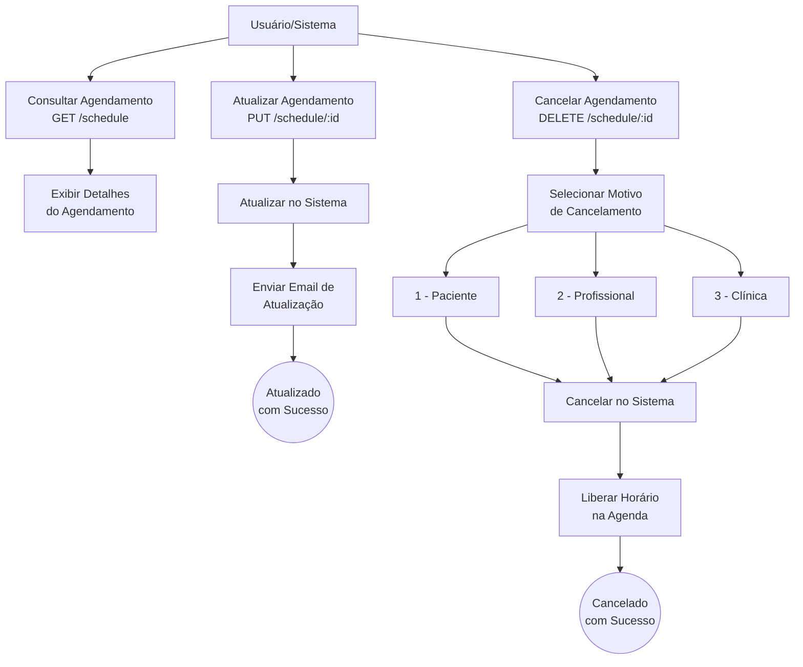
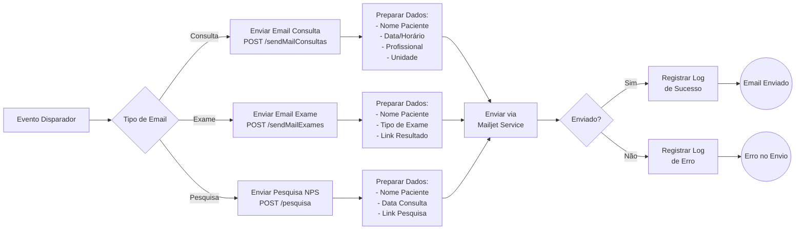
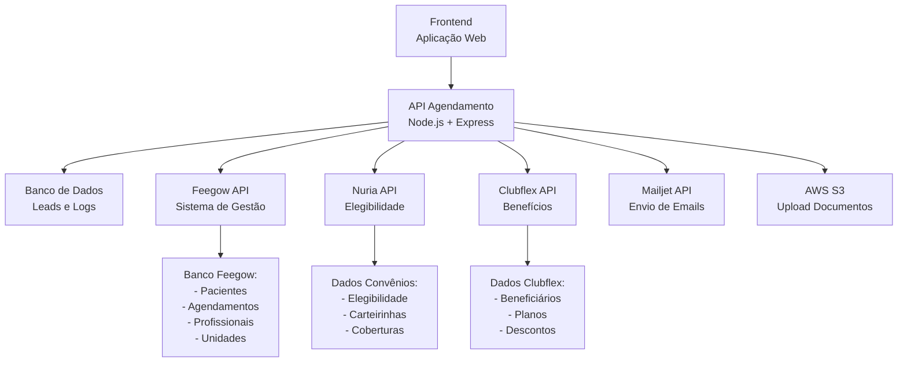

# Fluxo Visual da API - Sistema de Agendamento Online

## Diagrama Geral do Sistema

```mermaid
flowchart TB
    Start(("Início"))
    
    Start --> CreateLead["Criar Lead<br/>POST /lead"]
    CreateLead --> SelectInsurance["Selecionar Convênio<br/>GET /insurance"]
    SelectInsurance --> UpdateLead1["Atualizar Lead<br/>PATCH /lead"]
    UpdateLead1 --> SelectSpeciality["Selecionar Especialidade<br/>GET /specialities"]
    SelectSpeciality --> UpdateLead2["Atualizar Lead<br/>PATCH /lead"]
    UpdateLead2 --> CheckClubflex{"Tem Clubflex?"}
    
    CheckClubflex -->|Sim| VerifyClubflex["Verificar CPF<br/>GET /clubflex/:cpf"]
    CheckClubflex -->|Não| SearchPatient["Buscar Paciente<br/>POST /patient"]
    VerifyClubflex --> SearchPatient
    
    SearchPatient --> PatientExists{"Paciente<br/>existe?"}
    
    PatientExists -->|Não| CreatePatient["Criar Paciente<br/>POST /patient-store"]
    PatientExists -->|Sim| CheckElegibility{"Verificar<br/>Elegibilidade?"}
    CreatePatient --> CheckElegibility
    
    CheckElegibility -->|Sim| VerifyElegibility["Verificar Nuria<br/>POST /elegible"]
    CheckElegibility -->|Não| GetUnits["Buscar Unidades<br/>GET /units"]
    VerifyElegibility --> ElegibilityOk{"Elegível?"}
    
    ElegibilityOk -->|Sim| GetUnits
    ElegibilityOk -->|Não| EndFail(("Fim<br/>Não Elegível"))
    
    GetUnits --> GetProcedures["Buscar Procedimentos<br/>POST /procedures"]
    GetProcedures --> GetProfessionals["Buscar Profissionais<br/>GET /professionals"]
    GetProfessionals --> SearchSchedule["Buscar Horários<br/>POST /schedule"]
    
    SearchSchedule --> HasSchedules{"Tem<br/>horários?"}
    
    HasSchedules -->|Não| EndNoSchedule(("Fim<br/>Sem Horários"))
    HasSchedules -->|Sim| SelectSchedule["Paciente Seleciona<br/>Data e Horário"]
    
    SelectSchedule --> HasMedicalOrder{"Tem Pedido<br/>Médico?"}
    
    HasMedicalOrder -->|Sim| UploadDoc["Upload Documento<br/>POST /pedido-medico"]
    HasMedicalOrder -->|Não| CreateSchedule["Criar Agendamento<br/>POST /schedule-store"]
    UploadDoc --> CreateSchedule
    
    CreateSchedule --> ScheduleSuccess{"Sucesso?"}
    
    ScheduleSuccess -->|Sim| SendConfirmEmail["Enviar Email<br/>POST /sendMailConsultas"]
    ScheduleSuccess -->|Não| EndScheduleFail(("Fim<br/>Erro ao Agendar"))
    
    SendConfirmEmail --> UpdateLead3["Atualizar Lead<br/>PATCH /lead"]
    UpdateLead3 --> EndSuccess(("Fim<br/>Sucesso"))
```

## Fluxo de Gestão de Agendamentos

## Fluxo de Comunicação por Email

## Arquitetura de Integração

## Descrição dos Fluxos

### 1. Diagrama Geral do Sistema

Mostra o fluxo completo desde o início do processo de agendamento até a confirmação final. Inclui todas as validações, integrações e pontos de decisão.

**Pontos-chave:**

- Criação e atualização contínua do Lead
- Validações de elegibilidade
- Verificação de benefícios Clubflex
- Busca ou criação de paciente
- Seleção de horários disponíveis
- Upload de documentos (opcional)
- Criação do agendamento
- Confirmação por email

### 2. Fluxo de Gestão de Agendamentos

Demonstra as operações disponíveis para gerenciar agendamentos já criados.

**Operações:**

- Consulta de agendamentos existentes
- Atualização de dados do agendamento
- Cancelamento com motivos específicos
- Liberação automática de horários

### 3. Fluxo de Comunicação por Email

Ilustra o processo de envio de emails automáticos para diferentes situações.

**Tipos de email:**

- Confirmação de consultas
- Notificação de exames
- Pesquisa de satisfação (NPS)

### 4. Arquitetura de Integração

Apresenta a visão macro de como a API se integra com sistemas externos.

**Integrações:**

- **Feegow**: Sistema principal de gestão clínica
- **Nuria**: Verificação de elegibilidade de convênios
- **Clubflex**: Programa de benefícios
- **Mailjet**: Serviço de envio de emails
- **AWS S3**: Armazenamento de documentos

---

## Como Usar Este Diagrama

1. **Para Desenvolvedores**: Use como referência para entender o fluxo completo e implementar novas features
2. **Para Product Owners**: Visualize o journey do usuário e identifique pontos de melhoria
3. **Para QA**: Crie casos de teste baseados nos diferentes caminhos do fluxo
4. **Para Stakeholders**: Entenda de forma visual como o sistema funciona

---

## Observações Importantes

- ⚠️ Todos os fluxos dependem da disponibilidade da API Feegow
- ⚠️ A verificação de elegibilidade (Nuria) é opcional mas recomendada
- ⚠️ O upload de pedido médico é opcional
- ⚠️ Leads são criados no início e atualizados durante todo o processo
- ⚠️ Emails são enviados de forma assíncrona

---

*Última atualização: 10 de novembro de 2025*
