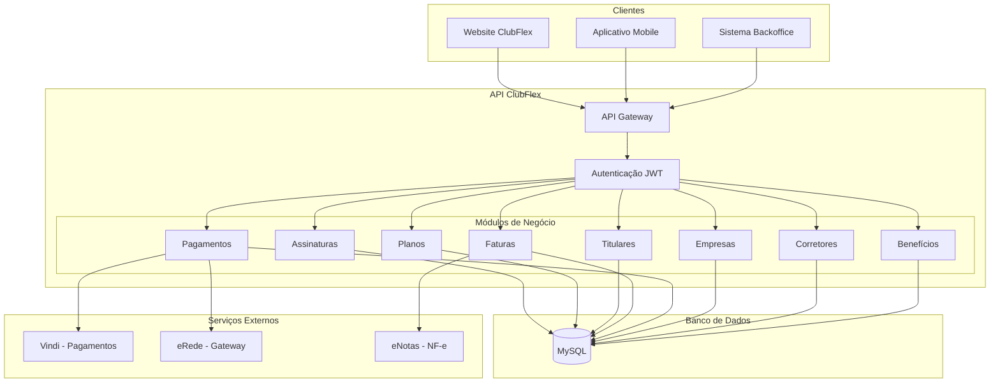
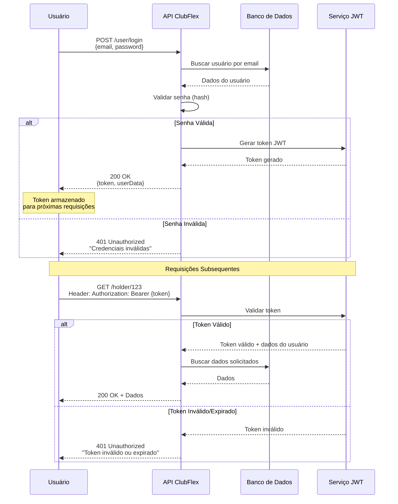
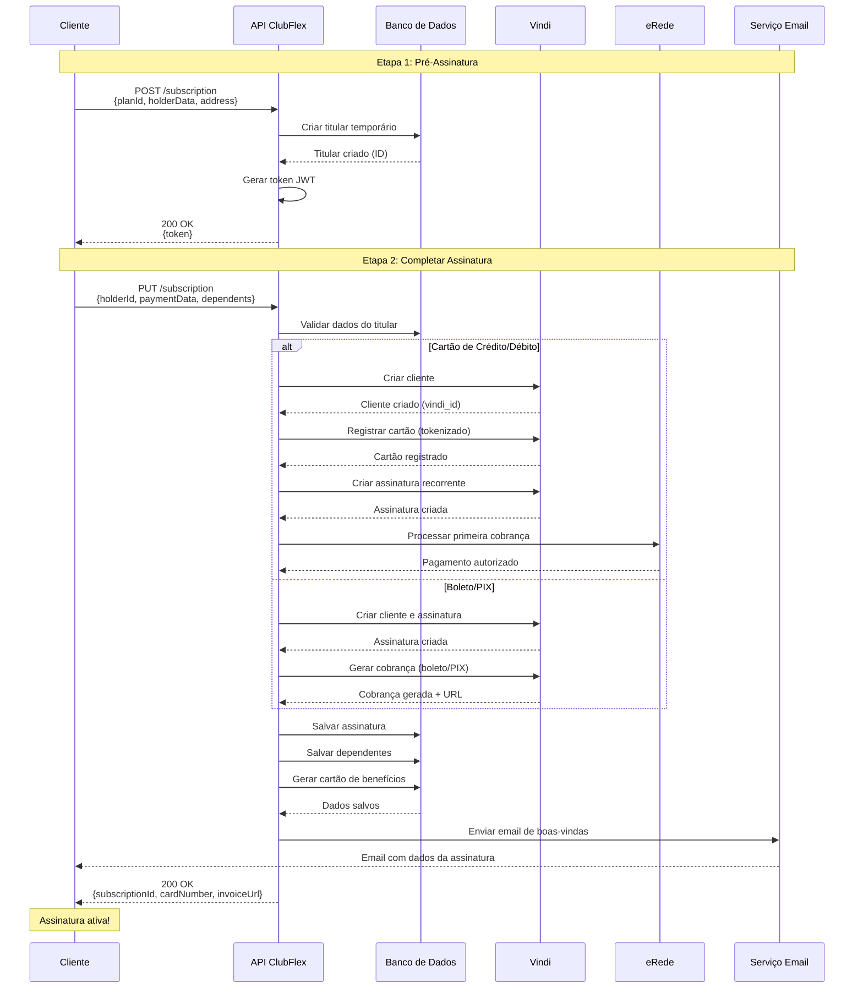
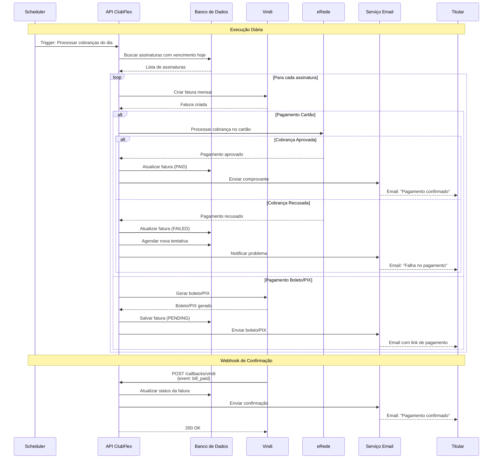
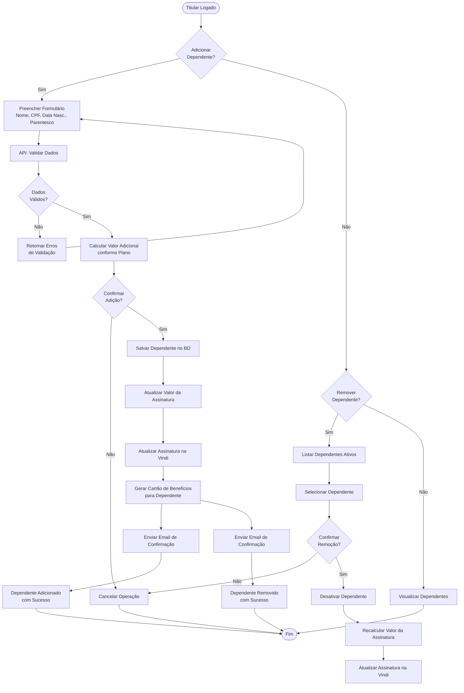
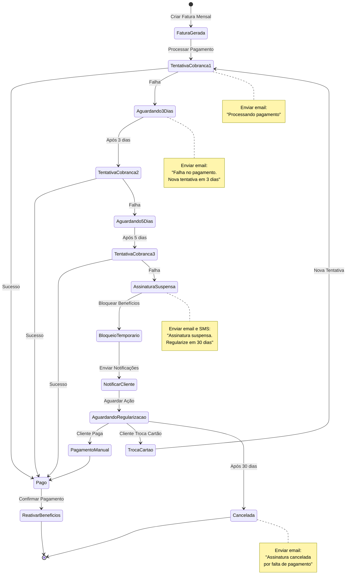
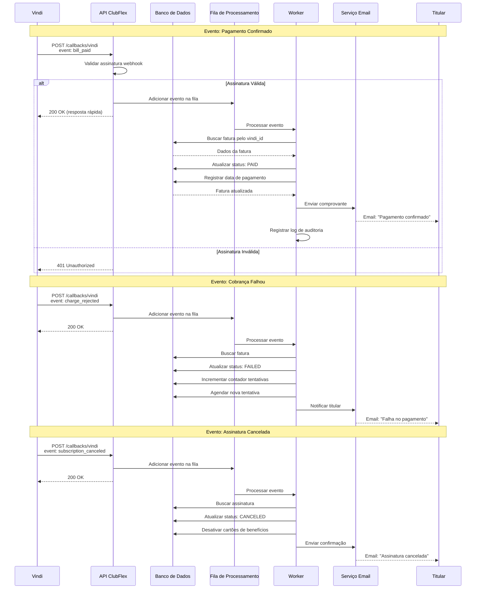

# Diagramas de Fluxo da API ClubFlex

## 📊 Visão Geral da Arquitetura



---

## 🔐 Fluxo de Autenticação



---

## 📝 Fluxo de Criação de Assinatura



---

## 💳 Fluxo de Processamento de Pagamento Recorrente



---

## 👥 Fluxo de Gestão de Dependentes



---

## 🔄 Fluxo de Tratamento de Falha de Pagamento



---

## 📊 Fluxo de Consulta e Relatórios

```mermaid
graph LR
    subgraph "Usuários"
        MANAGER[Gerente]
        BROKER[Corretor]
        ATTENDANT[Atendente]
    end
    
    subgraph "Endpoints de Consulta"
        FILTER_HOLDER[/holder/filter]
        FILTER_SUB[/subscription/filter]
        FILTER_INV[/invoice search]
        DASHBOARD[/dashboard]
    end
    
    subgraph "Processamento"
        VALIDATE{Validar<br/>Permissões}
        APPLY_FILTERS[Aplicar Filtros<br/>e Paginação]
        QUERY_DB[(Consultar<br/>Banco de Dados)]
        FORMAT[Formatar<br/>Resposta]
    end
    
    subgraph "Relatórios"
        EXCEL[Exportar Excel]
        PDF[Exportar PDF]
        CHART[Gráficos e<br/>Dashboards]
    end
    
    MANAGER --> FILTER_HOLDER
    MANAGER --> FILTER_SUB
    MANAGER --> FILTER_INV
    MANAGER --> DASHBOARD
    
    BROKER --> FILTER_HOLDER
    BROKER --> DASHBOARD
    
    ATTENDANT --> FILTER_HOLDER
    ATTENDANT --> FILTER_SUB
    ATTENDANT --> FILTER_INV
    
    FILTER_HOLDER --> VALIDATE
    FILTER_SUB --> VALIDATE
    FILTER_INV --> VALIDATE
    DASHBOARD --> VALIDATE
    
    VALIDATE -->|Autorizado| APPLY_FILTERS
    VALIDATE -->|Não Autorizado| ERROR[403 Forbidden]
    
    APPLY_FILTERS --> QUERY_DB
    QUERY_DB --> FORMAT
    
    FORMAT --> EXCEL
    FORMAT --> PDF
    FORMAT --> CHART
    
    EXCEL --> RESULT[Resultado]
    PDF --> RESULT
    CHART --> RESULT
```

---

## 🔄 Fluxo de Integração com Vindi (Webhook)



---

## 🛠️ Fluxo de Tratamento de Erros

```mermaid
graph TB
    REQUEST[Requisição HTTP]
    REQUEST --> INTERCEPT[Interceptador de Requisição]
    INTERCEPT --> VALIDATE_TOKEN{Token JWT<br/>Válido?}
    
    VALIDATE_TOKEN -->|Não| AUTH_ERROR[401 Unauthorized<br/>"Token inválido ou expirado"]
    AUTH_ERROR --> RESPONSE
    
    VALIDATE_TOKEN -->|Sim| CHECK_PERMISSION{Usuário tem<br/>Permissão?}
    CHECK_PERMISSION -->|Não| PERM_ERROR[403 Forbidden<br/>"Sem permissão para este recurso"]
    PERM_ERROR --> RESPONSE
    
    CHECK_PERMISSION -->|Sim| CONTROLLER[Controller]
    CONTROLLER --> SERVICE[Service Layer]
    SERVICE --> VALIDATE_DATA{Dados<br/>Válidos?}
    
    VALIDATE_DATA -->|Não| VALIDATION_ERROR[400 Bad Request<br/>Erros de validação]
    VALIDATION_ERROR --> RESPONSE
    
    VALIDATE_DATA -->|Sim| BUSINESS_LOGIC[Lógica de Negócio]
    BUSINESS_LOGIC --> CHECK_BUSINESS{Regras de<br/>Negócio OK?}
    
    CHECK_BUSINESS -->|Não| BUSINESS_ERROR[422 Unprocessable Entity<br/>Regra de negócio violada]
    BUSINESS_ERROR --> RESPONSE
    
    CHECK_BUSINESS -->|Sim| DATABASE[Operação no Banco]
    DATABASE --> DB_SUCCESS{Sucesso?}
    
    DB_SUCCESS -->|Não| DB_ERROR[500 Internal Server Error<br/>Erro no banco de dados]
    DB_ERROR --> LOG[Registrar Log de Erro]
    LOG --> ALERT[Alertar Equipe Técnica]
    ALERT --> RESPONSE
    
    DB_SUCCESS -->|Sim| EXTERNAL_API{Chamar API<br/>Externa?}
    
    EXTERNAL_API -->|Não| SUCCESS
    EXTERNAL_API -->|Sim| CALL_EXTERNAL[Chamada à API Externa]
    CALL_EXTERNAL --> EXT_SUCCESS{Sucesso?}
    
    EXT_SUCCESS -->|Não| EXT_ERROR[502 Bad Gateway<br/>Erro na integração externa]
    EXT_ERROR --> LOG
    
    EXT_SUCCESS -->|Sim| SUCCESS[200 OK<br/>Operação realizada com sucesso]
    SUCCESS --> RESPONSE[Retornar Resposta]
```

---

**Versão do documento:** 1.0  
**Última atualização:** Novembro 2024
