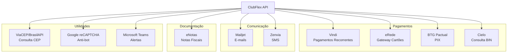
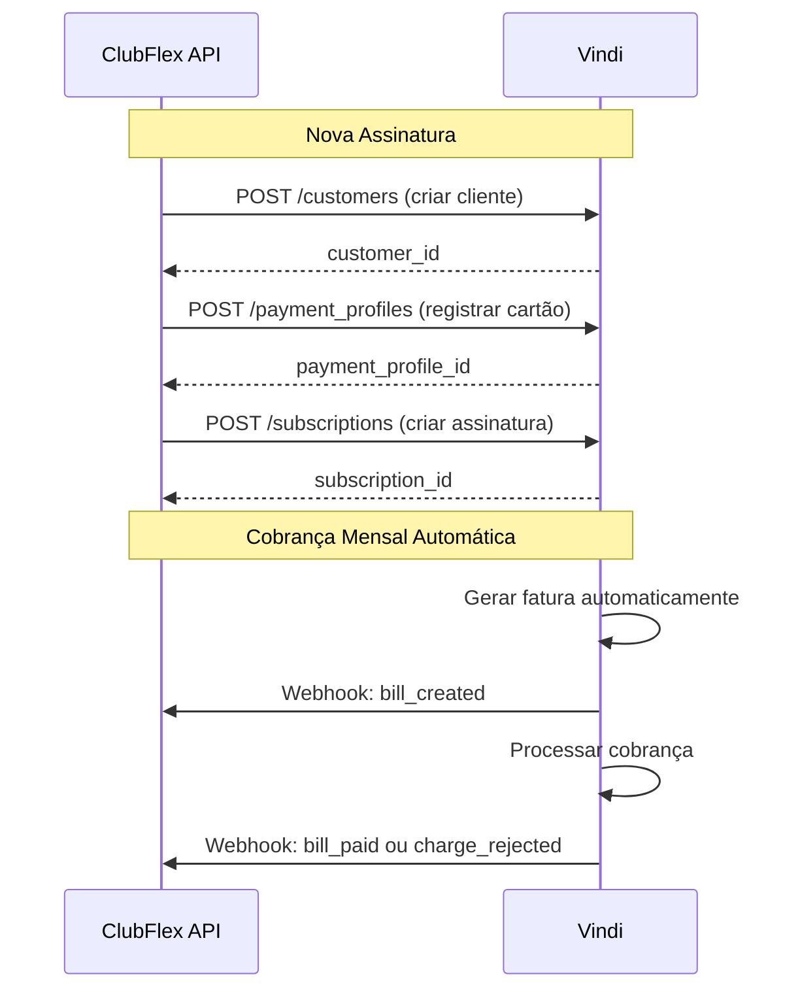
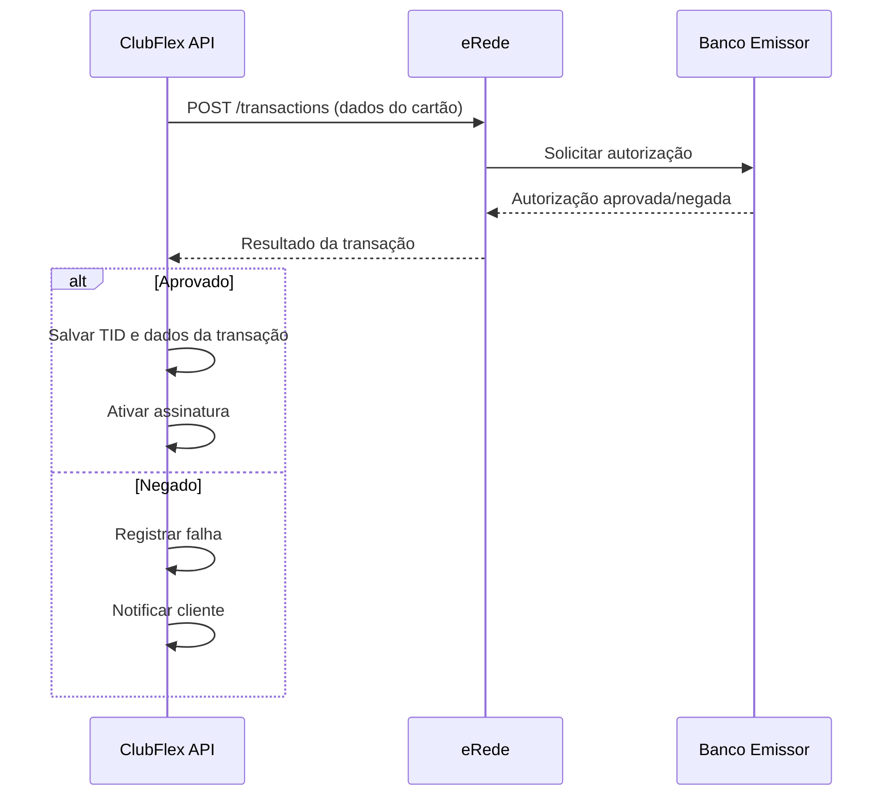
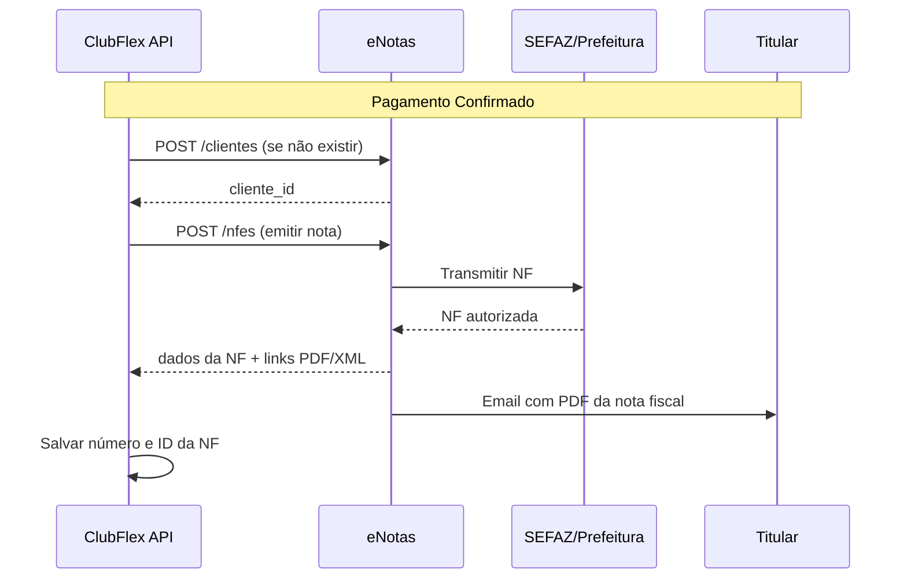
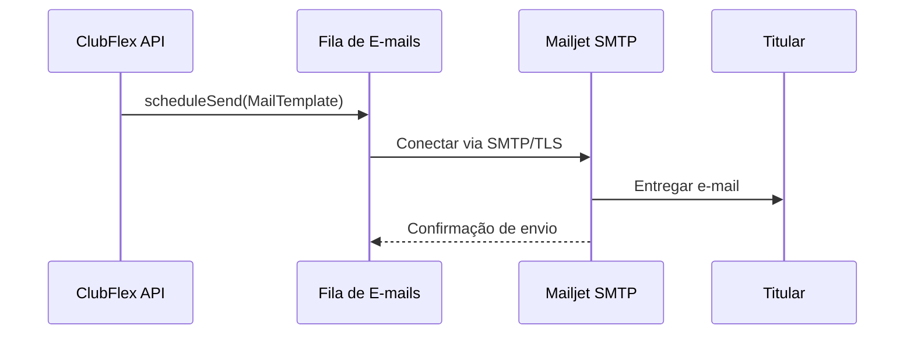
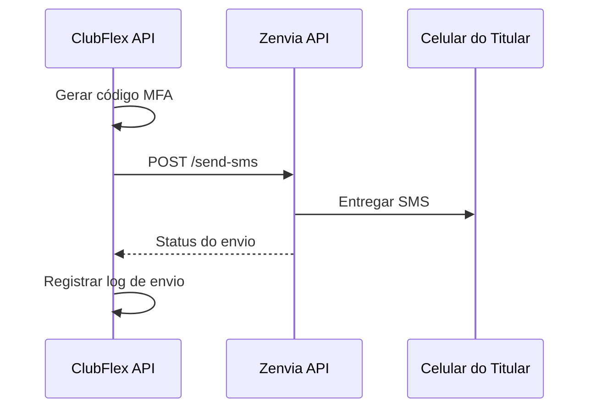
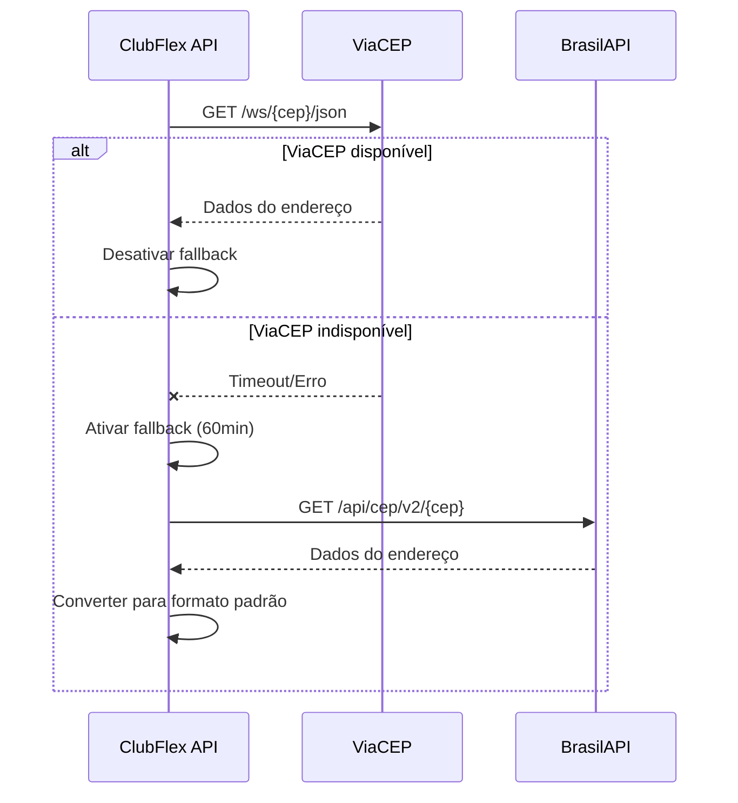

# Serviços Externos - Integrações da API ClubFlex

## 📋 Visão Geral

A API ClubFlex integra-se com diversos serviços externos para oferecer funcionalidades completas de pagamento, comunicação, validação e emissão de documentos fiscais. Este documento detalha cada integração, seu propósito e as operações utilizadas.

## 🎯 Resumo Executivo

A aplicação utiliza **10 serviços externos diferentes**, categorizados em:

### 💳 **Pagamentos e Transações Financeiras** (4 serviços)

1. **Vindi** - Plataforma principal de pagamentos recorrentes
2. **eRede** - Gateway para processamento de cartões
3. **BTG Pactual** - Geração de PIX e PIX automático
4. **Cielo** - Consulta de BIN de cartões

### 📧 **Comunicação** (2 serviços)

5. **Mailjet** - Envio de e-mails transacionais (contratos, notificações)
6. **Zenvia** - Envio de SMS (MFA, alertas)

### 📄 **Documentação Fiscal** (1 serviço)

7. **eNotas** - Emissão de notas fiscais eletrônicas

### 🔍 **Dados e Validação** (3 serviços)

8. **ViaCEP / BrasilAPI** - Consulta de endereços por CEP (com fallback automático)
9. **Google reCAPTCHA** - Proteção anti-bot em formulários
10. **Microsoft Teams** - Alertas e notificações para equipe técnica

---

## 📊 Mapa de Integrações



---

## 💳 Vindi - Plataforma de Pagamentos Recorrentes

### 🎯 Propósito

A Vindi é a principal plataforma de gestão de pagamentos recorrentes utilizada pela ClubFlex. Ela gerencia todo o ciclo de vida das assinaturas, desde a criação até o cancelamento, incluindo cobranças mensais automáticas.

### 🔗 Informações de Conexão

- **URL Base:** Configurável via `vindi.gateway.url`
- **Autenticação:** API Key (configurada em `vindi.gateway.apiKey`)
- **Tipo:** REST API
- **Formato:** JSON

### 📡 Endpoints Utilizados

#### 1. **Gestão de Clientes (Customers)**

##### `POST /customers`

**Objetivo:** Criar um novo cliente na Vindi  
**Quando é usado:** Durante a criação de uma nova assinatura

**Request:**

```json
{
  "name": "João Silva",
  "email": "joao@email.com",
  "registry_code": "12345678900",
  "phone": {
    "number": "11999999999"
  },
  "address": {
    "street": "Rua Exemplo",
    "number": "123",
    "zipcode": "01234567",
    "city": "São Paulo",
    "state": "SP",
    "country": "BR"
  }
}
```

**Response:**

```json
{
  "customer": {
    "id": 12345,
    "name": "João Silva",
    "email": "joao@email.com",
    "code": "CUST-12345"
  }
}
```

---

##### `GET /customers/{id}`

**Objetivo:** Buscar dados de um cliente  
**Quando é usado:** Para consultar informações atualizadas do cliente

**Response:**

```json
{
  "customer": {
    "id": 12345,
    "name": "João Silva",
    "email": "joao@email.com",
    "status": "active"
  }
}
```

---

##### `PUT /customers/{id}`

**Objetivo:** Atualizar dados de um cliente  
**Quando é usado:** Quando o titular atualiza suas informações cadastrais

**Request:**

```json
{
  "email": "joao.novo@email.com",
  "phone": {
    "number": "11988888888"
  }
}
```

---

#### 2. **Meios de Pagamento (Payment Profiles)**

##### `POST /payment_profiles`

**Objetivo:** Registrar um cartão de crédito/débito  
**Quando é usado:** Ao adicionar ou atualizar o cartão de pagamento

**Request:**

```json
{
  "customer_id": 12345,
  "holder_name": "JOAO SILVA",
  "card_number": "4111111111111111",
  "card_expiration": "12/2025",
  "card_cvv": "123",
  "payment_method_code": "credit_card",
  "payment_company_code": "visa"
}
```

**Response:**

```json
{
  "payment_profile": {
    "id": 67890,
    "token": "card_token_xyz123",
    "card_number_first_six": "411111",
    "card_number_last_four": "1111",
    "status": "active"
  }
}
```

---

##### `DELETE /payment_profiles/{id}`

**Objetivo:** Remover um cartão de crédito  
**Quando é usado:** Quando o cliente remove um cartão cadastrado

---

#### 3. **Assinaturas (Subscriptions)**

##### `POST /subscriptions`

**Objetivo:** Criar uma nova assinatura recorrente  
**Quando é usado:** Ao finalizar o cadastro de um novo cliente

**Request:**

```json
{
  "customer_id": 12345,
  "plan_id": 100,
  "payment_method_code": "credit_card",
  "start_at": "2024-01-15",
  "product_items": [
    {
      "product_id": 200,
      "quantity": 1
    }
  ]
}
```

**Response:**

```json
{
  "subscription": {
    "id": 54321,
    "status": "active",
    "start_at": "2024-01-15",
    "next_billing_at": "2024-02-15",
    "customer": {
      "id": 12345,
      "name": "João Silva"
    }
  }
}
```

---

##### `GET /subscriptions/{id}`

**Objetivo:** Consultar detalhes de uma assinatura  
**Quando é usado:** Para verificar status e informações da assinatura

---

##### `PUT /subscriptions/{id}`

**Objetivo:** Atualizar uma assinatura  
**Quando é usado:** Ao fazer upgrade/downgrade de plano ou alterar dados

**Request:**

```json
{
  "plan_id": 101,
  "product_items": [
    {
      "product_id": 201,
      "quantity": 1
    }
  ]
}
```

---

##### `DELETE /subscriptions/{id}`

**Objetivo:** Cancelar uma assinatura  
**Quando é usado:** Quando o cliente solicita cancelamento

---

#### 4. **Faturas (Bills)**

##### `POST /bills`

**Objetivo:** Criar uma fatura manualmente  
**Quando é usado:** Para cobranças avulsas ou correções

**Request:**

```json
{
  "customer_id": 12345,
  "payment_method_code": "bank_slip",
  "bill_items": [
    {
      "product_id": 200,
      "amount": 199.90,
      "description": "Mensalidade Plano Premium"
    }
  ],
  "due_at": "2024-01-20"
}
```

**Response:**

```json
{
  "bill": {
    "id": 98765,
    "amount": 199.90,
    "status": "pending",
    "due_at": "2024-01-20",
    "url": "https://vindi.com/faturas/98765",
    "bank_slip_url": "https://vindi.com/boletos/98765.pdf"
  }
}
```

---

##### `GET /bills/{id}`

**Objetivo:** Consultar uma fatura  
**Quando é usado:** Para verificar status de pagamento

---

##### `POST /bills/{id}/charges`

**Objetivo:** Tentar nova cobrança em uma fatura  
**Quando é usado:** Após falha de pagamento, para reprocessar

---

##### `POST /bills/{id}/refund`

**Objetivo:** Estornar uma fatura paga  
**Quando é usado:** Para devoluções e cancelamentos com reembolso

**Request:**

```json
{
  "amount": 199.90,
  "description": "Estorno por cancelamento"
}
```

---

#### 5. **Webhooks**

##### `POST /webhooks` (Configuração)

**Objetivo:** Registrar URL para receber notificações  
**Quando é usado:** Configuração inicial do sistema

**Request:**

```json
{
  "url": "https://api.clubflex.com.br/callbacks/vindi",
  "event": "bill_paid"
}
```

##### Eventos Recebidos

- `bill_paid` - Fatura paga
- `bill_created` - Fatura criada
- `charge_rejected` - Cobrança recusada
- `subscription_created` - Assinatura criada
- `subscription_canceled` - Assinatura cancelada
- `subscription_suspended` - Assinatura suspensa

**Payload de Webhook:**

```json
{
  "event": {
    "type": "bill_paid",
    "created_at": "2024-01-15T10:30:00Z",
    "data": {
      "bill": {
        "id": 98765,
        "amount": 199.90,
        "status": "paid",
        "paid_at": "2024-01-15T10:25:00Z"
      }
    }
  }
}
```

---

### 🔄 Fluxo Típico de Uso



---

## 💰 eRede - Gateway de Pagamento

### 🎯 Propósito

A eRede é utilizada como gateway de pagamento para processar transações com cartão de crédito e débito em tempo real, complementando a Vindi em cenários que exigem processamento imediato.

### 🔗 Informações de Conexão

- **URL Base:** `https://api.userede.com.br/` (produção) ou `https://sandbox.userede.com.br/` (teste)
- **Autenticação:** PV (Número do estabelecimento) + Token
- **Tipo:** REST API
- **Formato:** JSON

### 📡 Endpoints Utilizados

#### 1. **Criar Transação**

##### `POST /v1/transactions`

**Objetivo:** Processar uma transação de cartão  
**Quando é usado:** Primeira cobrança de assinatura ou pagamentos pontuais

**Request:**

```json
{
  "capture": true,
  "kind": "credit",
  "reference": "pedido123",
  "amount": 19990,
  "installments": 1,
  "cardNumber": "4111111111111111",
  "cardCvv": "123",
  "cardExpirationMonth": 12,
  "cardExpirationYear": 2025,
  "cardHolderName": "JOAO SILVA",
  "softDescriptor": "CLUBFLEX"
}
```

**Response:**

```json
{
  "returnCode": "00",
  "returnMessage": "Transação autorizada",
  "tid": "10127355487",
  "nsu": "000023",
  "authorizationCode": "123456",
  "amount": 19990,
  "cardBin": "411111",
  "last4": "1111",
  "brandName": "VISA"
}
```

---

#### 2. **Consultar Transação**

##### `GET /v1/transactions/{tid}`

**Objetivo:** Consultar status de uma transação  
**Quando é usado:** Para verificar resultado de processamento

**Response:**

```json
{
  "tid": "10127355487",
  "amount": 19990,
  "authorization": {
    "status": "APPROVED",
    "returnCode": "00"
  }
}
```

---

#### 3. **Cancelar Transação**

##### `POST /v1/transactions/{tid}/refunds`

**Objetivo:** Estornar uma transação  
**Quando é usado:** Para devoluções e cancelamentos

**Request:**

```json
{
  "amount": 19990
}
```

**Response:**

```json
{
  "returnCode": "00",
  "returnMessage": "Estorno realizado com sucesso",
  "refundId": "123456"
}
```

---

### 🔒 Códigos de Retorno Importantes

| Código | Descrição | Ação |
|--------|-----------|------|
| `00` | Transação autorizada | Sucesso |
| `05` | Não autorizada | Entrar em contato com banco |
| `51` | Limite excedido | Solicitar outro cartão |
| `54` | Cartão vencido | Atualizar dados do cartão |
| `57` | Transação não permitida | Verificar com banco |
| `91` | Emissor fora do ar | Tentar novamente mais tarde |

---

### 🔄 Fluxo Típico de Uso



---

## 📄 eNotas - Emissão de Notas Fiscais

### 🎯 Propósito

O eNotas é utilizado para emissão automática de notas fiscais eletrônicas (NF-e e NFS-e) sempre que uma cobrança é confirmada, garantindo conformidade fiscal.

### 🔗 Informações de Conexão

- **URL Base:** Configurável via `enotas.gateway.api.url`
- **Autenticação:** Token Basic Auth (configurado em `enotas.gateway.api.token`)
- **Tipo:** REST API
- **Formato:** JSON

### 📡 Endpoints Utilizados

#### 1. **Gestão de Clientes**

##### `POST /empresas/{id}/clientes`

**Objetivo:** Cadastrar cliente para emissão de NF  
**Quando é usado:** Ao criar uma nova assinatura

**Request:**

```json
{
  "nome": "João Silva",
  "email": "joao@email.com",
  "cpfCnpj": "12345678900",
  "telefone": "11999999999",
  "endereco": {
    "pais": "Brasil",
    "uf": "SP",
    "cidade": "São Paulo",
    "logradouro": "Rua Exemplo",
    "numero": "123",
    "complemento": "Apto 45",
    "bairro": "Centro",
    "cep": "01234567"
  }
}
```

**Response:**

```json
{
  "id": "cliente123",
  "nome": "João Silva",
  "cpfCnpj": "12345678900"
}
```

---

#### 2. **Emissão de Notas Fiscais**

##### `POST /empresas/{id}/nfes`

**Objetivo:** Emitir uma nota fiscal eletrônica  
**Quando é usado:** Após confirmação de pagamento de fatura

**Request:**

```json
{
  "tipo": "NFS-e",
  "idExterno": "fatura-98765",
  "cliente": {
    "cpfCnpj": "12345678900",
    "nome": "João Silva",
    "email": "joao@email.com"
  },
  "servico": {
    "descricao": "Mensalidade Plano Premium ClubFlex",
    "aliquotaIss": 5.00,
    "valorUnitario": 199.90,
    "quantidade": 1
  },
  "enviarPorEmail": true
}
```

**Response:**

```json
{
  "id": "nfe-12345",
  "numero": "12345",
  "status": "Autorizada",
  "linkDownloadPdf": "https://enotas.com.br/nfe/12345.pdf",
  "linkDownloadXml": "https://enotas.com.br/nfe/12345.xml",
  "dataEmissao": "2024-01-15T10:30:00Z"
}
```

---

#### 3. **Consulta de Notas Fiscais**

##### `GET /empresas/{id}/nfes/{nfeId}`

**Objetivo:** Consultar status e dados de uma NF  
**Quando é usado:** Para verificar emissão ou reenviar PDF

**Response:**

```json
{
  "id": "nfe-12345",
  "numero": "12345",
  "status": "Autorizada",
  "valorTotal": 199.90,
  "cliente": {
    "nome": "João Silva",
    "cpfCnpj": "12345678900"
  },
  "linkDownloadPdf": "https://enotas.com.br/nfe/12345.pdf"
}
```

---

#### 4. **Cancelamento de Notas Fiscais**

##### `POST /empresas/{id}/nfes/{nfeId}/cancelamento`

**Objetivo:** Cancelar uma nota fiscal emitida  
**Quando é usado:** Em casos de estorno ou correção

**Request:**

```json
{
  "motivo": "Estorno de pagamento por cancelamento de assinatura"
}
```

**Response:**

```json
{
  "id": "nfe-12345",
  "status": "Cancelada",
  "dataCancelamento": "2024-01-16T14:30:00Z"
}
```

---

### 🔄 Fluxo Típico de Uso



---

## � Mailjet - Envio de E-mails

### 🎯 Propósito

O Mailjet é utilizado para envio de e-mails transacionais como confirmações de contrato, notificações de pagamento, alertas e comunicações com os clientes.

### 🔗 Informações de Conexão

- **SMTP Host:** `in-v3.mailjet.com`
- **Autenticação:** Usuario/Senha (configurado em `smtp.user` e `smtp.passwd`)
- **Porta:** 587 (TLS) / 465 (SSL)
- **Protocolo:** SMTP com StartTLS

### 📨 Tipos de E-mails Enviados

#### 1. **Contrato de Fidelidade**

**Quando é enviado:** Após criação de uma nova assinatura  
**Template:** `contrato-fidelidade.html` ou `contrato-sem-fidelidade.html`

**Dados incluídos:**

- Número da assinatura
- Nome e CPF do titular
- Plano contratado
- Lista de dependentes
- Valor total
- Data de início do contrato
- Taxa de adesão
- Periodicidade de pagamento
- Período de fidelidade

**Destinatário:** Email do titular cadastrado

---

#### 2. **E-mails Customizados**

A aplicação utiliza templates HTML para envio de e-mails personalizados através do `MailService`.

**Recursos:**

- Suporte a templates HTML
- Substituição de parâmetros dinâmicos
- Encoding UTF-8
- TLS 1.2 para segurança
- Timeout configurável (4 segundos)

**Formato de envio:**

```java
MailTemplate mail = new MailTemplateBuilder()
    .subject("Assunto do email")
    .template("nome-template.html")
    .addParam("parametro1", "valor1")
    .addParam("parametro2", "valor2")
    .to("destinatario@email.com")
    .build();
```

---

### 🔄 Fluxo de Envio



---

## 📱 Zenvia - Envio de SMS

### 🎯 Propósito

A Zenvia é utilizada para envio de mensagens SMS, principalmente para autenticação multifator (MFA) e notificações críticas via celular.

### 🔗 Informações de Conexão

- **API Client:** Zenvia REST API
- **Autenticação:** Username + Password (configurado em `zenvia.api.username` e `zenvia.api.password`)
- **Remetente:** Configurável via `zenvia.api.remetente` (ex: "ClubFlex" ou "SEGMEDIC-ClubFlex")
- **Timeout:** 1000ms

### 📲 Funcionalidades

#### 1. **Envio de SMS**

**Quando é usado:**

- Códigos de verificação MFA
- Notificações de pagamento
- Alertas críticos

**Formato:**

```java
smsService.send(phoneNumber, message);
```

**Processo:**

- Remove formatação do telefone (mantém apenas números)
- Adiciona código do país (+55)
- Envia via API REST da Zenvia

**Response da API:**

```json
{
  "statusCode": "00",
  "statusDescription": "Ok",
  "detailCode": "000",
  "detailDescription": "Message Sent"
}
```

---

### 🔄 Fluxo de Envio



---

## 🌐 ViaCEP / BrasilAPI - Consulta de CEP

### 🎯 Propósito

Consulta automática de endereços através do CEP para facilitar o preenchimento de cadastros. Implementa sistema de fallback automático entre duas APIs para garantir disponibilidade.

### 🔗 Informações de Conexão

#### ViaCEP (Principal)

- **URL:** `https://viacep.com.br/ws/{cep}/json/`
- **Autenticação:** Não requer
- **Tipo:** REST API pública

#### BrasilAPI (Fallback)

- **URL:** `https://brasilapi.com.br/api/cep/v2/{cep}`
- **Autenticação:** Não requer
- **Tipo:** REST API pública

### 🔄 Sistema de Fallback Inteligente

**Funcionamento:**

1. Por padrão, utiliza ViaCEP
2. Se ViaCEP falhar, ativa fallback para BrasilAPI automaticamente
3. Fallback permanece ativo por 60 minutos
4. Após o período, tenta retornar ao ViaCEP
5. Se ViaCEP voltar a funcionar, desativa fallback imediatamente

**Request:**

```
GET https://viacep.com.br/ws/01310100/json/
```

**Response (ambas as APIs - normalizado):**

```json
{
  "street": "Avenida Paulista",
  "neighborhood": "Bela Vista",
  "city": "São Paulo",
  "uf": "SP"
}
```

---

### 🔄 Fluxo com Fallback



---

## 🔐 Google reCAPTCHA - Proteção Anti-Bot

### 🎯 Propósito

Validação de captcha para proteger formulários contra bots e automações maliciosas, especialmente em cadastros e login.

### 🔗 Informações de Conexão

- **URL:** `https://www.google.com/recaptcha/api/siteverify`
- **Autenticação:** Secret Key (configurada em `google.recaptcha.key.secret`)
- **Tipo:** REST API
- **Versão:** reCAPTCHA v2/v3

### 🛡️ Validação

**Request:**

```
GET https://www.google.com/recaptcha/api/siteverify?secret={serverKey}&response={captchaResponse}
```

**Response:**

```json
{
  "success": true,
  "challenge_ts": "2024-01-15T10:30:00Z",
  "hostname": "api.clubflex.com.br",
  "score": 0.9
}
```

**Modo de Escape:**
O sistema permite configurar um valor de escape para testes (`google.recaptcha.response.escape`), que bypassa a validação em ambientes de desenvolvimento/teste.

---

## 🏦 BTG Pactual - PIX Automático

### 🎯 Propósito

Integração bancária com BTG Pactual para geração de cobranças PIX (QR Code) e autorização de PIX automático (débito recorrente).

### 🔗 Informações de Conexão

- **URL Base:** `https://api.empresas.btgpactual.com/v1` (produção) ou `https://api.sandbox.empresas.btgpactual.com/v1` (sandbox)
- **Autenticação:** Token de acesso
- **Tipo:** REST API
- **Formato:** JSON

### 📡 Endpoints Utilizados

#### 1. **Criar Cobrança PIX**

##### `POST /pix`

**Objetivo:** Gerar QR Code PIX para pagamento  
**Quando é usado:** Ao gerar fatura para pagamento via PIX

**Request:**

```json
{
  "pixKey": "34314826000147",
  "amount": 199.90,
  "expiresIn": 3600,
  "invoiceId": 12345
}
```

**Response:**

```json
{
  "chargeId": "pix_abc123",
  "emv": "00020126360014BR.GOV.BCB.PIX...",
  "qrCode": "data:image/png;base64,iVBORw0KGgo...",
  "expiresAt": "2024-01-15T11:30:00Z"
}
```

---

#### 2. **Consultar Cobrança PIX**

##### `GET /pix/{chargeId}`

**Objetivo:** Verificar status de pagamento  
**Quando é usado:** Para confirmar se PIX foi pago

**Response:**

```json
{
  "chargeId": "pix_abc123",
  "status": "PAID",
  "amount": 199.90,
  "paidAt": "2024-01-15T10:45:00Z"
}
```

---

#### 3. **Criar Autorização PIX Automático**

##### `POST /pix/automatic/authorize`

**Objetivo:** Criar autorização para débito recorrente via PIX  
**Quando é usado:** Para assinaturas com pagamento via PIX automático

**Request:**

```json
{
  "pixKey": "34314826000147",
  "amount": 199.90,
  "description": "Assinatura ClubFlex Premium",
  "startDate": "2024-02-01",
  "frequency": "MONTHLY"
}
```

**Response:**

```json
{
  "authorizationId": "auth_xyz789",
  "status": "PENDING_APPROVAL",
  "qrCode": "data:image/png;base64,..."
}
```

---

#### 4. **Agendar PIX Automático**

##### `POST /pix/automatic/schedule`

**Objetivo:** Agendar cobrança de PIX automático  
**Quando é usado:** Para cobranças mensais recorrentes

**Request:**

```json
{
  "authorizationId": "auth_xyz789",
  "amount": 199.90,
  "scheduleDate": "2024-02-15",
  "description": "Mensalidade Fevereiro/2024"
}
```

---

#### 5. **Cancelar Autorização PIX Automático**

##### `DELETE /pix/automatic/{authorizationId}`

**Objetivo:** Cancelar autorização de débito recorrente  
**Quando é usado:** Ao cancelar assinatura

---

## 💳 Cielo - Consulta BIN de Cartão

### 🎯 Propósito

Consulta do BIN (Bank Identification Number) para identificar bandeira, tipo de cartão e banco emissor.

### 🔗 Informações de Conexão

- **URL Base:** `https://apiquery.cieloecommerce.cielo.com.br/1/` (produção) ou `https://apiquerysandbox.cieloecommerce.cielo.com.br/1/` (sandbox)
- **Autenticação:** Merchant ID + Merchant Key
- **Tipo:** REST API
- **Retry:** 3 tentativas com backoff de 10 segundos

### 📡 Endpoint Utilizado

##### `GET /cardBin/{firstSixDigits}`

**Objetivo:** Identificar informações do cartão pelos primeiros 6 dígitos  
**Quando é usado:** Durante cadastro de cartão para validação e UX

**Request:**

```
GET https://apiquery.cieloecommerce.cielo.com.br/1/cardBin/411111
```

**Response:**

```json
{
  "Status": "00",
  "Provider": "VISA",
  "CardType": "Crédito",
  "ForeignCard": false,
  "CorporateCard": false,
  "Issuer": "Banco Exemplo",
  "IssuerCode": "001"
}
```

**Códigos de Status:**

- `00` - BIN válido encontrado
- `01` - BIN não encontrado
- `02` - BIN inválido

---

## 🔔 Microsoft Teams - Alertas e Notificações

### 🎯 Propósito

Envio de alertas e notificações para canal do Microsoft Teams para monitoramento da equipe técnica.

### 🔗 Informações de Conexão

- **Webhook URL:** Configurável via `teams.webhook`
- **Tipo:** Webhook POST
- **Formato:** JSON (Adaptive Cards)

### 📢 Funcionalidades

**Quando é usado:**

- Erros críticos no sistema
- Falhas em integrações
- Alertas de transações suspeitas
- Notificações de alto volume de falhas

**Formato de Mensagem:**

```json
{
  "attachments": [
    {
      "contentType": "application/vnd.microsoft.card.adaptive",
      "content": {
        "type": "AdaptiveCard",
        "body": [
          {
            "type": "TextBlock",
            "text": "Alerta do Sistema ClubFlex"
          },
          {
            "type": "TextBlock",
            "text": "Erro ao processar pagamento"
          }
        ]
      }
    }
  ]
}
```

---

## �📊 Resumo Comparativo das Integrações

| Serviço | Função Principal | Frequência de Uso | Criticidade |
|---------|------------------|-------------------|-------------|
| **Vindi** | Gestão de pagamentos recorrentes | Diária (cobranças automáticas) | 🔴 Alta |
| **eRede** | Processamento de cartões | Por transação (sob demanda) | 🟡 Média-Alta |
| **eNotas** | Emissão de notas fiscais | Após cada pagamento | 🟡 Média |
| **Mailjet** | Envio de e-mails transacionais | Diária (confirmações/alertas) | 🟡 Média |
| **Zenvia** | Envio de SMS (MFA/notificações) | Por autenticação/alerta | 🟡 Média |
| **ViaCEP/BrasilAPI** | Consulta de endereços | Por cadastro | 🟢 Baixa |
| **Google reCAPTCHA** | Proteção anti-bot | Por formulário | 🟡 Média |
| **BTG Pactual** | PIX e PIX automático | Por transação PIX | 🟡 Média-Alta |
| **Cielo BIN Query** | Identificação de cartões | Por cadastro de cartão | 🟢 Baixa |
| **Microsoft Teams** | Alertas para equipe técnica | Por evento crítico | 🟢 Baixa |

---

## 🔐 Boas Práticas de Integração

### 1. **Tratamento de Erros**

- Sempre implementar retry com backoff exponencial para falhas temporárias
- Registrar logs detalhados de todas as requisições e respostas
- Implementar circuit breaker para proteger contra falhas em cascata
- Timeout configurável para cada integração (ex: 4s para e-mail, 1s para SMS)

### 2. **Segurança**

- Nunca armazenar dados sensíveis de cartão (PCI-DSS compliance)
- Utilizar tokens fornecidos pela Vindi/eRede para armazenar referências de cartões
- Criptografar todas as comunicações com TLS 1.2+
- Validar assinaturas de webhooks
- Manter credenciais em variáveis de ambiente ou cofres de segredos
- Implementar reCAPTCHA em formulários públicos

### 3. **Performance**

- Implementar cache para consultas frequentes (ex: dados de planos)
- Utilizar processamento assíncrono para webhooks e envio de e-mails
- Implementar fila de processamento para operações não críticas (emails, SMS)
- Sistema de fallback automático para serviços redundantes (ViaCEP/BrasilAPI)
- Retry inteligente com backoff (ex: Cielo com 3 tentativas e 10s de delay)

### 4. **Monitoramento**

- Monitorar taxa de sucesso/falha das integrações
- Alertar quando taxa de erro ultrapassar threshold
- Acompanhar tempo de resposta das APIs externas
- Implementar health checks periódicos
- Enviar alertas críticos para Microsoft Teams
- Registrar logs estruturados de todas as chamadas externas

### 5. **Disponibilidade**

- Implementar fallback entre serviços similares (ViaCEP ↔ BrasilAPI)
- Sistema de fila para retry automático de operações falhadas
- Não bloquear operações críticas por falhas em serviços secundários
- Timeouts adequados para evitar bloqueio de threads

---

## 🚨 Contingência

### Vindi Indisponível

- ⚠️ **Impacto:** Alto - Sistema de cobranças comprometido
- 🔧 **Ação:**
  - Adiar cobranças automáticas até restabelecimento
  - Permitir apenas consultas (modo somente leitura)
  - Notificar equipe técnica via Microsoft Teams imediatamente
  - Oferecer PIX como alternativa temporária

### eRede Indisponível

- ⚠️ **Impacto:** Médio - Processamento de cartões comprometido
- 🔧 **Ação:**
  - Utilizar gateway alternativo se configurado
  - Oferecer métodos de pagamento alternativos (boleto, PIX via BTG)
  - Processar manualmente após restabelecimento
  - Enfileirar tentativas para retry automático

### eNotas Indisponível

- ⚠️ **Impacto:** Baixo - Emissão de NF pode ser adiada
- 🔧 **Ação:**
  - Enfileirar emissões pendentes
  - Processar automaticamente quando serviço voltar
  - Não bloquear ativação de assinaturas (NF pode ser emitida posteriormente)
  - Enviar NF por email assim que disponível

### Mailjet Indisponível

- ⚠️ **Impacto:** Médio - E-mails não enviados temporariamente
- 🔧 **Ação:**
  - Enfileirar e-mails para envio posterior
  - Não bloquear operações críticas
  - Retry automático após 5, 15, 30 minutos
  - Alertar equipe se indisponibilidade > 1 hora

### Zenvia Indisponível

- ⚠️ **Impacto:** Médio - SMS (MFA) comprometido
- 🔧 **Ação:**
  - Oferecer autenticação alternativa (e-mail)
  - Enfileirar SMS não críticos
  - Alertar equipe técnica
  - Considerar provedor de SMS alternativo

### ViaCEP Indisponível

- ⚠️ **Impacto:** Baixo - Fallback automático ativo
- 🔧 **Ação:**
  - Sistema automaticamente utiliza BrasilAPI
  - Fallback permanece ativo por 60 minutos
  - Retorna para ViaCEP automaticamente quando disponível
  - Sem intervenção manual necessária

### BTG Pactual Indisponível

- ⚠️ **Impacto:** Médio - PIX comprometido
- 🔧 **Ação:**
  - Oferecer cartão de crédito como alternativa
  - Enfileirar cobranças PIX para retry
  - Notificar clientes sobre indisponibilidade temporária de PIX
  - Processar autorizações pendentes quando restabelecer

### Google reCAPTCHA Indisponível

- ⚠️ **Impacto:** Baixo-Médio - Formulários sem proteção anti-bot
- 🔧 **Ação:**
  - Utilizar modo de escape temporário para não bloquear cadastros
  - Aumentar monitoramento de atividades suspeitas
  - Implementar validações alternativas (rate limiting, IP blocking)
  - Alertar equipe de segurança

### Cielo BIN Query Indisponível

- ⚠️ **Impacto:** Baixo - Apenas UX comprometido
- 🔧 **Ação:**
  - Permitir cadastro de cartão sem validação de BIN
  - Retry com backoff já implementado (3 tentativas)
  - Validação será feita no gateway de pagamento
  - Sem bloqueio de operações

### Microsoft Teams Indisponível

- ⚠️ **Impacto:** Muito Baixo - Apenas notificações internas
- 🔧 **Ação:**
  - Alertas não são enviados mas operações continuam
  - Registrar em logs para análise posterior
  - Considerar canal alternativo de alertas (e-mail, Slack)

---

## 📞 Suporte e Documentação

### Vindi

- **Documentação:** <https://vindi.github.io/api-docs/>
- **Suporte:** <suporte@vindi.com.br>
- **Status:** <https://status.vindi.com.br>
- **Configuração:**
  - `vindi.gateway.url` - URL da API
  - `vindi.gateway.apiKey` - Chave de autenticação

### eRede

- **Documentação:** <https://www.userede.com.br/desenvolvedores>
- **Suporte:** <desenvolvedores@userede.com.br>
- **Configuração:**
  - URL base definida no client
  - PV e Token de autenticação

### eNotas

- **Documentação:** <https://api.enotasgw.com.br/docs>
- **Suporte:** <suporte@enotas.com.br>
- **Configuração:**
  - `enotas.gateway.api.url` - URL da API
  - `enotas.gateway.api.token` - Token de autenticação

### Mailjet

- **Documentação:** <https://dev.mailjet.com/>
- **Suporte:** <api@mailjet.com>
- **Status:** <https://status.mailjet.com/>
- **Configuração:**
  - `smtp.host` - in-v3.mailjet.com
  - `smtp.user` - API Key
  - `smtp.passwd` - Secret Key

### Zenvia

- **Documentação:** <https://zenvia.github.io/zenvia-api-docs/>
- **Suporte:** <suporte@zenvia.com>
- **Configuração:**
  - `zenvia.api.username` - Username da API
  - `zenvia.api.password` - Senha da API
  - `zenvia.api.remetente` - Nome do remetente

### ViaCEP

- **Documentação:** <https://viacep.com.br/>
- **Tipo:** API pública (sem autenticação)
- **URL:** <https://viacep.com.br/ws/{cep}/json/>

### BrasilAPI

- **Documentação:** <https://brasilapi.com.br/docs>
- **GitHub:** <https://github.com/BrasilAPI/BrasilAPI>
- **Tipo:** API pública (sem autenticação)
- **URL:** <https://brasilapi.com.br/api/cep/v2/{cep}>

### Google reCAPTCHA

- **Documentação:** <https://developers.google.com/recaptcha/docs/>
- **Console:** <https://www.google.com/recaptcha/admin>
- **Configuração:**
  - `google.recaptcha.key.secret` - Secret Key
  - `google.recaptcha.response.escape` - Valor de escape para testes

### BTG Pactual

- **Documentação:** <https://developers.btgpactual.com/>
- **Suporte:** <api@btgpactual.com>
- **Configuração:**
  - `btg.api.url` - URL da API (sandbox ou produção)
  - `btg.api.companyId` - ID da empresa
  - `btg.api.pixKey` - Chave PIX
  - `btg.api.pixExpireIn` - Tempo de expiração (segundos)

### Cielo

- **Documentação:** <https://developercielo.github.io/manual/cielo-ecommerce>
- **Suporte:** <cieloecommerce@cielo.com.br>
- **Configuração:**
  - `cielo.merchant.id` - Merchant ID
  - `cielo.merchant.key` - Merchant Key
  - URLs: Produção vs Sandbox automaticamente selecionadas

### Microsoft Teams

- **Documentação:** <https://docs.microsoft.com/en-us/microsoftteams/platform/webhooks-and-connectors/>
- **Configuração:**
  - `teams.webhook` - URL do webhook do canal

---

## ⚙️ Variáveis de Configuração

### Arquivo: `application.properties` / `application-{env}.properties`

```properties
# Vindi
vindi.gateway.url=${VINDI_GATEWAY_URL}
vindi.gateway.apiKey=${VINDI_GATEWAY_API_KEY}

# eNotas
enotas.gateway.api.url=${ENOTAS_GATEWAY_API_URL}
enotas.gateway.api.token=${ENOTAS_GATEWAY_API_TOKEN}

# Email (Mailjet)
smtp.host=in-v3.mailjet.com
smtp.user=${MAILJET_API_KEY}
smtp.passwd=${MAILJET_SECRET_KEY}

# SMS (Zenvia)
zenvia.api.username=segmedic.web
zenvia.api.password=${ZENVIA_PASSWORD}
zenvia.api.remetente=ClubFlex

# reCAPTCHA
google.recaptcha.key.secret=${RECAPTCHA_SECRET_KEY}
google.recaptcha.response.escape=false

# BTG Pactual
btg.api.url=${BTG_API_URL}
btg.api.companyId=${BTG_COMPANY_ID}
btg.api.pixKey=${BTG_API_PIX_KEY}
btg.api.pixExpireIn=${BTG_API_PIX_EXPIRE_IN}

# Cielo
cielo.merchant.id=${CIELO_MERCHANT_ID}
cielo.merchant.key=${CIELO_MERCHANT_KEY}

# Microsoft Teams
teams.webhook=${TEAMS_WEBHOOK_URL}
```

---

## 📈 Métricas e SLA

### SLA Esperado dos Serviços

| Serviço | Disponibilidade | Tempo de Resposta | Suporte |
|---------|----------------|-------------------|---------|
| Vindi | 99.9% | < 2s | 24x7 |
| eRede | 99.5% | < 3s | Horário comercial |
| eNotas | 99.0% | < 5s | Horário comercial |
| Mailjet | 99.9% | < 10s (async) | 24x7 |
| Zenvia | 99.5% | < 2s | Horário comercial |
| ViaCEP | 95.0% | < 1s | Sem suporte |
| BrasilAPI | 95.0% | < 1s | Comunidade |
| Google reCAPTCHA | 99.9% | < 500ms | Comunidade |
| BTG Pactual | 99.5% | < 2s | Horário comercial |
| Cielo | 99.5% | < 1s | Horário comercial |
| Microsoft Teams | 99.9% | < 5s (async) | Microsoft 365 |

### Métricas a Monitorar

**Para cada integração:**

- ✅ Taxa de sucesso (%)
- ⏱️ Tempo médio de resposta
- 🔁 Número de retries
- ❌ Taxa de erro por tipo
- 📊 Volume de chamadas por hora/dia
- 🚨 Alertas de threshold

---

## 🔍 Troubleshooting

### Problema: E-mails não estão sendo enviados

**Possíveis causas:**

1. Credenciais Mailjet inválidas
2. TLS não configurado corretamente
3. Timeout muito baixo
4. Email do destinatário inválido

**Solução:**

```bash
# Verificar logs
tail -f logs/application.log | grep MailService

# Testar conectividade SMTP
telnet in-v3.mailjet.com 587

# Validar configuração
echo $MAILJET_API_KEY
echo $MAILJET_SECRET_KEY
```

---

### Problema: SMS não chegando

**Possíveis causas:**

1. Número de telefone inválido
2. Formato incorreto (deve ser 55+DDD+número)
3. Credenciais Zenvia incorretas
4. Timeout de 1s muito baixo

**Solução:**

```java
// Verificar formato do número
String formatted = "55".concat(phone.replaceAll("[^0-9]", ""));
log.info("Sending SMS to: {}", formatted);

// Verificar resposta da Zenvia nos logs
```

---

### Problema: Consulta de CEP falhando

**Possíveis causas:**

1. Ambos ViaCEP e BrasilAPI fora do ar
2. CEP inválido
3. Timeout de rede

**Solução:**

- Sistema de fallback automático já implementado
- Verificar logs para entender qual API falhou
- Validar formato do CEP (8 dígitos)

---

### Problema: PIX não sendo gerado (BTG)

**Possíveis causas:**

1. Chave PIX inválida
2. Valor menor que mínimo permitido
3. Token de autenticação expirado

**Solução:**

```bash
# Verificar configuração
echo $BTG_API_PIX_KEY
echo $BTG_API_URL

# Testar API manualmente
curl -X POST $BTG_API_URL/pix \
  -H "Authorization: Bearer $TOKEN" \
  -d '{"pixKey":"...","amount":10.00}'
```

---

### Problema: reCAPTCHA sempre falhando

**Possíveis causas:**

1. Secret Key incorreta
2. Response do frontend inválido
3. Domínio não autorizado

**Solução:**

- Verificar `google.recaptcha.key.secret`
- Validar se o domínio está registrado no Google reCAPTCHA Admin
- Usar modo de escape para testes: `google.recaptcha.response.escape`

---

**Versão do documento:** 1.0  
**Última atualização:** Novembro 2024
