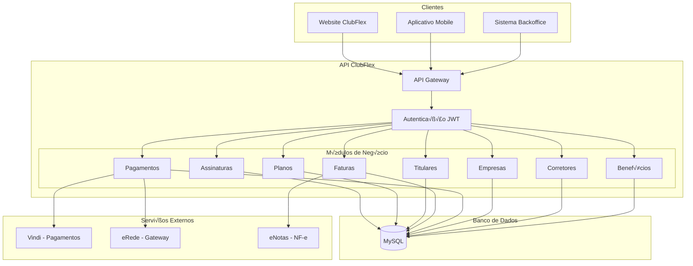
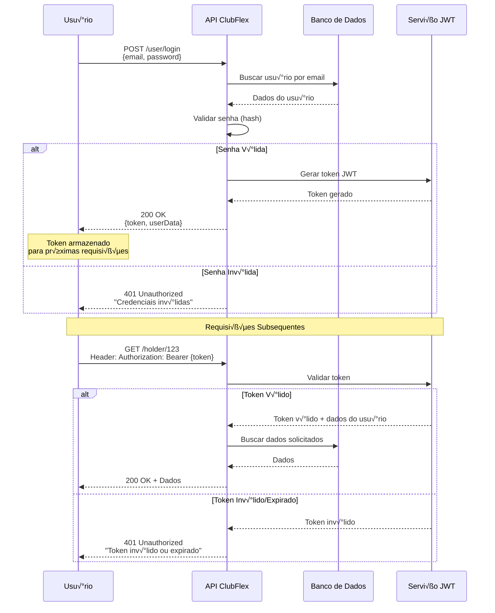
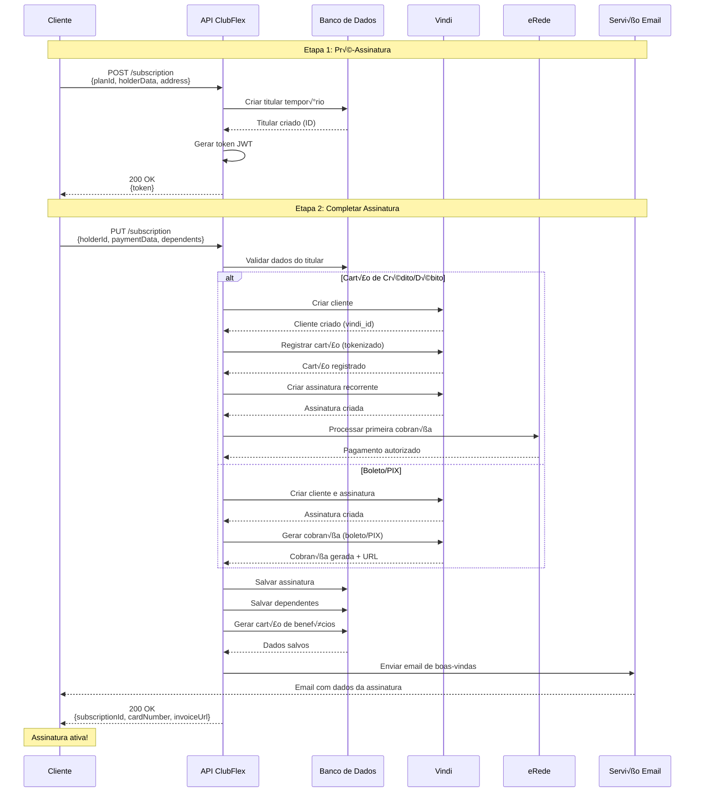
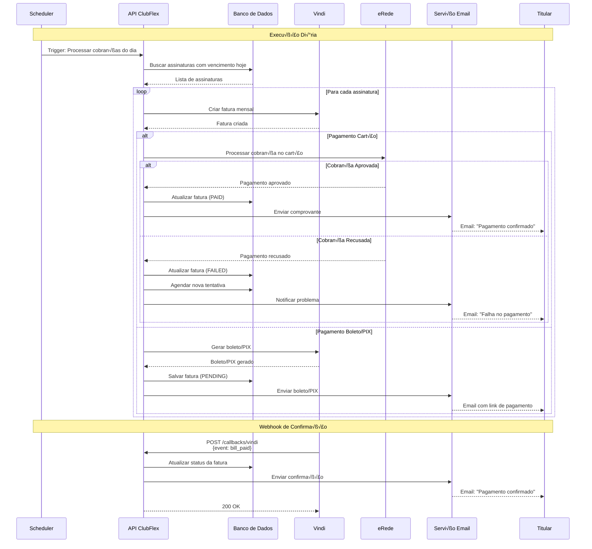
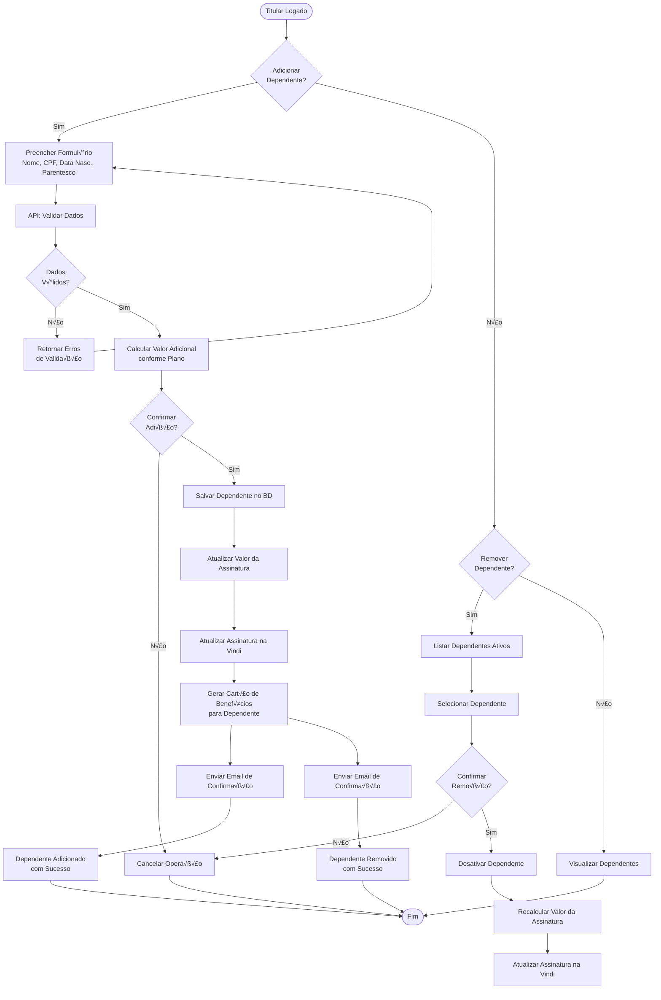
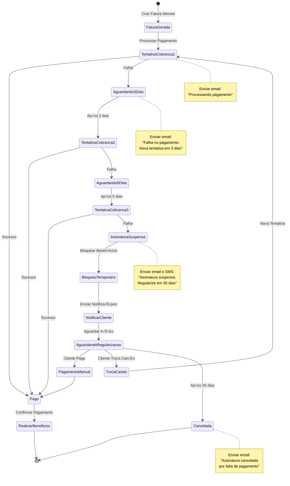
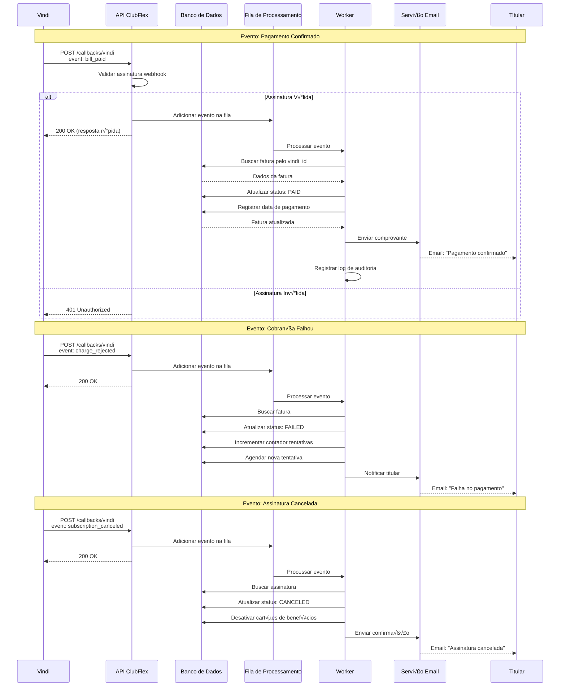

# Diagramas de Fluxo da API ClubFlex

## üìä Vis√£o Geral da Arquitetura

```mermaid
graph TB
    subgraph "Clientes"
        WEB[Website ClubFlex]
        APP[Aplicativo Mobile]
        BACKOFFICE[Sistema Backoffice]
    end
    
    subgraph "API ClubFlex"
        GATEWAY[API Gateway]
        AUTH[Autenticação JWT]
        
        subgraph "Módulos de Negócio"
            SUB[Assinaturas]
            PLAN[Planos]
            HOLDER[Titulares]
            INV[Faturas]
            PAY[Pagamentos]
            COMPANY[Empresas]
            BROKER[Corretores]
            BENEFIT[Benefícios]
        end
    end
    
    subgraph "Banco de Dados"
        DB[(MySQL)]
    end
    
    subgraph "Serviços Externos"
        VINDI[Vindi - Pagamentos]
        EREDE[eRede - Gateway]
        ENOTAS[eNotas - NF-e]
    end
    
    WEB --> GATEWAY
    APP --> GATEWAY
    BACKOFFICE --> GATEWAY
    
    GATEWAY --> AUTH
    AUTH --> SUB
    AUTH --> PLAN
    AUTH --> HOLDER
    AUTH --> INV
    AUTH --> PAY
    AUTH --> COMPANY
    AUTH --> BROKER
    AUTH --> BENEFIT
    
    SUB --> DB
    PLAN --> DB
    HOLDER --> DB
    INV --> DB
    PAY --> DB
    COMPANY --> DB
    BROKER --> DB
    BENEFIT --> DB
    
    PAY --> VINDI
    PAY --> EREDE
    INV --> ENOTAS
```

---

## 🔐 Fluxo de Autenticação

```mermaid
sequenceDiagram
    participant U as Usu√°rio
    participant API as API ClubFlex
    participant DB as Banco de Dados
    participant JWT as Serviço JWT
    
    U->>API: POST /user/login<br/>{email, password}
    API->>DB: Buscar usu√°rio por email
    DB-->>API: Dados do usu√°rio
    API->>API: Validar senha (hash)
    
    alt Senha V√°lida
        API->>JWT: Gerar token JWT
        JWT-->>API: Token gerado
        API-->>U: 200 OK<br/>{token, userData}
        Note over U: Token armazenado<br/>para próximas requisições
    else Senha Inv√°lida
        API-->>U: 401 Unauthorized<br/>"Credenciais inv√°lidas"
    end
    
    Note over U,JWT: Requisições Subsequentes
    U->>API: GET /holder/123<br/>Header: Authorization: Bearer {token}
    API->>JWT: Validar token
    
    alt Token V√°lido
        JWT-->>API: Token v√°lido + dados do usu√°rio
        API->>DB: Buscar dados solicitados
        DB-->>API: Dados
        API-->>U: 200 OK + Dados
    else Token Inv√°lido/Expirado
        JWT-->>API: Token inv√°lido
        API-->>U: 401 Unauthorized<br/>"Token inv√°lido ou expirado"
    end
```

---

## 📝 Fluxo de Criação de Assinatura

```mermaid
sequenceDiagram
    participant C as Cliente
    participant API as API ClubFlex
    participant DB as Banco de Dados
    participant VINDI as Vindi
    participant EREDE as eRede
    participant EMAIL as Serviço Email
    
    Note over C,EMAIL: Etapa 1: Pré-Assinatura
    C->>API: POST /subscription<br/>{planId, holderData, address}
    API->>DB: Criar titular tempor√°rio
    DB-->>API: Titular criado (ID)
    API->>API: Gerar token JWT
    API-->>C: 200 OK<br/>{token}
    
    Note over C,EMAIL: Etapa 2: Completar Assinatura
    C->>API: PUT /subscription<br/>{holderId, paymentData, dependents}
    API->>DB: Validar dados do titular
    
    alt Cartão de Crédito/Débito
        API->>VINDI: Criar cliente
        VINDI-->>API: Cliente criado (vindi_id)
        API->>VINDI: Registrar cart√£o (tokenizado)
        VINDI-->>API: Cart√£o registrado
        API->>VINDI: Criar assinatura recorrente
        VINDI-->>API: Assinatura criada
        API->>EREDE: Processar primeira cobrança
        EREDE-->>API: Pagamento autorizado
    else Boleto/PIX
        API->>VINDI: Criar cliente e assinatura
        VINDI-->>API: Assinatura criada
        API->>VINDI: Gerar cobrança (boleto/PIX)
        VINDI-->>API: Cobrança gerada + URL
    end
    
    API->>DB: Salvar assinatura
    API->>DB: Salvar dependentes
    API->>DB: Gerar cartão de benefícios
    DB-->>API: Dados salvos
    
    API->>EMAIL: Enviar email de boas-vindas
    EMAIL-->>C: Email com dados da assinatura
    
    API-->>C: 200 OK<br/>{subscriptionId, cardNumber, invoiceUrl}
    
    Note over C: Assinatura ativa!
```

---

## üí≥ Fluxo de Processamento de Pagamento Recorrente

```mermaid
sequenceDiagram
    participant SCHED as Scheduler
    participant API as API ClubFlex
    participant DB as Banco de Dados
    participant VINDI as Vindi
    participant EREDE as eRede
    participant EMAIL as Serviço Email
    participant HOLDER as Titular
    
    Note over SCHED,HOLDER: Execução Diária
    SCHED->>API: Trigger: Processar cobranças do dia
    API->>DB: Buscar assinaturas com vencimento hoje
    DB-->>API: Lista de assinaturas
    
    loop Para cada assinatura
        API->>VINDI: Criar fatura mensal
        VINDI-->>API: Fatura criada
        
        alt Pagamento Cart√£o
            API->>EREDE: Processar cobrança no cartão
            
            alt Cobrança Aprovada
                EREDE-->>API: Pagamento aprovado
                API->>DB: Atualizar fatura (PAID)
                API->>EMAIL: Enviar comprovante
                EMAIL-->>HOLDER: Email: "Pagamento confirmado"
            else Cobrança Recusada
                EREDE-->>API: Pagamento recusado
                API->>DB: Atualizar fatura (FAILED)
                API->>DB: Agendar nova tentativa
                API->>EMAIL: Notificar problema
                EMAIL-->>HOLDER: Email: "Falha no pagamento"
            end
            
        else Pagamento Boleto/PIX
            API->>VINDI: Gerar boleto/PIX
            VINDI-->>API: Boleto/PIX gerado
            API->>DB: Salvar fatura (PENDING)
            API->>EMAIL: Enviar boleto/PIX
            EMAIL-->>HOLDER: Email com link de pagamento
        end
    end
    
    Note over SCHED,HOLDER: Webhook de Confirmação
    VINDI->>API: POST /callbacks/vindi<br/>{event: bill_paid}
    API->>DB: Atualizar status da fatura
    API->>EMAIL: Enviar confirmação
    EMAIL-->>HOLDER: Email: "Pagamento confirmado"
    API-->>VINDI: 200 OK
```

---

## üë• Fluxo de Gest√£o de Dependentes

```mermaid
graph TB
    START([Titular Logado])
    START --> ADD{Adicionar<br/>Dependente?}
    
    ADD -->|Sim| FORM[Preencher Formul√°rio<br/>Nome, CPF, Data Nasc., Parentesco]
    FORM --> VALIDATE[API: Validar Dados]
    VALIDATE --> CHECK{Dados<br/>V√°lidos?}
    
    CHECK -->|Não| ERROR[Retornar Erros<br/>de Validação]
    ERROR --> FORM
    
    CHECK -->|Sim| CALC[Calcular Valor Adicional<br/>conforme Plano]
    CALC --> CONFIRM{Confirmar<br/>Adição?}
    
    CONFIRM -->|Não| CANCEL[Cancelar Operação]
    CANCEL --> END
    
    CONFIRM -->|Sim| SAVE[Salvar Dependente no BD]
    SAVE --> UPDATE_SUB[Atualizar Valor da Assinatura]
    UPDATE_SUB --> UPDATE_VINDI[Atualizar Assinatura na Vindi]
    UPDATE_VINDI --> CARD[Gerar Cartão de Benefícios<br/>para Dependente]
    CARD --> NOTIFY[Enviar Email de Confirmação]
    NOTIFY --> SUCCESS[Dependente Adicionado<br/>com Sucesso]
    SUCCESS --> END
    
    ADD -->|N√£o| REMOVE{Remover<br/>Dependente?}
    REMOVE -->|Sim| LIST[Listar Dependentes Ativos]
    LIST --> SELECT[Selecionar Dependente]
    SELECT --> CONFIRM_REMOVE{Confirmar<br/>Remoção?}
    
    CONFIRM_REMOVE -->|N√£o| CANCEL
    CONFIRM_REMOVE -->|Sim| DEACTIVATE[Desativar Dependente]
    DEACTIVATE --> RECALC[Recalcular Valor da Assinatura]
    RECALC --> UPDATE_VINDI2[Atualizar Assinatura na Vindi]
    CARD --> NOTIFY2[Enviar Email de Confirmação]
    NOTIFY2 --> SUCCESS2[Dependente Removido<br/>com Sucesso]
    SUCCESS2 --> END
    
    REMOVE -->|N√£o| VIEW[Visualizar Dependentes]
    VIEW --> END
    
    END([Fim])
```

---

## 🔄 Fluxo de Tratamento de Falha de Pagamento

```mermaid
stateDiagram-v2
    [*] --> FaturaGerada: Criar Fatura Mensal
    
    FaturaGerada --> TentativaCobranca1: Processar Pagamento
    
    TentativaCobranca1 --> Pago: Sucesso
    TentativaCobranca1 --> Aguardando3Dias: Falha
    
    Aguardando3Dias --> TentativaCobranca2: Após 3 dias
    TentativaCobranca2 --> Pago: Sucesso
    TentativaCobranca2 --> Aguardando5Dias: Falha
    
    Aguardando5Dias --> TentativaCobranca3: Após 5 dias
    TentativaCobranca3 --> Pago: Sucesso
    TentativaCobranca3 --> AssinaturaSuspensa: Falha
    
    AssinaturaSuspensa --> BloqueioTemporario: Bloquear Benefícios
    BloqueioTemporario --> NotificarCliente: Enviar Notificações
    NotificarCliente --> AguardandoRegularizacao: Aguardar Ação
    
    AguardandoRegularizacao --> PagamentoManual: Cliente Paga
    AguardandoRegularizacao --> TrocaCartao: Cliente Troca Cart√£o
    AguardandoRegularizacao --> Cancelada: Após 30 dias
    
    PagamentoManual --> Pago
    TrocaCartao --> TentativaCobranca1: Nova Tentativa
    
    Pago --> ReativarBeneficios: Confirmar Pagamento
    ReativarBeneficios --> [*]
    
    Cancelada --> [*]
    
    note right of TentativaCobranca1
        Enviar email:
        "Processando pagamento"
    end note
    
    note right of Aguardando3Dias
        Enviar email:
        "Falha no pagamento.
        Nova tentativa em 3 dias"
    end note
    
    note right of AssinaturaSuspensa
        Enviar email e SMS:
        "Assinatura suspensa.
        Regularize em 30 dias"
    end note
    
    note right of Cancelada
        Enviar email:
        "Assinatura cancelada
        por falta de pagamento"
    end note
```

---

## 📊 Fluxo de Consulta e Relatórios

```mermaid
graph LR
    subgraph "Usu√°rios"
        MANAGER[Gerente]
        BROKER[Corretor]
        ATTENDANT[Atendente]
    end
    
    subgraph "Endpoints de Consulta"
        FILTER_HOLDER[/holder/filter]
        FILTER_SUB[/subscription/filter]
        FILTER_INV[/invoice search]
        DASHBOARD[/dashboard]
    end
    
    subgraph "Processamento"
        VALIDATE{Validar<br/>Permissões}
        APPLY_FILTERS[Aplicar Filtros<br/>e Paginação]
        QUERY_DB[(Consultar<br/>Banco de Dados)]
        FORMAT[Formatar<br/>Resposta]
    end
    
    subgraph "Relatórios"
        EXCEL[Exportar Excel]
        PDF[Exportar PDF]
        CHART[Gr√°ficos e<br/>Dashboards]
    end
    
    MANAGER --> FILTER_HOLDER
    MANAGER --> FILTER_SUB
    MANAGER --> FILTER_INV
    MANAGER --> DASHBOARD
    
    BROKER --> FILTER_HOLDER
    BROKER --> DASHBOARD
    
    ATTENDANT --> FILTER_HOLDER
    ATTENDANT --> FILTER_SUB
    ATTENDANT --> FILTER_INV
    
    FILTER_HOLDER --> VALIDATE
    FILTER_SUB --> VALIDATE
    FILTER_INV --> VALIDATE
    DASHBOARD --> VALIDATE
    
    VALIDATE -->|Autorizado| APPLY_FILTERS
    VALIDATE -->|N√£o Autorizado| ERROR[403 Forbidden]
    
    APPLY_FILTERS --> QUERY_DB
    QUERY_DB --> FORMAT
    
    FORMAT --> EXCEL
    FORMAT --> PDF
    FORMAT --> CHART
    
    EXCEL --> RESULT[Resultado]
    PDF --> RESULT
    CHART --> RESULT
```

---

## 🔄 Fluxo de Integração com Vindi (Webhook)

```mermaid
sequenceDiagram
    participant VINDI as Vindi
    participant API as API ClubFlex
    participant DB as Banco de Dados
    participant QUEUE as Fila de Processamento
    participant WORKER as Worker
    participant EMAIL as Serviço Email
    participant HOLDER as Titular
    
    Note over VINDI,HOLDER: Evento: Pagamento Confirmado
    VINDI->>API: POST /callbacks/vindi<br/>event: bill_paid
    API->>API: Validar assinatura webhook
    
    alt Assinatura V√°lida
        API->>QUEUE: Adicionar evento na fila
        API-->>VINDI: 200 OK (resposta r√°pida)
        
        QUEUE->>WORKER: Processar evento
        WORKER->>DB: Buscar fatura pelo vindi_id
        DB-->>WORKER: Dados da fatura
        
        WORKER->>DB: Atualizar status: PAID
        WORKER->>DB: Registrar data de pagamento
        DB-->>WORKER: Fatura atualizada
        
        WORKER->>EMAIL: Enviar comprovante
        EMAIL-->>HOLDER: Email: "Pagamento confirmado"
        
        WORKER->>WORKER: Registrar log de auditoria
        
    else Assinatura Inv√°lida
        API-->>VINDI: 401 Unauthorized
    end
    
    Note over VINDI,HOLDER: Evento: Cobrança Falhou
    VINDI->>API: POST /callbacks/vindi<br/>event: charge_rejected
    API->>QUEUE: Adicionar evento na fila
    API-->>VINDI: 200 OK
    
    QUEUE->>WORKER: Processar evento
    WORKER->>DB: Buscar fatura
    WORKER->>DB: Atualizar status: FAILED
    WORKER->>DB: Incrementar contador tentativas
    WORKER->>DB: Agendar nova tentativa
    WORKER->>EMAIL: Notificar titular
    EMAIL-->>HOLDER: Email: "Falha no pagamento"
    
    Note over VINDI,HOLDER: Evento: Assinatura Cancelada
    VINDI->>API: POST /callbacks/vindi<br/>event: subscription_canceled
    API->>QUEUE: Adicionar evento na fila
    API-->>VINDI: 200 OK
    
    QUEUE->>WORKER: Processar evento
    WORKER->>DB: Buscar assinatura
    WORKER->>DB: Atualizar status: CANCELED
    WORKER->>DB: Desativar cartões de benefícios
    WORKER->>EMAIL: Enviar confirmação
    EMAIL-->>HOLDER: Email: "Assinatura cancelada"
```

---

## 🛠️ Fluxo de Tratamento de Erros

```mermaid
graph TB
    REQUEST[Requisição HTTP]
    REQUEST --> INTERCEPT[Interceptador de Requisição]
    INTERCEPT --> VALIDATE_TOKEN{Token JWT<br/>V√°lido?}
    
    VALIDATE_TOKEN -->|N√£o| AUTH_ERROR[401 Unauthorized<br/>"Token inv√°lido ou expirado"]
    AUTH_ERROR --> RESPONSE
    
    VALIDATE_TOKEN -->|Sim| CHECK_PERMISSION{Usu√°rio tem<br/>Permiss√£o?}
    CHECK_PERMISSION -->|N√£o| PERM_ERROR[403 Forbidden<br/>"Sem permiss√£o para este recurso"]
    PERM_ERROR --> RESPONSE
    
    CHECK_PERMISSION -->|Sim| CONTROLLER[Controller]
    CONTROLLER --> SERVICE[Service Layer]
    SERVICE --> VALIDATE_DATA{Dados<br/>V√°lidos?}
    
    VALIDATE_DATA -->|Não| VALIDATION_ERROR[400 Bad Request<br/>Erros de validação]
    VALIDATION_ERROR --> RESPONSE
    
    VALIDATE_DATA -->|Sim| BUSINESS_LOGIC[Lógica de Negócio]
    BUSINESS_LOGIC --> CHECK_BUSINESS{Regras de<br/>Negócio OK?}
    
    CHECK_BUSINESS -->|Não| BUSINESS_ERROR[422 Unprocessable Entity<br/>Regra de negócio violada]
    BUSINESS_ERROR --> RESPONSE
    
    CHECK_BUSINESS -->|Sim| DATABASE[Operação no Banco]
    DATABASE --> DB_SUCCESS{Sucesso?}
    
    DB_SUCCESS -->|N√£o| DB_ERROR[500 Internal Server Error<br/>Erro no banco de dados]
    DB_ERROR --> LOG[Registrar Log de Erro]
    LOG --> ALERT[Alertar Equipe Técnica]
    ALERT --> RESPONSE
    
    DB_SUCCESS -->|Sim| EXTERNAL_API{Chamar API<br/>Externa?}
    
    EXTERNAL_API -->|N√£o| SUCCESS
    EXTERNAL_API -->|Sim| CALL_EXTERNAL[Chamada à API Externa]
    CALL_EXTERNAL --> EXT_SUCCESS{Sucesso?}
    
    EXT_SUCCESS -->|Não| EXT_ERROR[502 Bad Gateway<br/>Erro na integração externa]
    EXT_ERROR --> LOG
    
    EXT_SUCCESS -->|Sim| SUCCESS[200 OK<br/>Operação realizada com sucesso]
    SUCCESS --> RESPONSE[Retornar Resposta]
```

---

**Vers√£o do documento:** 1.0  
**Última atualização:** Novembro 2024
