# Fluxo da API - Segmedic Totem

## Visão Geral do Sistema

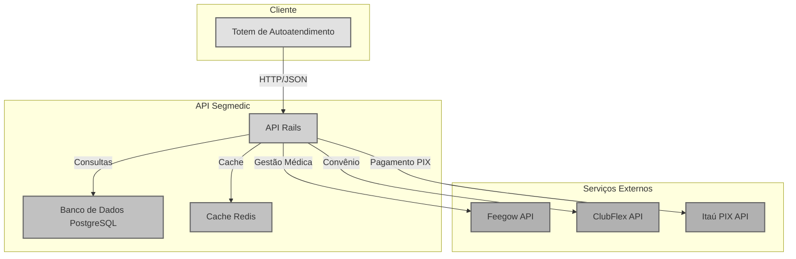

---

## Fluxo 1: Agendamento com Convênio

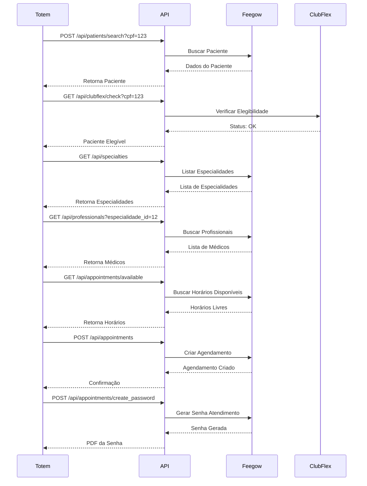

---

## Fluxo 2: Agendamento Particular com Pagamento PIX

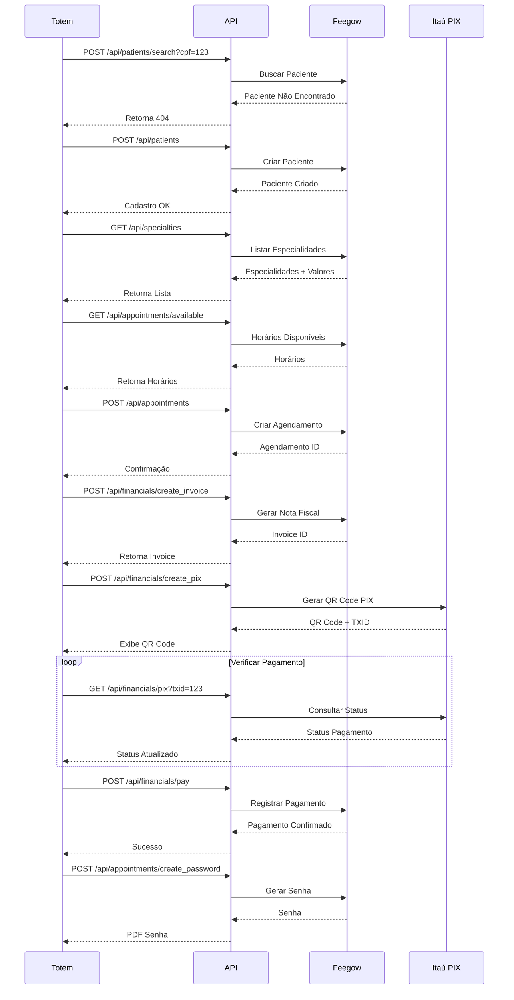

---

## Fluxo 3: Check-in do Paciente

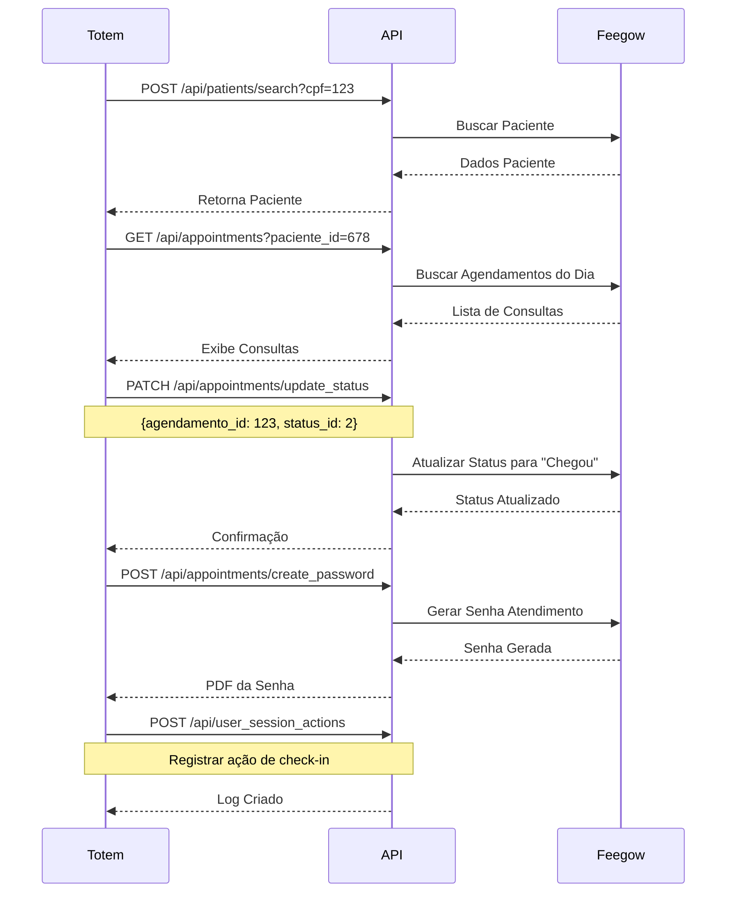

---

## Fluxo 4: Cancelamento de Agendamento

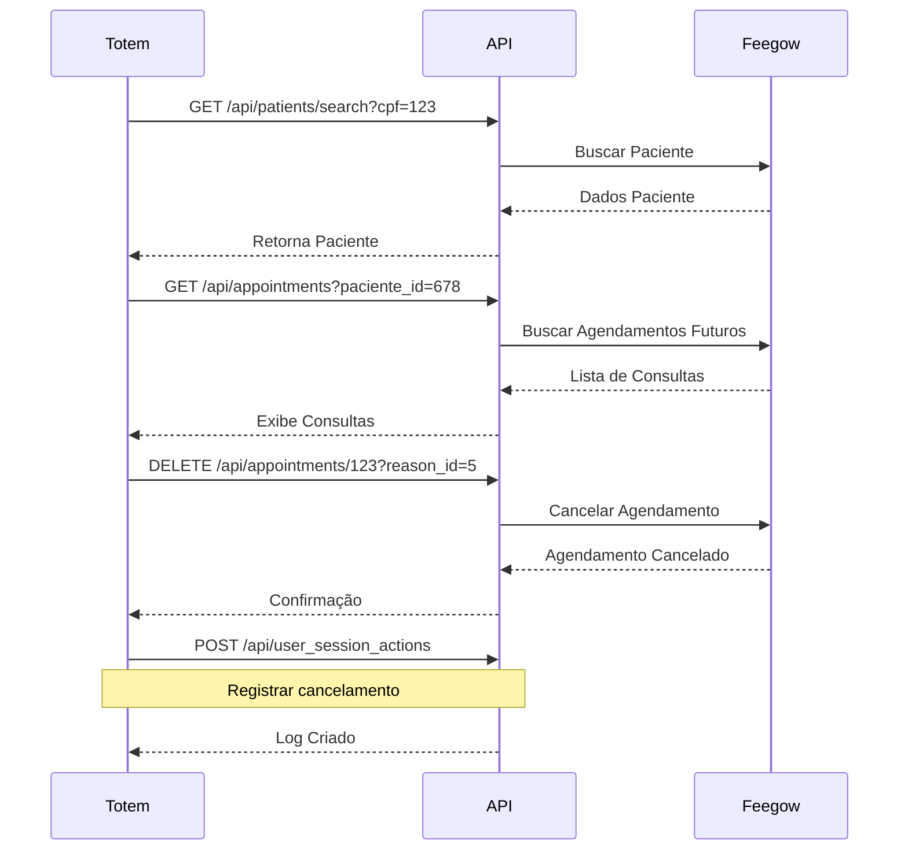

---

## Fluxo 5: Pagamento com Cartão de Crédito

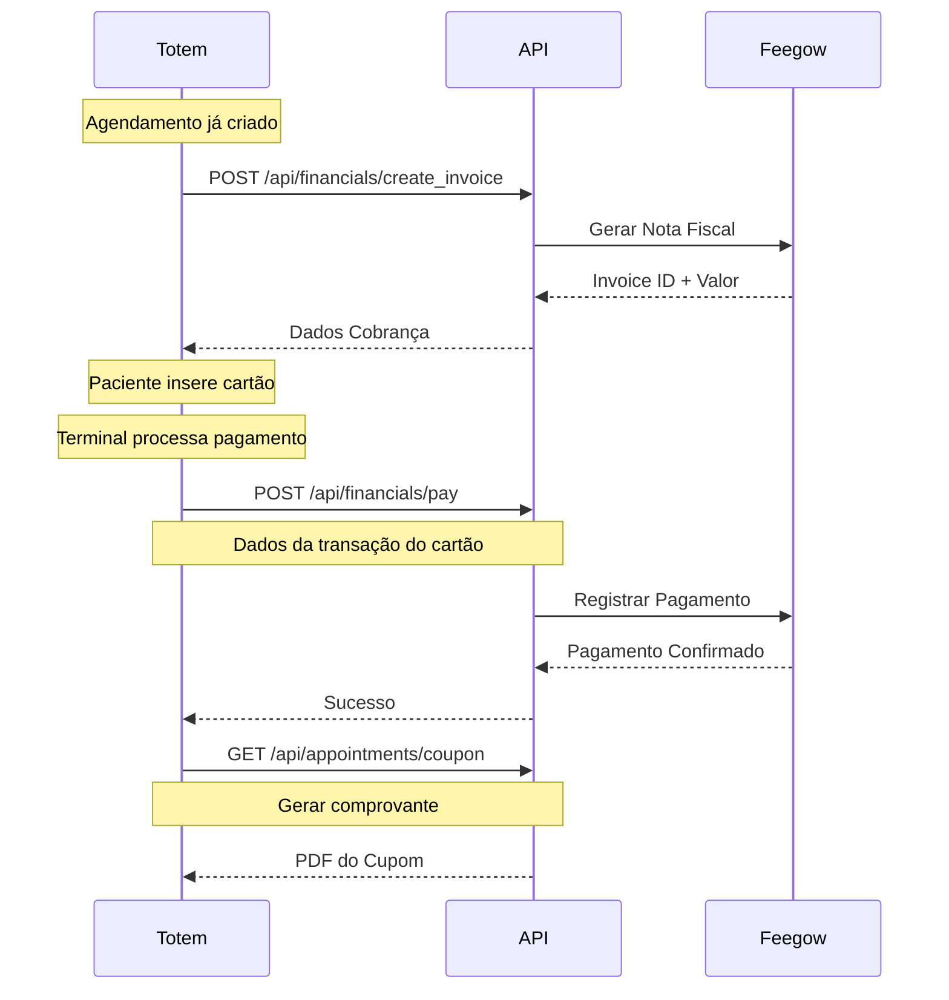

---

## Fluxo de Dados Internos

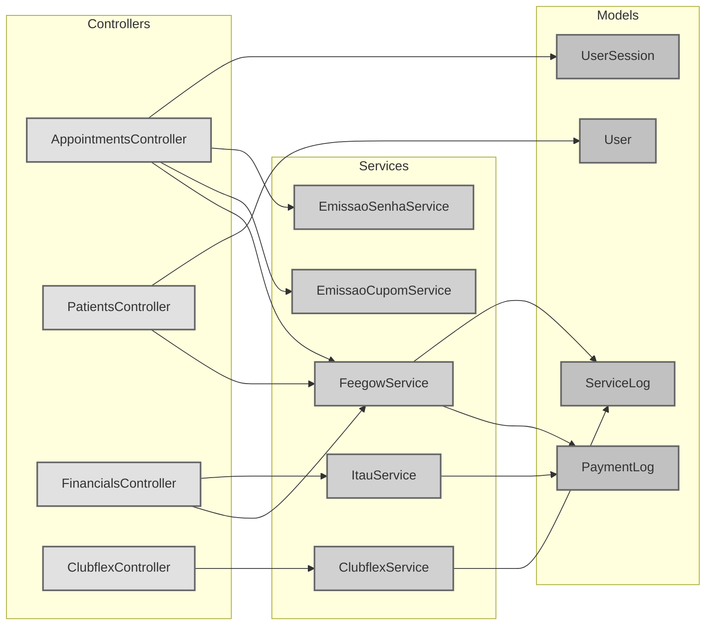

---

## Arquitetura de Integração

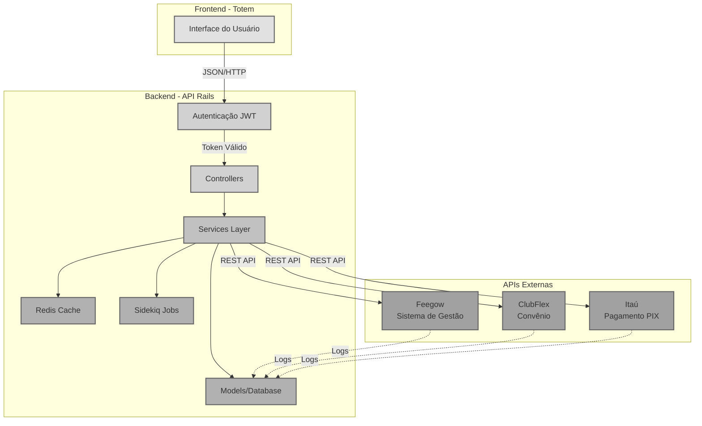

---

## Ciclo de Vida de um Agendamento

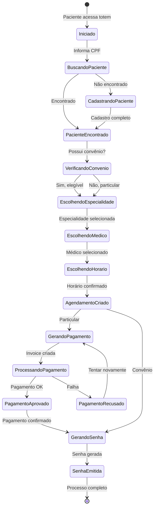

---

## Modelo de Dados Simplificado

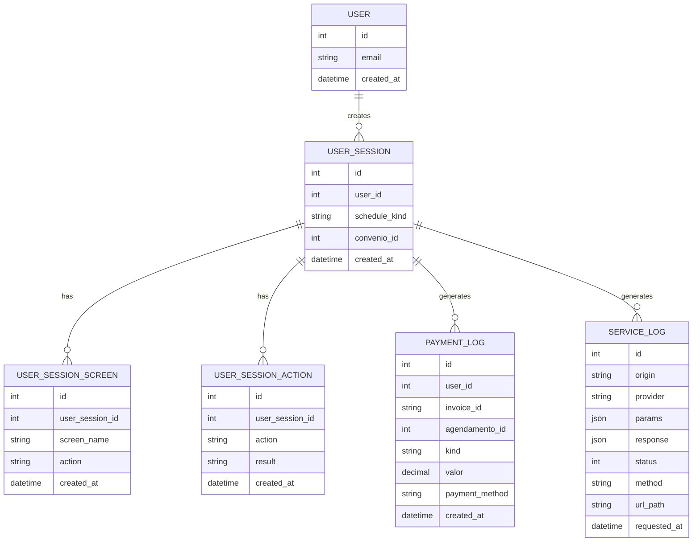

---

## Fluxo de Autenticação e Sessão

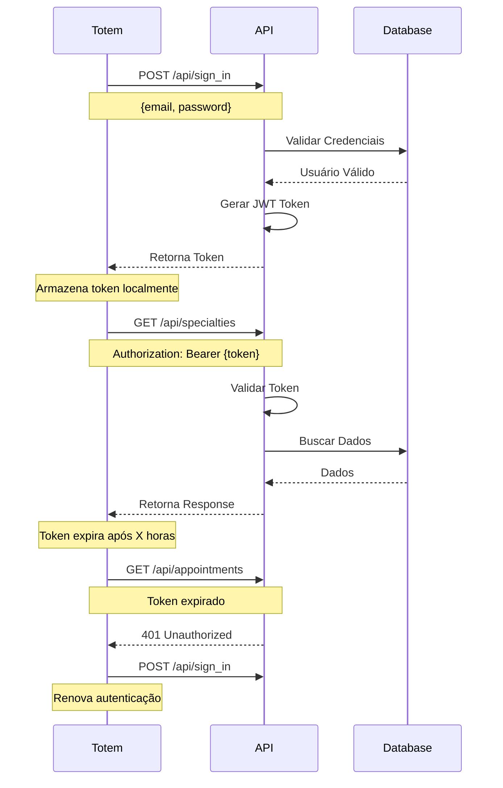

---

## Performance e Cache

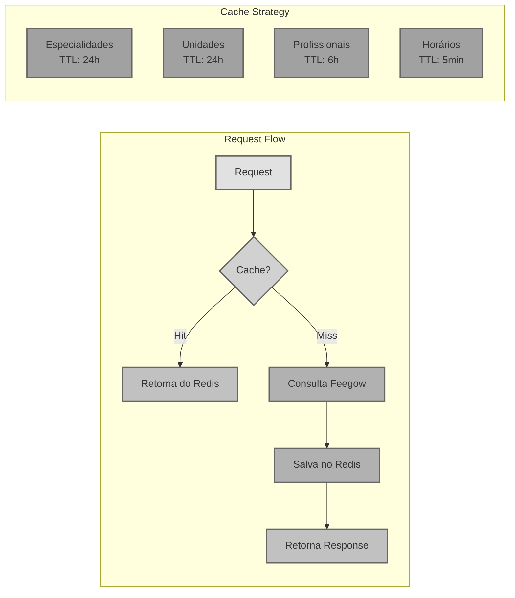

---

## Tratamento de Erros

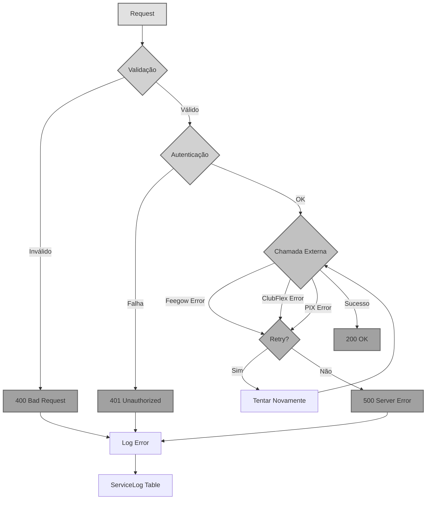
