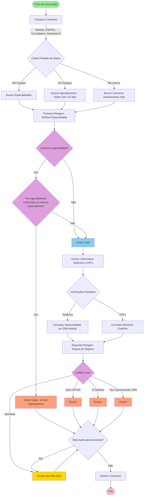
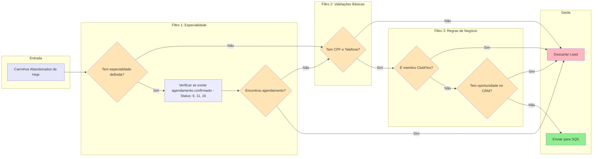
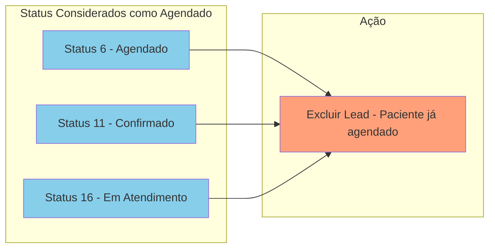
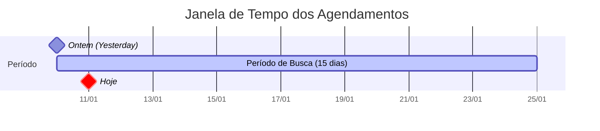
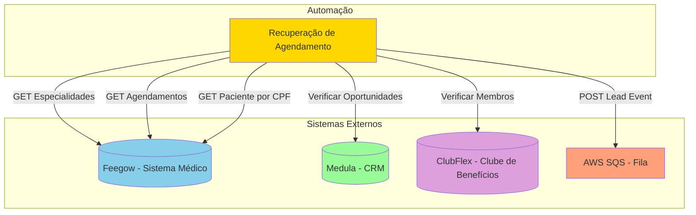
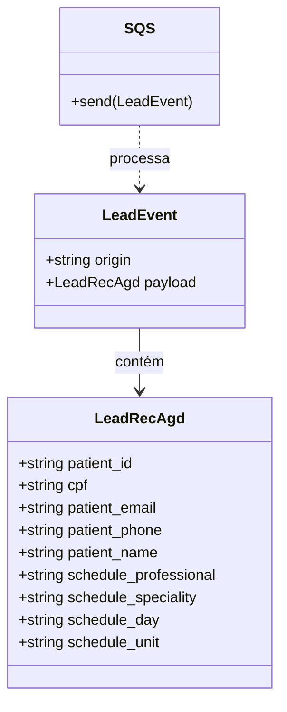
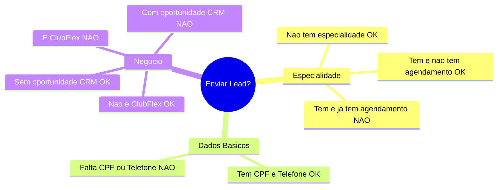

# Fluxo Visual - Recuperação de Agendamento

## 🔄 Diagrama Principal

## 📊 Fluxo de Filtragem Detalhado

## 🎯 Status de Agendamento

## 📅 Período de Busca

## 🔄 Integração com Sistemas Externos

## 📦 Estrutura do Lead

## 🚦 Decisões Críticas

