# Fluxo Visual - Recuperação de Agendamento

## 🔄 Diagrama Principal

```mermaid
flowchart TD
    Start([Início da Automação]) --> Init[Inicializar Conexões]
    
    Init -->|Medula, ClubFlex, Consultation, ScheduleV2| Parallel1{Coleta Paralela de Dados}
    
    Parallel1 -->|API Feegow| GetSpec[Buscar Especialidades]
    Parallel1 -->|API Feegow| GetSched[Buscar Agendamentos - Ontem até +15 dias]
    Parallel1 -->|BD Interno| GetCart[Buscar Carrinhos Abandonados Hoje]
    
    GetSpec --> Filter1[Primeira Filtragem: Verificar Especialidade]
    GetSched --> Filter1
    GetCart --> Filter1
    
    Filter1 --> Decision1{Lead tem especialidade?}
    
    Decision1 -->|Não| Include1[Incluir Lead]
    Decision1 -->|Sim| CheckAppt{Tem agendamento confirmado na mesma especialidade?}
    
    CheckAppt -->|Sim| Exclude1[Excluir Lead - Já tem agendamento]
    CheckAppt -->|Não| Include1
    
    Include1 --> Extract[Extrair e Normalizar Telefones e CPFs]
    
    Extract --> Parallel2{Verificações Paralelas}
    
    Parallel2 -->|Telefones| CheckCRM[Consultar Oportunidades no CRM Medula]
    Parallel2 -->|CPFs| CheckClub[Consultar Membros ClubFlex]
    
    CheckCRM --> Filter2[Segunda Filtragem: Regras de Negócio]
    CheckClub --> Filter2
    
    Filter2 --> Validate{Validar Lead}
    
    Validate -->|Sem CPF/Tel| Exclude2[Excluir]
    Validate -->|É ClubFlex| Exclude3[Excluir]
    Validate -->|Tem Oportunidade CRM| Exclude4[Excluir]
    Validate -->|Aprovado| Send[Enviar para Fila SQS]
    
    Send --> Loop{Mais leads para processar?}
    
    Loop -->|Sim| Send
    Loop -->|Não| Cleanup[Destruir Conexões]
    
    Cleanup --> End([Fim])
    
    Exclude1 --> Loop
    Exclude2 --> Loop
    Exclude3 --> Loop
    Exclude4 --> Loop
    
    style Start fill:#90EE90
    style End fill:#FFB6C1
    style Include1 fill:#87CEEB
    style Send fill:#FFD700
    style Exclude1 fill:#FFA07A
    style Exclude2 fill:#FFA07A
    style Exclude3 fill:#FFA07A
    style Exclude4 fill:#FFA07A
    style Decision1 fill:#DDA0DD
    style CheckAppt fill:#DDA0DD
    style Validate fill:#DDA0DD
```

## 📊 Fluxo de Filtragem Detalhado

```mermaid
flowchart LR
    subgraph Input["Entrada"]
        A[Carrinhos Abandonados de Hoje]
    end
    
    subgraph Filter1["Filtro 1: Especialidade"]
        B{Tem especialidade definida?}
        C[Verificar se existe agendamento confirmado - Status: 6, 11, 16]
        D{Encontrou agendamento?}
    end
    
    subgraph Filter2["Filtro 2: Validações Básicas"]
        E{Tem CPF e Telefone?}
    end
    
    subgraph Filter3["Filtro 3: Regras de Negócio"]
        F{É membro ClubFlex?}
        G{Tem oportunidade no CRM?}
    end
    
    subgraph Output["Saída"]
        H[Enviar para SQS]
        I[Descartar Lead]
    end
    
    A --> B
    B -->|Não| E
    B -->|Sim| C
    C --> D
    D -->|Não| E
    D -->|Sim| I
    E -->|Não| I
    E -->|Sim| F
    F -->|Sim| I
    F -->|Não| G
    G -->|Sim| I
    G -->|Não| H
    
    style A fill:#E6E6FA
    style H fill:#90EE90
    style I fill:#FFB6C1
    style B fill:#FFE4B5
    style D fill:#FFE4B5
    style E fill:#FFE4B5
    style F fill:#FFE4B5
    style G fill:#FFE4B5
```

## 🎯 Status de Agendamento

## 📅 Período de Busca

```mermaid
gantt
    title Janela de Tempo dos Agendamentos
    dateFormat YYYY-MM-DD
    axisFormat %d/%m
    
    section Período
    Ontem (Yesterday)           :milestone, m1, 2024-01-10, 0d
    Período de Busca (15 dias)  :active, 2024-01-10, 15d
    Hoje                        :crit, milestone, m2, 2024-01-11, 0d
```

## 🔄 Integração com Sistemas Externos

## 📦 Estrutura do Lead

```mermaid
classDiagram
    class LeadRecAgd {
        +string patient_id
        +string cpf
        +string patient_email
        +string patient_phone
        +string patient_name
        +string schedule_professional
        +string schedule_speciality
        +string schedule_day
        +string schedule_unit
    }
    
    class LeadEvent {
        +string origin
        +LeadRecAgd payload
    }
    
    LeadEvent --> LeadRecAgd : contém
    
    class SQS {
        +send(LeadEvent)
    }
    
    SQS ..> LeadEvent : processa
```

## 🚦 Decisões Críticas

