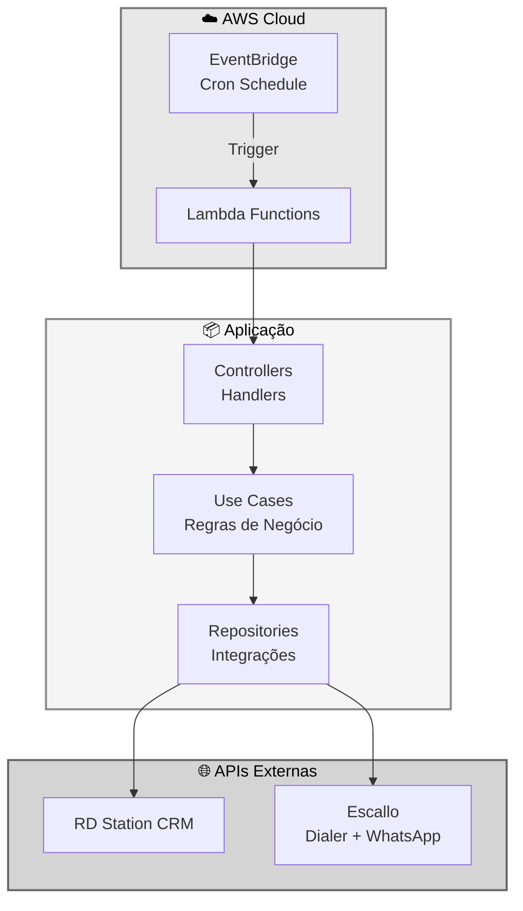
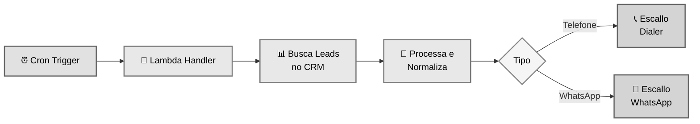
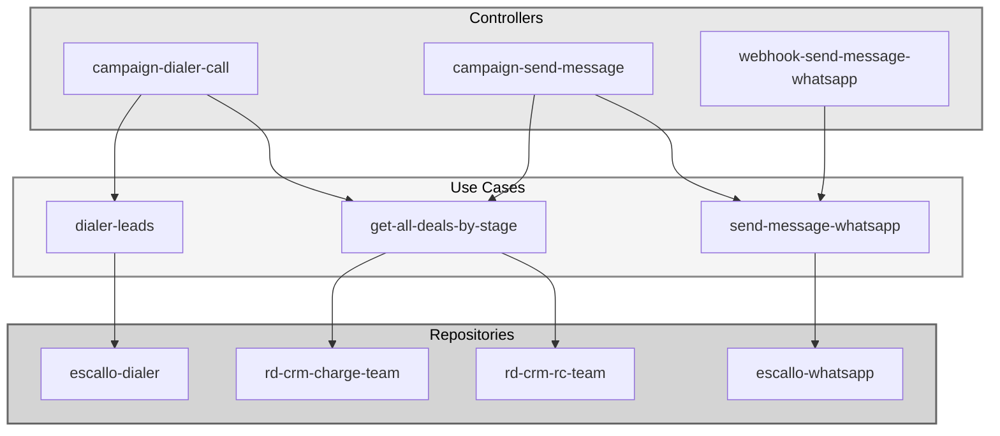
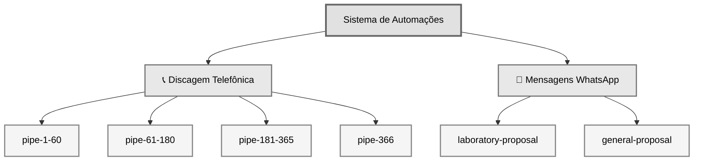
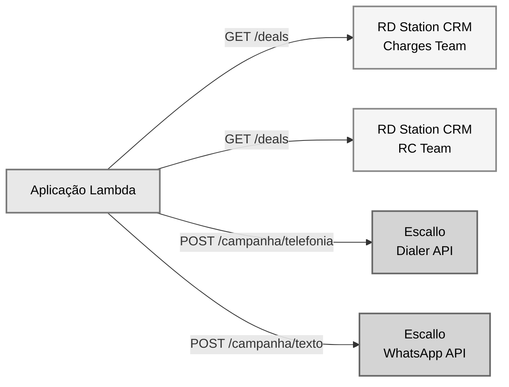
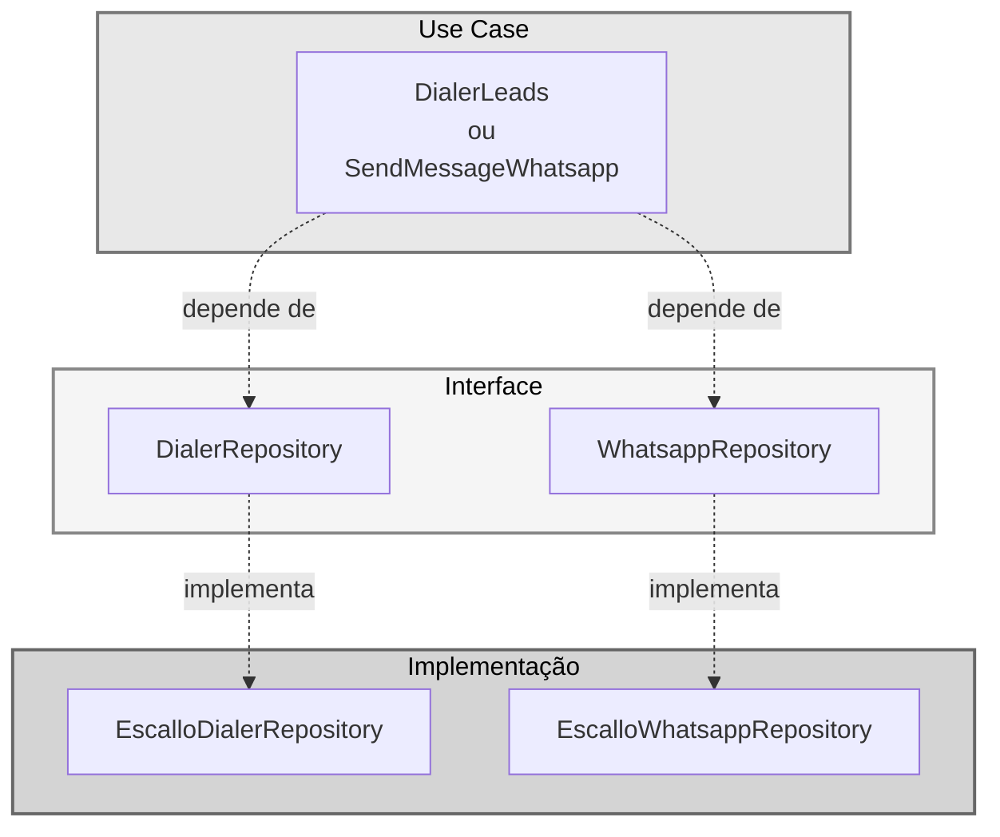
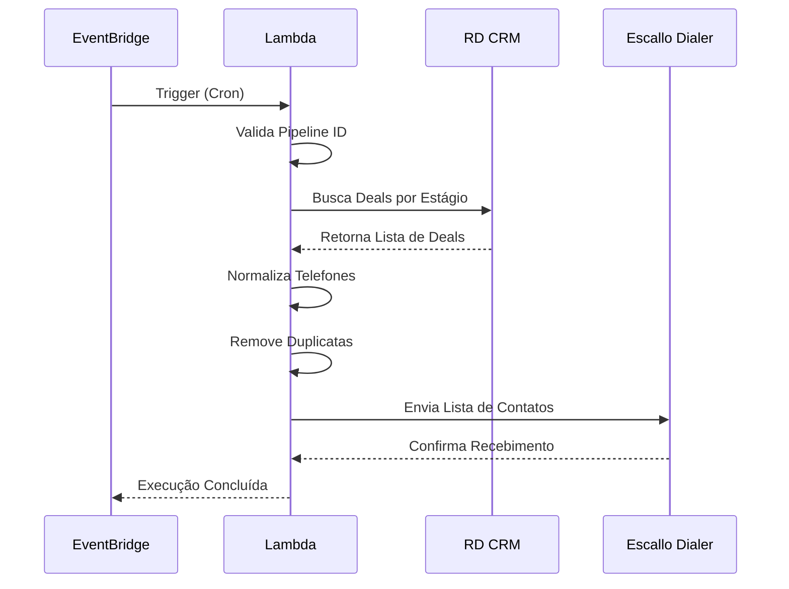
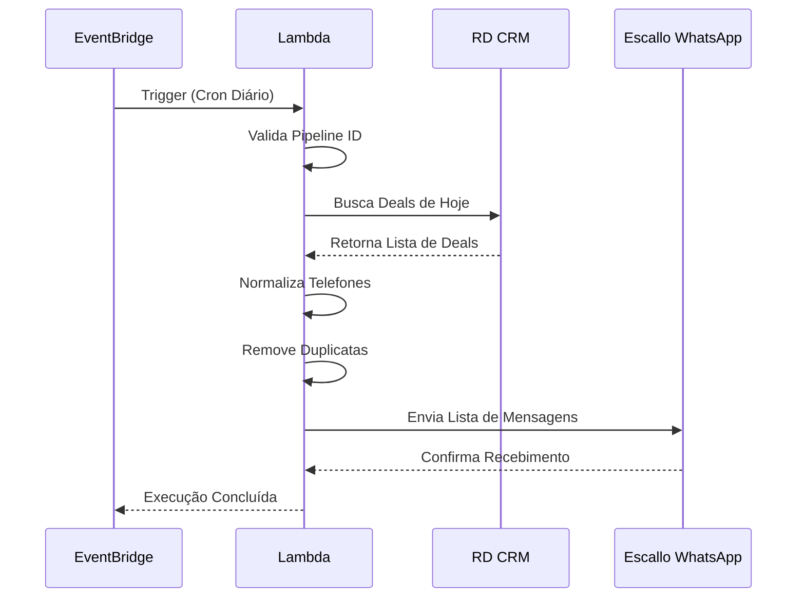
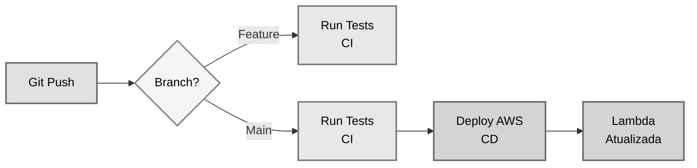

# Arquitetura Geral do Sistema

## 📋 Visão Geral

Sistema de automação de contatos para o time de cobranças e relacionamento com clientes, utilizando AWS Lambda com execução agendada via EventBridge (Cron).

## 🏗️ Arquitetura em Camadas

## 🔄 Fluxo Geral de Execução

## 📂 Estrutura de Código

## 🎯 Tipos de Automação

## 🔌 Integrações Externas

## 🔐 Inversão de Dependências

## 📊 Fluxo de Dados: Discador

## 📊 Fluxo de Dados: WhatsApp

## ⚙️ Componentes Principais

| Componente | Responsabilidade | Tecnologia |
|------------|------------------|------------|
| **EventBridge** | Agendamento de execuções | AWS EventBridge (Cron) |
| **Lambda Functions** | Execução das automações | Node.js 22 + TypeScript |
| **Controllers** | Orquestração do fluxo | TypeScript |
| **Use Cases** | Lógica de negócio | TypeScript |
| **Repositories** | Integração com APIs | Axios + TypeScript |
| **CRM** | Fonte de dados de leads | RD Station CRM API |
| **Dialer/WhatsApp** | Envio de contatos | Escallo API |

## 🔄 Pipeline CI/CD

## 📝 Princípios Arquiteturais

### Clean Architecture

- **Independência de Frameworks**: Use cases não dependem de bibliotecas externas
- **Testabilidade**: Lógica de negócio testável sem dependências externas
- **Independência de UI**: Não há interface, apenas APIs
- **Independência de Banco**: Usa APIs externas como fonte de dados
- **Inversão de Dependências**: Interfaces definem contratos

### SOLID

- **S** - Single Responsibility: Cada classe tem uma única responsabilidade
- **O** - Open/Closed: Aberto para extensão, fechado para modificação
- **L** - Liskov Substitution: Implementações intercambiáveis via interfaces
- **I** - Interface Segregation: Interfaces específicas e enxutas
- **D** - Dependency Inversion: Dependências através de abstrações

## 🎯 Padrões Utilizados

- **Repository Pattern**: Abstração de acesso a dados externos
- **Factory Pattern**: Criação de instâncias de use cases
- **Dependency Injection**: Injeção de dependências nos construtores
- **Strategy Pattern**: Diferentes estratégias de busca (charges vs rc team)

## 📚 Documentações Detalhadas

- **[Campaign Dialer Call](./campaign-dialer-call/)** - Discagem automática
- **[Laboratory Proposal Message](./laboratory-proposal-message/)** - WhatsApp Lab
- **[General Proposal Message](./general-proposal-message/)** - WhatsApp Geral

---

📖 **Este documento fornece uma visão geral da arquitetura. Para detalhes de cada automação, consulte as pastas específicas.**
