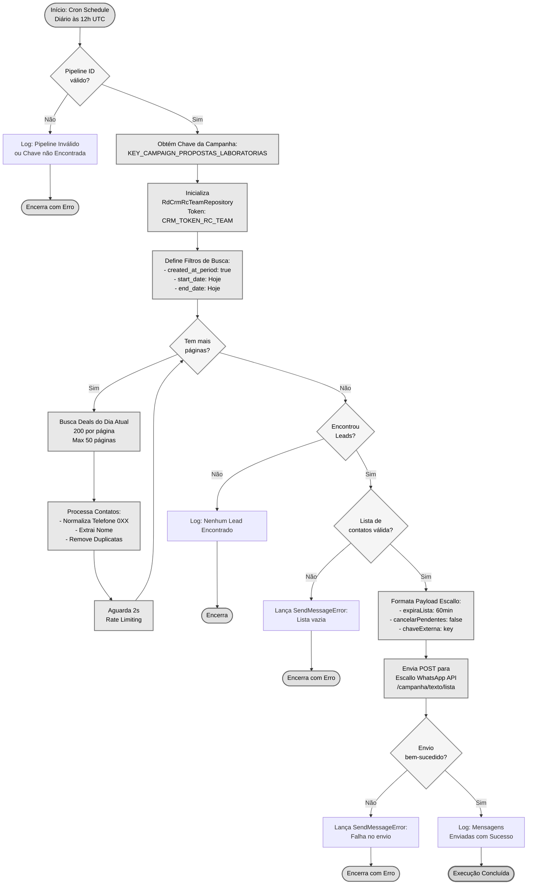
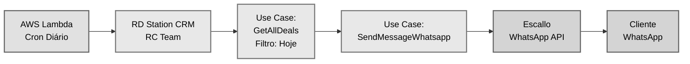
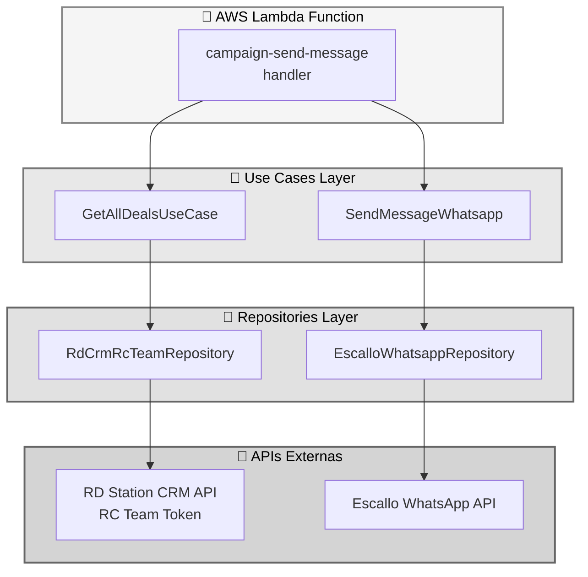
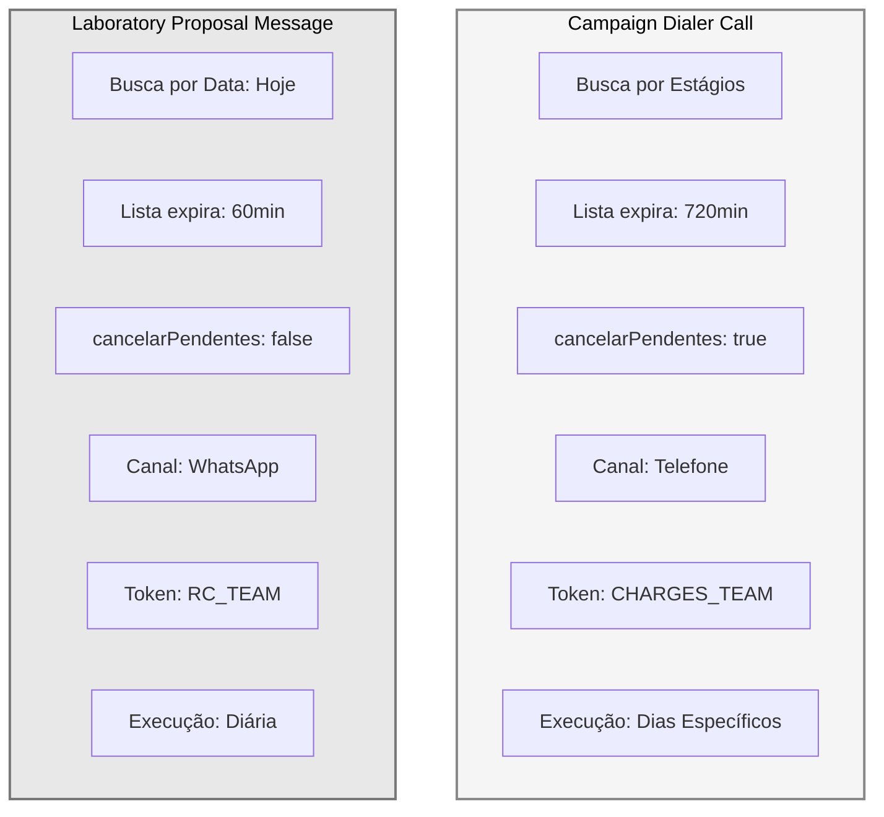
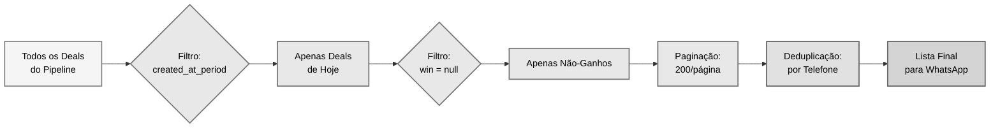
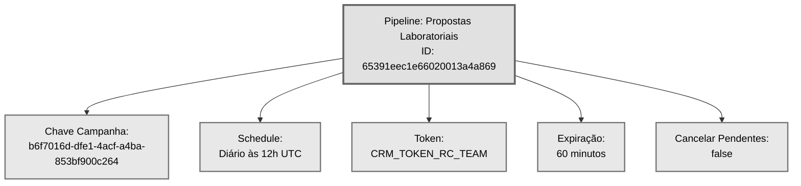

# Fluxo Visual - Laboratory Proposal Message

## 📊 Diagrama do Fluxo de Automação

## 🔄 Fluxo Simplificado de Dados

## 🏗️ Arquitetura de Camadas

## ⏱️ Timeline de Execução Diária

```mermaid
gantt
    title Execução Diária - Laboratory Proposal Message
    dateFormat HH:mm
    axisFormat %H:%M
    
    section Trigger
    Cron Schedule (12h UTC)        :milestone, 12:00, 0m
    
    section Busca CRM
    Validação Pipeline             :active, 12:00, 1m
    Busca Deals do Dia             :active, 12:01, 5m
    Normalização Contatos          :active, 12:06, 2m
    
    section Envio WhatsApp
    Preparação Payload             :active, 12:08, 1m
    Envio para Escallo             :active, 12:09, 3m
    
    section Finalização
    Logs e Conclusão               :milestone, 12:12, 0m
```

## 📋 Comparação: Dialer Call vs WhatsApp Message

## 📊 Fluxo de Filtros e Processamento

## 🔑 Informações do Pipeline

## 🎯 Pontos-Chave da Automação

| Característica | Valor |
|----------------|-------|
| **Frequência** | Diária (todos os dias) |
| **Horário** | 12h UTC (09h BRT) |
| **Canal** | WhatsApp |
| **Filtro Temporal** | Apenas deals criados hoje |
| **Expiração Lista** | 60 minutos |
| **Cancelar Pendentes** | Não |
| **Token CRM** | RC_TEAM |
| **Max Páginas** | 50 |
| **Deals/Página** | 200 |
| **Rate Limit** | 2s entre requests |

## 📝 Notas

- **Cores neutras**: Paleta em tons de cinza para visualização no GitHub
- **Fluxo detalhado**: Mostra todas as etapas, validações e decisões
- **Comparação visual**: Diferenças entre automações de dialer e WhatsApp
- **Timeline realista**: Estimativa de tempo de execução por etapa
- **Arquitetura clara**: Separação de responsabilidades entre camadas
