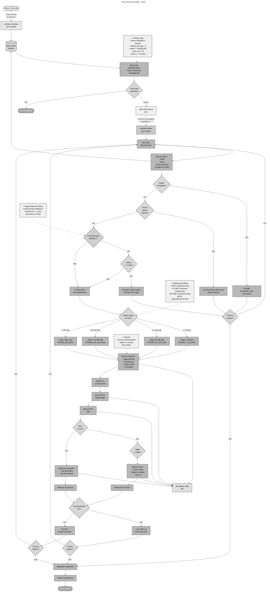

# Fluxo Visual - Sync

## Diagrama Mermaid

```mermaid
---
title: Fluxo da Automação - Sync
---
flowchart TD
    %% Estilos neutros para GitHub
    classDef scheduleClass fill:#e8e8e8,stroke:#666,stroke-width:2px,color:#000
    classDef databaseClass fill:#d4d4d4,stroke:#666,stroke-width:2px,color:#000
    classDef processClass fill:#b8b8b8,stroke:#666,stroke-width:2px,color:#000
    classDef queueClass fill:#f0f0f0,stroke:#666,stroke-width:2px,color:#000
    classDef workerClass fill:#c8c8c8,stroke:#666,stroke-width:2px,color:#000
    classDef decisionClass fill:#d8d8d8,stroke:#666,stroke-width:2px,color:#000
    classDef externalClass fill:#e0e0e0,stroke:#666,stroke-width:2px,color:#000
    classDef endClass fill:#a8a8a8,stroke:#666,stroke-width:2px,color:#fff
    classDef validationClass fill:#d0d0d0,stroke:#666,stroke-width:2px,color:#000

    Start([Início - Cron Job]):::scheduleClass
    Schedule[Lambda Schedule<br/>sync.handler]:::scheduleClass
    
    Start -->|Todos os dias<br/>às 3h UTC| Schedule
    
    DB[(Banco DNA<br/>MySQL)]:::databaseClass
    Schedule --> DB
    
    Query[Query SQL<br/>listSubscription:<br/>Todas assinaturas inadimplentes]:::processClass
    DB --> Query
    
    Loop{Para cada<br/>assinatura}:::decisionClass
    Query --> Loop
    
    Queue[AWS SQS Queue<br/>sync]:::queueClass
    Loop -->|Enviar| Queue
    
    Loop -->|Fim| End1([Fim do Schedule]):::endClass
    
    Worker[Lambda Worker<br/>sync.handler]:::workerClass
    Queue -->|Consome mensagem<br/>batchSize: 1| Worker
    
    Parse[Use Case:<br/>SyncUseCase]:::processClass
    Worker --> Parse
    
    GetData[Buscar dados:<br/>- Titular<br/>- Plano<br/>- Faturas abertas<br/>- Cartão de Crédito]:::processClass
    Parse --> GetData
    GetData --> DB
    
    CheckData{Dados<br/>completos?}:::decisionClass
    GetData --> CheckData
    
    LogError1[Exceção:<br/>Titular/Plano não encontrado]:::processClass
    CheckData -->|Não| LogError1
    LogError1 --> NextRecord1
    
    CheckInvoices{Possui<br/>faturas<br/>abertas?}:::decisionClass
    CheckData -->|Sim| CheckInvoices
    
    LogNoInvoice[Log: Assinatura não possui<br/>faturas abertas]:::processClass
    CheckInvoices -->|Não| LogNoInvoice
    LogNoInvoice --> NextRecord1
    
    ValidateTicket{É Ticket/Carnê<br/>DEFAULT?}:::validationClass
    CheckInvoices -->|Sim| ValidateTicket
    
    CheckDays{Atraso<br/><= 2 dias?}:::decisionClass
    ValidateTicket -->|Sim| CheckDays
    
    LogTicketRule[Exceção: Cliente ainda<br/>não deve há 2 dias]:::processClass
    CheckDays -->|Sim| LogTicketRule
    LogTicketRule --> NextRecord1
    
    CalcDays[Calcular dias<br/>de inadimplência]:::processClass
    ValidateTicket -->|Não| CalcDays
    CheckDays -->|Não| CalcDays
    
    DefineStage{Definir Stage<br/>por dias}:::decisionClass
    CalcDays --> DefineStage
    
    Stage1[Stage: 1-60 dias<br/>STAGES_1_60_DIAS]:::processClass
    Stage2[Stage: 61-180 dias<br/>STAGES_61_180_DIAS]:::processClass
    Stage3[Stage: 181-365 dias<br/>STAGES_181_365_DIAS]:::processClass
    Stage4[Stage: 366+ dias<br/>STAGES_366_DIAS]:::processClass
    
    DefineStage -->|<= 60 dias| Stage1
    DefineStage -->|61-180 dias| Stage2
    DefineStage -->|181-365 dias| Stage3
    DefineStage -->|> 365 dias| Stage4
    
    BuildDeal[Montar DealDTO:<br/>- Stage definido<br/>- Classificação<br/>- Custom fields<br/>- Anotações]:::processClass
    Stage1 --> BuildDeal
    Stage2 --> BuildDeal
    Stage3 --> BuildDeal
    Stage4 --> BuildDeal
    
    RDStation[RD Station CRM<br/>API]:::externalClass
    BuildDeal --> RDStation
    
    ProcessLead[RdService:<br/>processLead]:::processClass
    BuildDeal --> ProcessLead
    
    FindOrg[Buscar/Criar<br/>Organização]:::processClass
    ProcessLead --> FindOrg
    FindOrg --> RDStation
    
    FindDeal[Buscar/Criar<br/>Deal]:::processClass
    FindOrg --> FindDeal
    FindDeal --> RDStation
    
    CheckNew{Deal<br/>é novo?}:::decisionClass
    FindDeal --> CheckNew
    
    CheckStage{Stage<br/>é válido?}:::decisionClass
    CheckNew -->|Não| CheckStage
    
    UpdateDeal[Atualizar Deal:<br/>- Custom fields<br/>- Stage se inválido<br/>- User ID]:::processClass
    CheckStage --> UpdateDeal
    UpdateDeal --> RDStation
    UpdateDeal --> ReturnID1[Retornar ID do Deal]:::processClass
    
    AddNotes[Adicionar Anotações:<br/>- Link Backoffice<br/>- IDs das Faturas]:::processClass
    CheckNew -->|Sim| AddNotes
    AddNotes --> RDStation
    AddNotes --> ReturnID2[Retornar ID do Deal]:::processClass
    
    CheckSuccess{Processamento<br/>OK?}:::decisionClass
    ReturnID1 --> CheckSuccess
    ReturnID2 --> CheckSuccess
    
    LogError2[Log: Falha ao<br/>processar lead]:::processClass
    CheckSuccess -->|Não| LogError2
    LogError2 --> NextRecord2
    
    LogSuccess[Sucesso<br/>Deal processado]:::processClass
    CheckSuccess -->|Sim| LogSuccess
    LogSuccess --> NextRecord3
    
    NextRecord1{Próximo<br/>registro?}:::decisionClass
    NextRecord2{Próximo<br/>registro?}:::decisionClass
    NextRecord3{Próximo<br/>registro?}:::decisionClass
    
    NextRecord1 -->|Sim| Parse
    NextRecord2 -->|Sim| Parse
    NextRecord3 -->|Sim| Parse
    
    Wait[Aguardar 5 segundos]:::processClass
    NextRecord1 -->|Não| Wait
    NextRecord2 -->|Não| Wait
    NextRecord3 -->|Não| Wait
    
    CloseConn[Fechar conexão DB]:::processClass
    Wait --> CloseConn
    
    End2([Fim do Worker]):::endClass
    CloseConn --> End2

    %% Notas explicativas
    Note1[📝 Critérios SQL:<br/>- Fatura OPENED e vencida<br/>- waiting_first_pay = 0<br/>- status != CANCELED<br/>- type_sub = PF<br/>- Atraso <= 720 dias]:::queueClass
    Note1 -.-> Query
    
    Note2[📝 Stages Automáticos:<br/>1-60d: Cobrança inicial<br/>61-180d: Cobrança intensificada<br/>181-365d: Cobrança crítica<br/>366+d: Judicial/Encerramento]:::queueClass
    Note2 -.-> DefineStage
    
    Note3[📝 Regra Especial Tickets:<br/>Carnês/Tickets DEFAULT<br/>precisam ter > 2 dias<br/>para entrar no fluxo]:::queueClass
    Note3 -.-> ValidateTicket
    
    Note4[📝 Deal ID:<br/>Formato: idsubscription<br/>Apenas o número<br/>Sem sufixo]:::queueClass
    Note4 -.-> BuildDeal
```
