# Fluxo Visual - Escallo Chat

## 🔄 Diagrama Principal

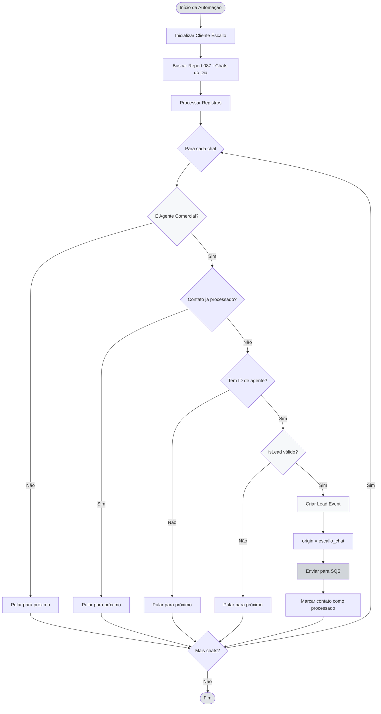

## 📊 Validação de Lead (isLead)

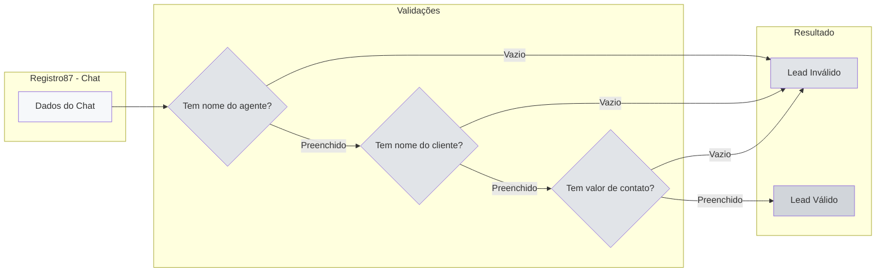

## 🎯 Fluxo de Decisão Simplificado

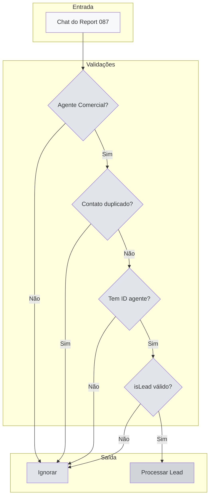

## 🔄 Integração com Escallo

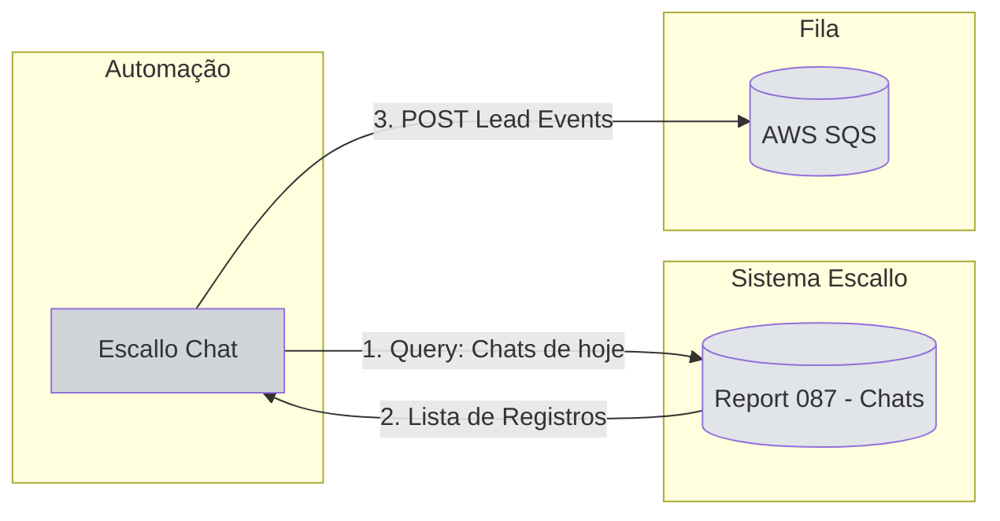

## 📦 Estrutura de Dados Completa

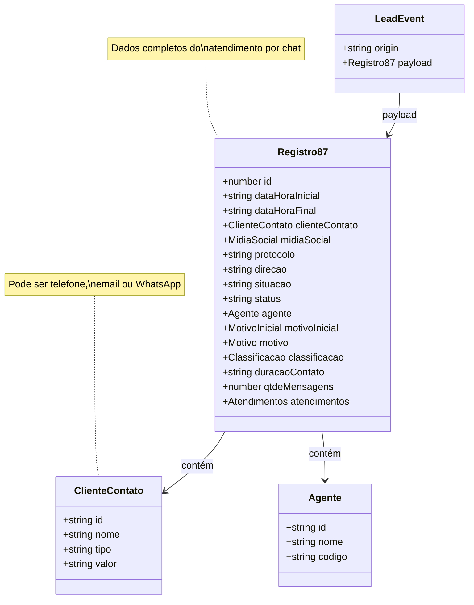

## 💬 Canais de Atendimento

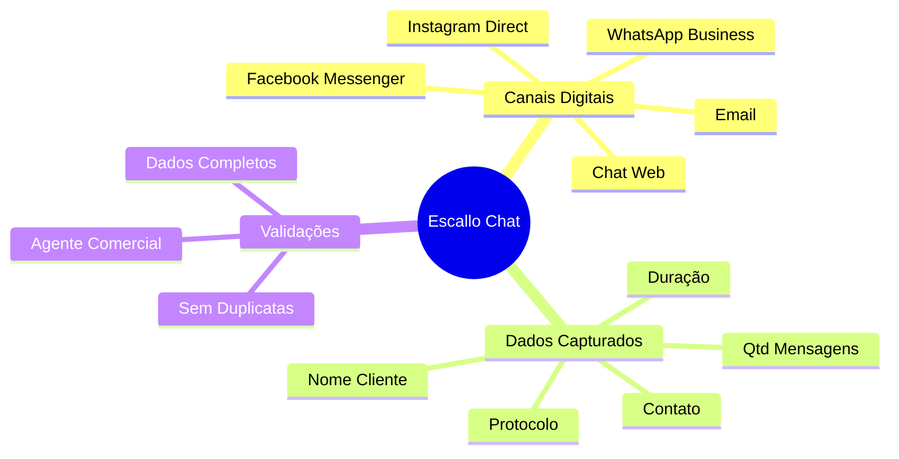

## 🔢 Deduplicação por Contato

```mermaid
sequenceDiagram
    participant Loop as Loop de Chats
    participant Array as Array de Contatos
    participant Queue as Fila SQS
    
    Loop->>Array: Verificar se clienteContato.valor existe
    
    alt Contato Novo
        Array-->>Loop: Não existe
        Loop->>Loop: Processar lead
        Loop->>Queue: Enviar para fila
        Loop->>Array: Adicionar contato
    else Contato Duplicado
        Array-->>Loop: Já existe
        Loop->>Loop: Pular para próximo
    end
```

## 👥 Verificação de Agente Comercial

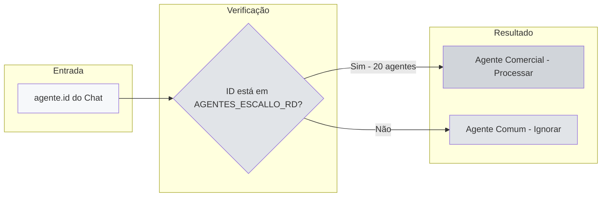

## 🎯 Origem Única

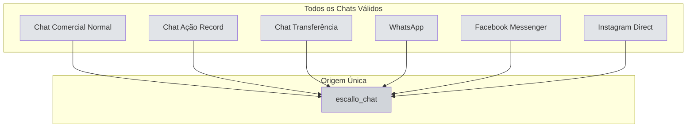

## 📊 Diferença: Chat vs Ligação

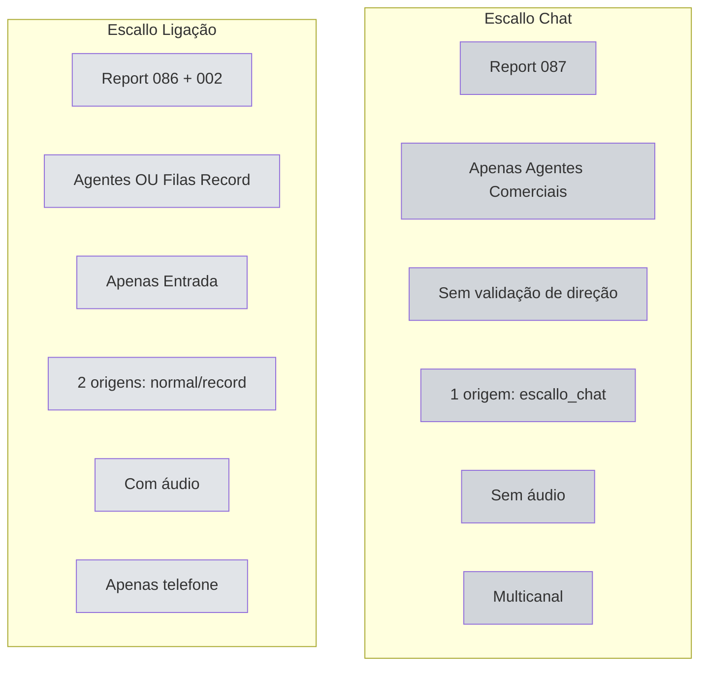

## 🔍 Tipo de Contato

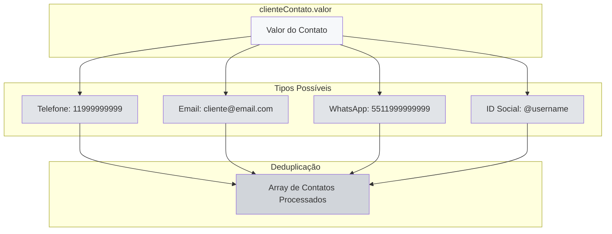

## 📊 Métricas do Chat

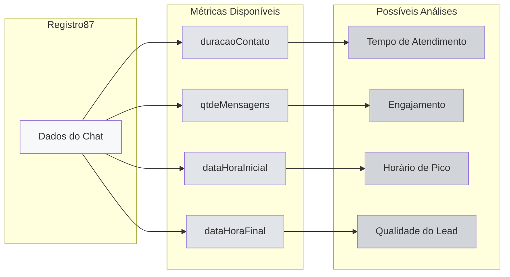

## 🎯 Fluxo Completo Simplificado

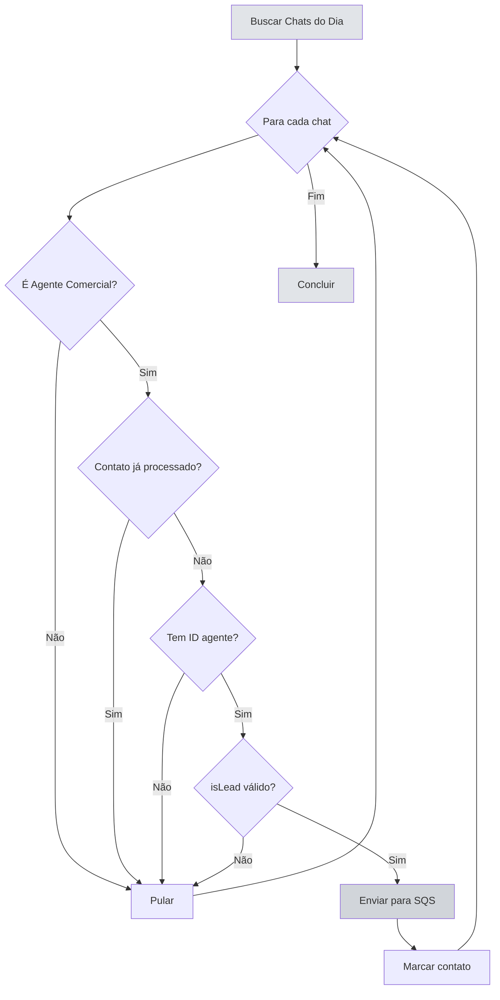

## 📋 Checklist de Validação

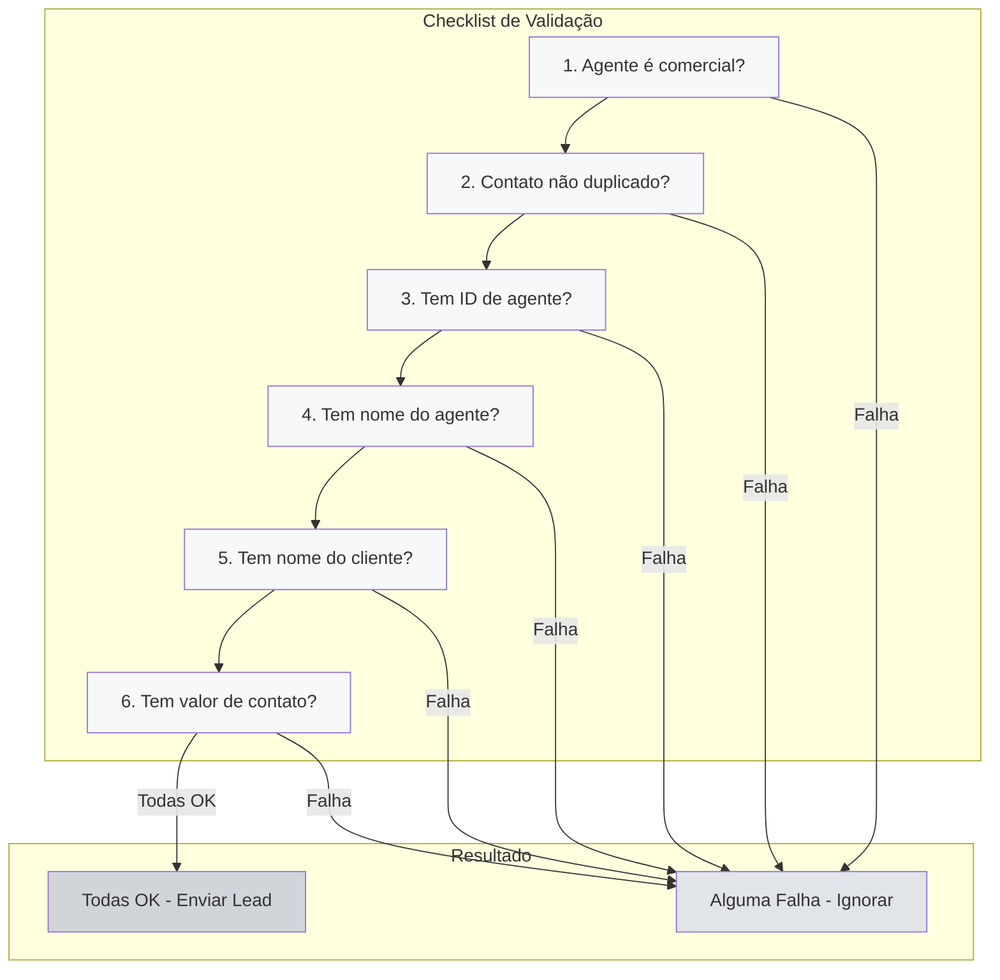

## 🎯 Comparação: Todas as Automações

```mermaid
graph TB
    subgraph EscalloChat["Escallo Chat"]
        EC[Report 087 - Multicanal]
    end
    
    subgraph EscalloLigacao["Escallo Ligação"]
        EL[Report 086/002 - Telefone]
    end
    
    subgraph LeadsAmanha["Leads Amanhã"]
        LA[Feegow - Agendamentos D+1]
    end
    
    subgraph LeadsConvenios["Leads Convênios"]
        LC[Medula - Atendimentos D-1]
    end
    
    subgraph RecuperacaoAgd["Recuperação Agendamento"]
        RA[Feegow - Carrinhos D-1 a D+15]
    end
    
    subgraph RetencaoB2B["Retenção B2B"]
        RB[ClubFlex + Medula - Último Mês]
    end
    
    style EC fill:#d1d5da
    style EL fill:#e1e4e8
    style LA fill:#f6f8fa
    style LC fill:#e1e4e8
    style RA fill:#f6f8fa
    style RB fill:#e1e4e8
```
