# Fluxo Visual - Escallo Ligação

## 🔄 Diagrama Principal

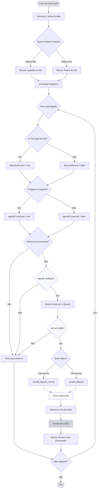

## 📊 Lógica de Decisão - Agente e Fila

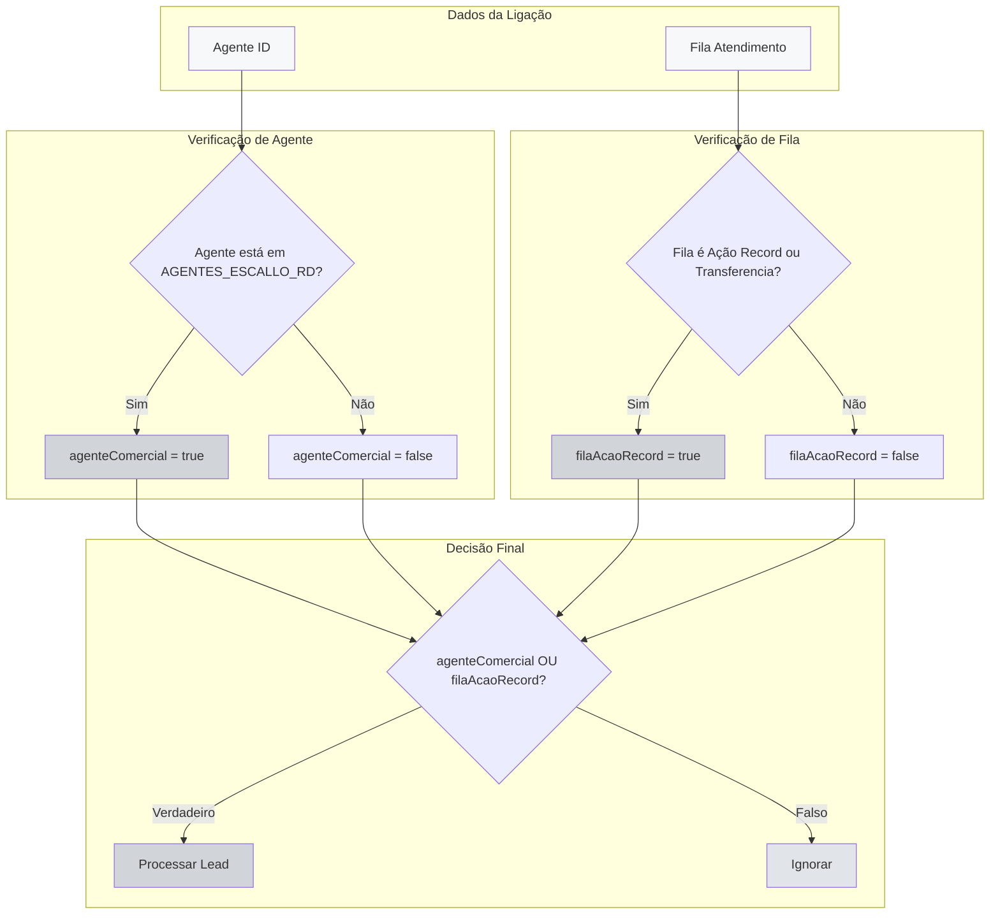

## 🎯 Tabela de Decisão Visual

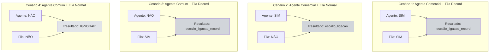

## 📞 Validação de Lead (isLead)

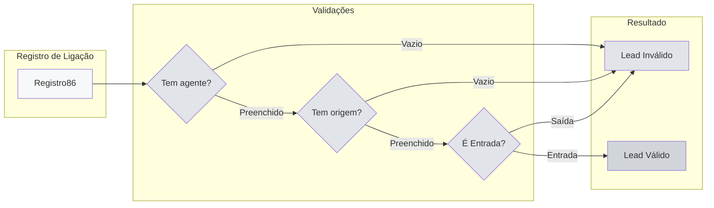

## 🔄 Integração com Escallo

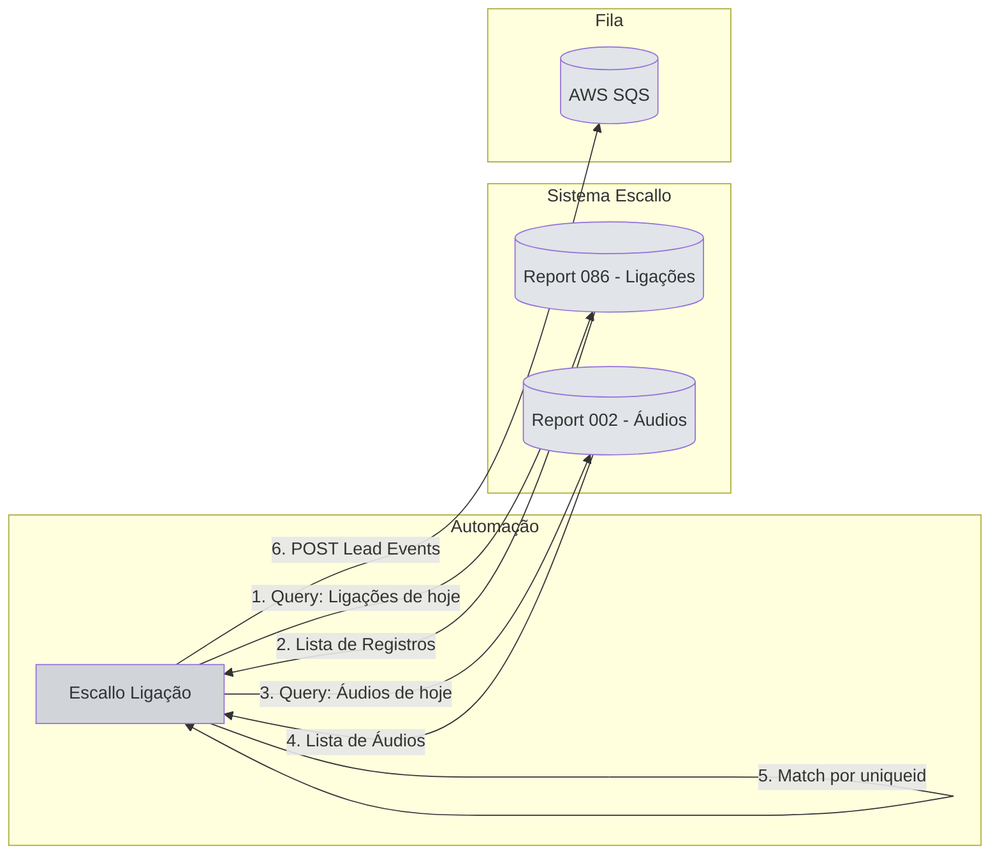

## 📦 Estrutura de Dados

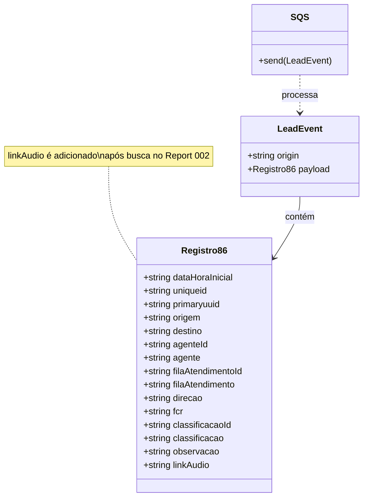

## 🎯 Filas de Atendimento

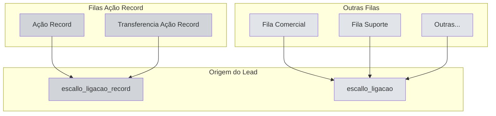

## 🔢 Deduplicação por Número

```mermaid
sequenceDiagram
    participant Loop as Loop de Ligações
    participant Array as Array de Números
    participant Queue as Fila SQS
    
    Loop->>Array: Verificar se número existe
    
    alt Número Novo
        Array-->>Loop: Não existe
        Loop->>Loop: Processar lead
        Loop->>Queue: Enviar para fila
        Loop->>Array: Adicionar número
    else Número Duplicado
        Array-->>Loop: Já existe
        Loop->>Loop: Pular para próximo
    end
```

## 📊 Matching de Áudio

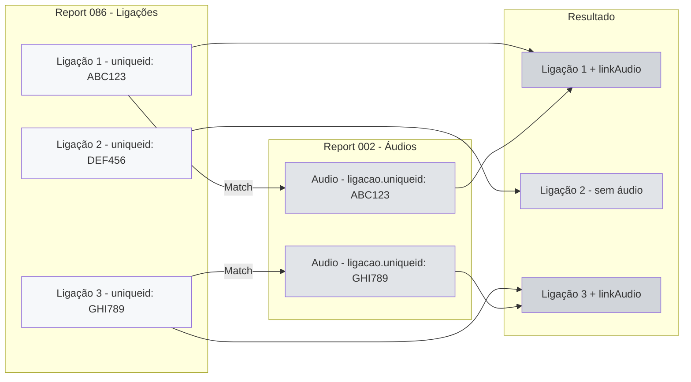

## 🚦 Filtros de Direção

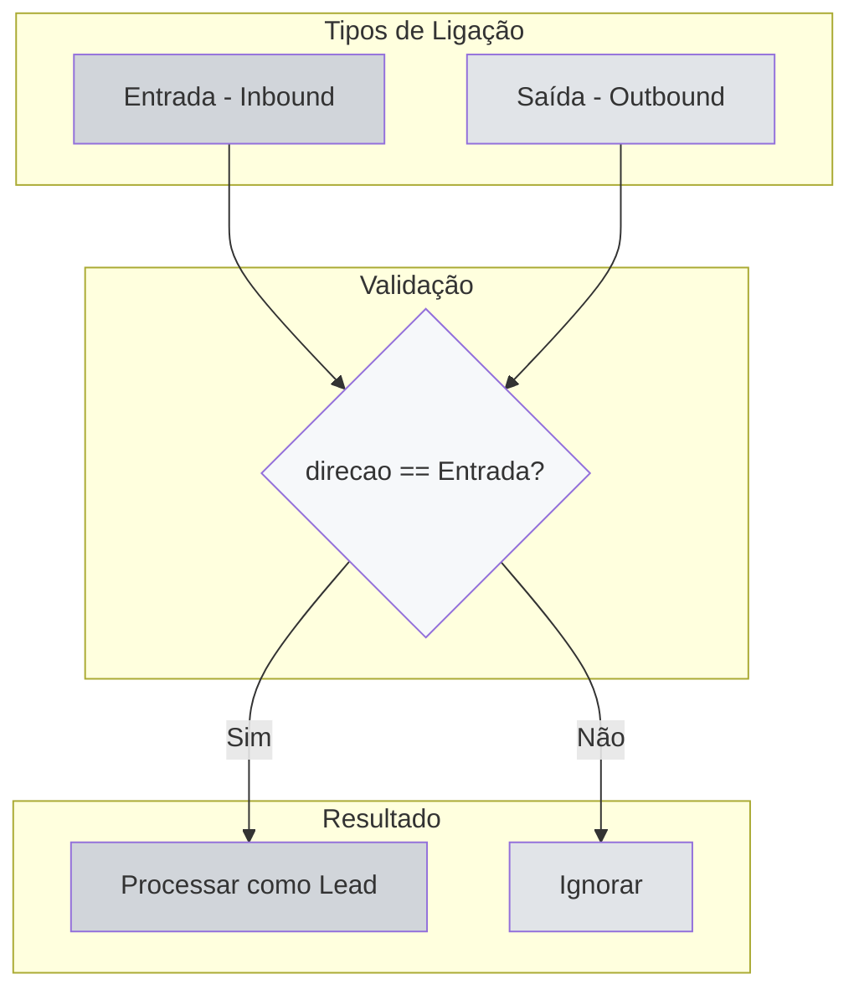

## 👥 Agentes Comerciais

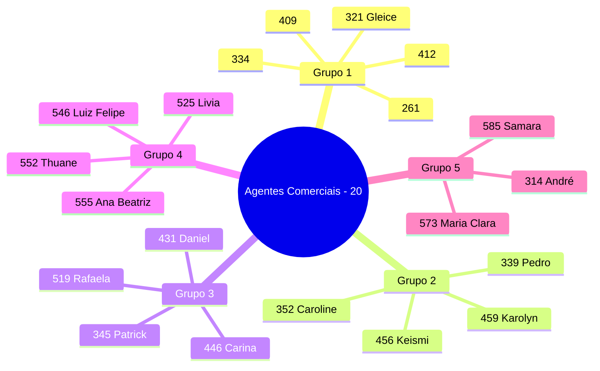

## 🎯 Fluxo Completo Simplificado

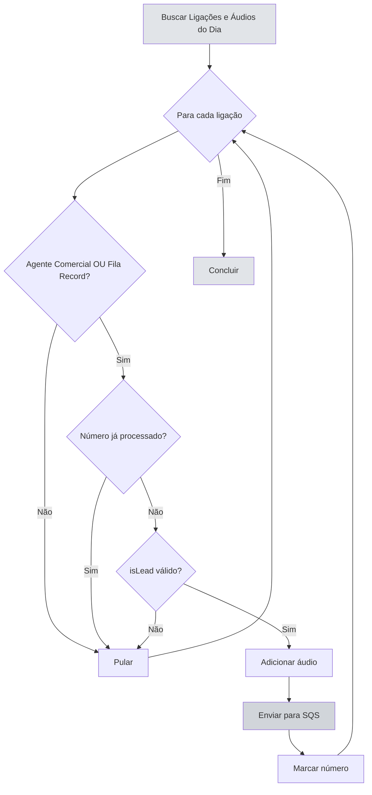

## 📊 Comparação com Escallo Chat

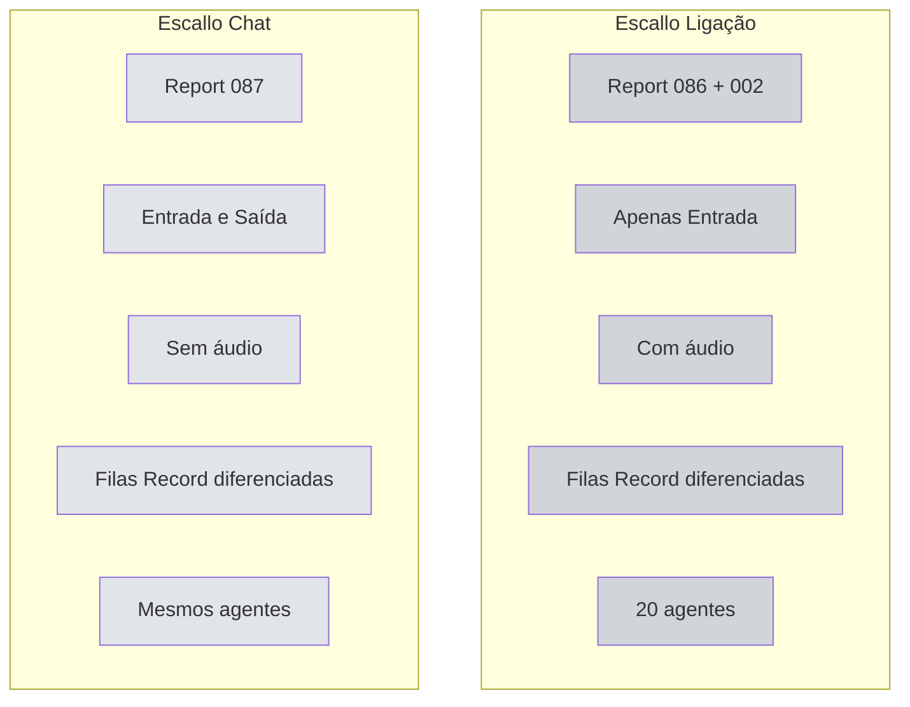
