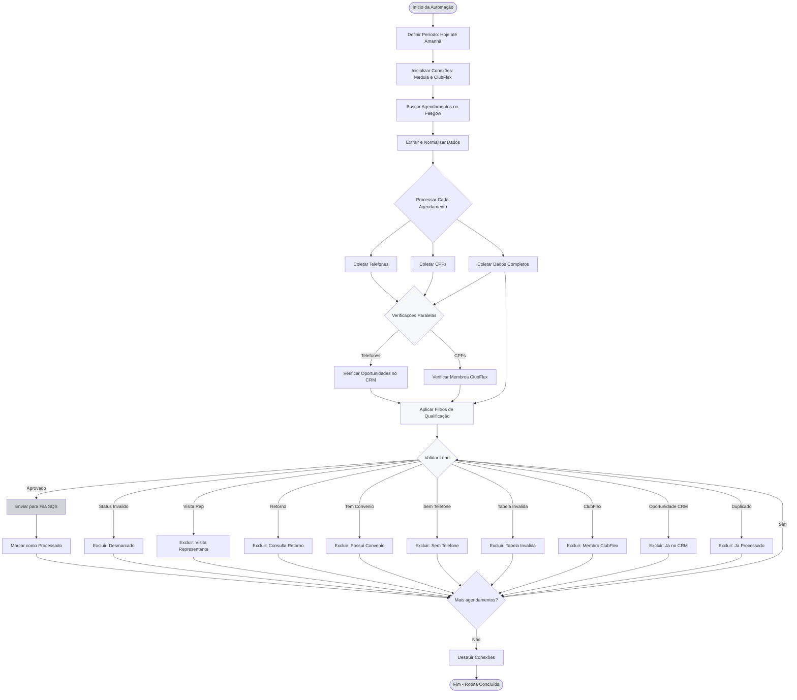
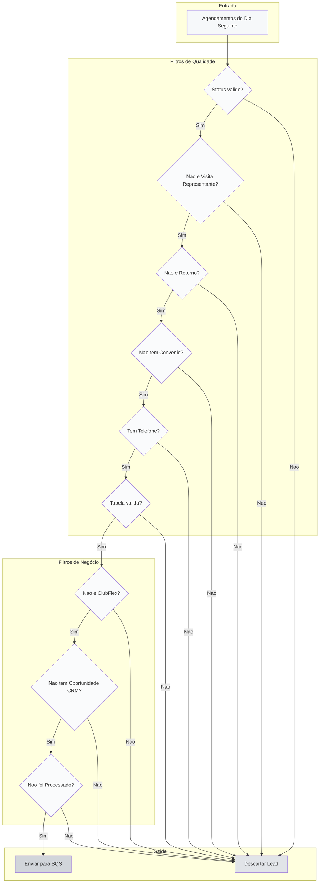
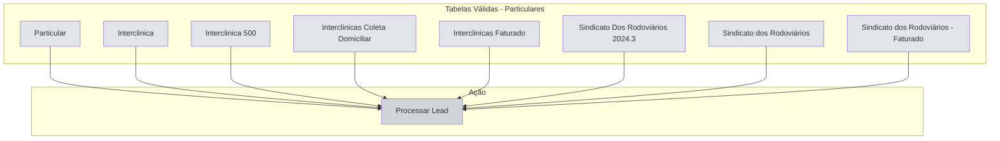
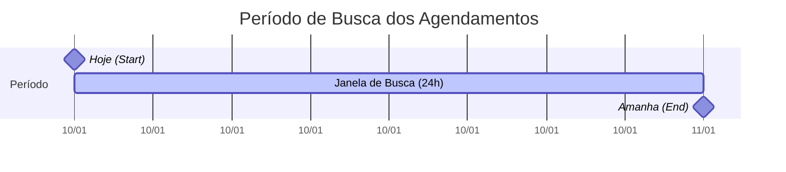
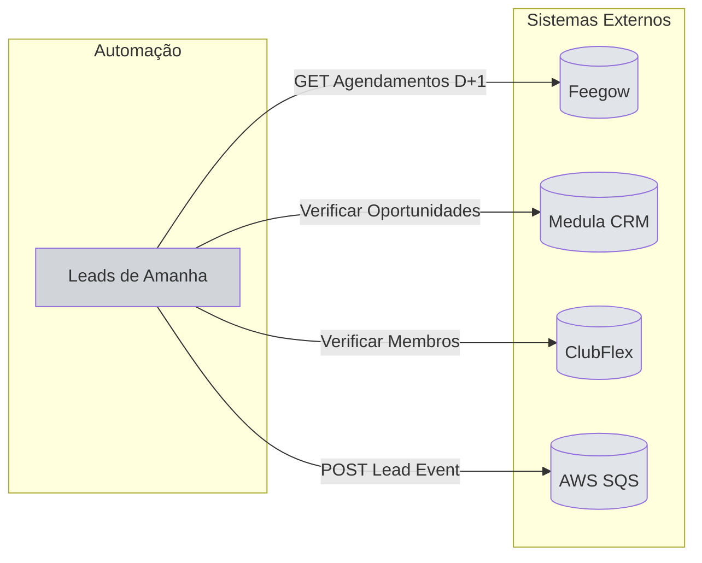
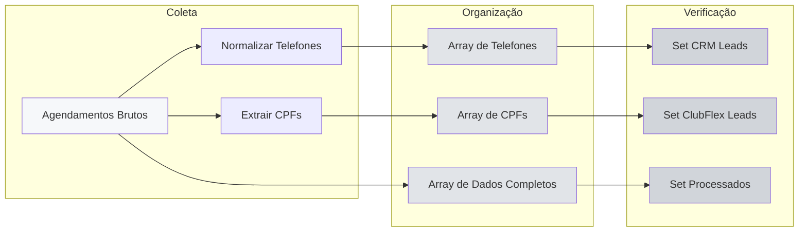
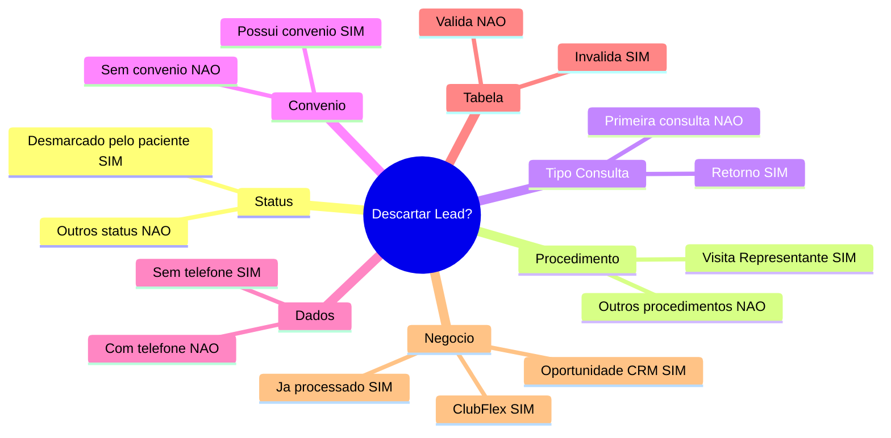
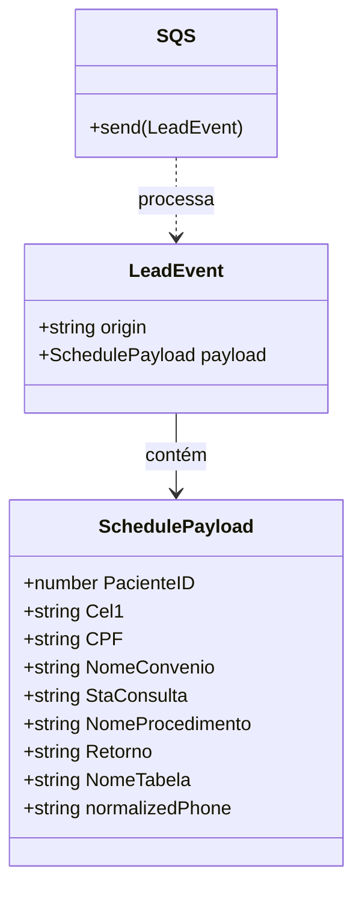

# Fluxo Visual - Leads de Amanhã

## 🔄 Diagrama Principal



## 📊 Fluxo de Filtragem Detalhado



## 🎯 Tabelas Válidas



## 📅 Janela de Tempo



## 🔄 Integração com Sistemas Externos



## 📦 Processamento de Dados



## 🚦 Critérios de Exclusão



## 🔢 Deduplicação

```mermaid
sequenceDiagram
    participant Loop as Loop de Leads
    participant Set as Set de Processados
    participant Queue as Fila SQS
    
    Loop->>Set: Verificar se PacienteID existe
    
    alt Não Existe
        Set-->>Loop: Lead novo
        Loop->>Queue: Enviar para fila
        Loop->>Set: Adicionar PacienteID
    else Já Existe
        Set-->>Loop: Lead duplicado
        Loop->>Loop: Pular para próximo
    end
```

## 📊 Estrutura do Lead Event


