# Fluxo Visual - Leads de Amanhã

## 🔄 Diagrama Principal

```mermaid
flowchart TD
    Start([Início da Automação]) --> DefineDate[Definir Período: Hoje até Amanhã]
    
    DefineDate --> Init[Inicializar Conexões: Medula e ClubFlex]
    
    Init --> GetSchedules[Buscar Agendamentos no Feegow]
    
    GetSchedules --> Extract[Extrair e Normalizar Dados]
    
    Extract --> Process{Processar Cada Agendamento}
    
    Process --> CollectPhones[Coletar Telefones]
    Process --> CollectCPFs[Coletar CPFs]
    Process --> CollectData[Coletar Dados Completos]
    
    CollectPhones --> Parallel{Verificações Paralelas}
    CollectCPFs --> Parallel
    CollectData --> Parallel
    
    Parallel -->|Telefones| CheckCRM[Verificar Oportunidades no CRM]
    Parallel -->|CPFs| CheckClub[Verificar Membros ClubFlex]
    
    CheckCRM --> Filter[Aplicar Filtros de Qualificação]
    CheckClub --> Filter
    CollectData --> Filter
    
    Filter --> Validate{Validar Lead}
    
    Validate -->|Status Invalido| Exclude1[Excluir: Desmarcado]
    Validate -->|Visita Rep| Exclude2[Excluir: Visita Representante]
    Validate -->|Retorno| Exclude3[Excluir: Consulta Retorno]
    Validate -->|Tem Convenio| Exclude4[Excluir: Possui Convenio]
    Validate -->|Sem Telefone| Exclude5[Excluir: Sem Telefone]
    Validate -->|Tabela Invalida| Exclude6[Excluir: Tabela Invalida]
    Validate -->|ClubFlex| Exclude7[Excluir: Membro ClubFlex]
    Validate -->|Oportunidade CRM| Exclude8[Excluir: Ja no CRM]
    Validate -->|Duplicado| Exclude9[Excluir: Ja Processado]
    Validate -->|Aprovado| Send[Enviar para Fila SQS]
    
    Send --> MarkProcessed[Marcar como Processado]
    
    MarkProcessed --> Loop{Mais agendamentos?}
    
    Loop -->|Sim| Validate
    Loop -->|Não| Cleanup[Destruir Conexões]
    
    Cleanup --> End([Fim - Rotina Concluída])
    
    Exclude1 --> Loop
    Exclude2 --> Loop
    Exclude3 --> Loop
    Exclude4 --> Loop
    Exclude5 --> Loop
    Exclude6 --> Loop
    Exclude7 --> Loop
    Exclude8 --> Loop
    Exclude9 --> Loop
    
    style Start fill:#e1e4e8
    style End fill:#e1e4e8
    style Send fill:#d1d5da
    style Filter fill:#f6f8fa
    style Validate fill:#f6f8fa
    style Parallel fill:#f6f8fa
```



## 📊 Fluxo de Filtragem Detalhado


## 🎯 Tabelas Válidas

```mermaid
graph TB
    subgraph Validas["Tabelas Válidas - Particulares"]
        T1[Particular]
        T2[Interclinica]
        T3[Interclinica 500]
        T4[Interclinicas Coleta Domiciliar]
        T5[Interclinicas Faturado]
        T6[Sindicato Dos Rodoviários 2024.3]
        T7[Sindicato dos Rodoviários]
        T8[Sindicato dos Rodoviários - Faturado]
    end
    
    subgraph Acao["Ação"]
        Accept[Processar Lead]
    end
    
    T1 --> Accept
    T2 --> Accept
    T3 --> Accept
    T4 --> Accept
    T5 --> Accept
    T6 --> Accept
    T7 --> Accept
    T8 --> Accept
    
    style T1 fill:#e1e4e8
    style T2 fill:#e1e4e8
    style T3 fill:#e1e4e8
    style T4 fill:#e1e4e8
    style T5 fill:#e1e4e8
    style T6 fill:#e1e4e8
    style T7 fill:#e1e4e8
    style T8 fill:#e1e4e8
    style Accept fill:#d1d5da
```



## 📅 Janela de Tempo

```mermaid
gantt
    title Período de Busca dos Agendamentos
    dateFormat YYYY-MM-DD
    axisFormat %d/%m
    
    section Período
    Hoje (Start)                :milestone, m1, 2024-01-10, 0d
    Janela de Busca (24h)       :active, 2024-01-10, 1d
    Amanha (End)                :milestone, m2, 2024-01-11, 0d
```



## 🔄 Integração com Sistemas Externos

```mermaid
graph LR
    subgraph Automacao["Automação"]
        Auto[Leads de Amanha]
    end
    
    subgraph Externos["Sistemas Externos"]
        Feegow[(Feegow)]
        Medula[(Medula CRM)]
        ClubFlex[(ClubFlex)]
        SQS[(AWS SQS)]
    end
    
    Auto -->|GET Agendamentos D+1| Feegow
    Auto -->|Verificar Oportunidades| Medula
    Auto -->|Verificar Membros| ClubFlex
    Auto -->|POST Lead Event| SQS
    
    style Auto fill:#d1d5da
    style Feegow fill:#e1e4e8
    style Medula fill:#e1e4e8
    style ClubFlex fill:#e1e4e8
    style SQS fill:#e1e4e8
```



## 📦 Processamento de Dados

```mermaid
flowchart LR
    subgraph Coleta["Coleta"]
        A[Agendamentos Brutos]
        B[Normalizar Telefones]
        C[Extrair CPFs]
    end
    
    subgraph Organizacao["Organização"]
        D[Array de Telefones]
        E[Array de CPFs]
        F[Array de Dados Completos]
    end
    
    subgraph Verificacao["Verificação"]
        G[Set CRM Leads]
        H[Set ClubFlex Leads]
        I[Set Processados]
    end
    
    A --> B
    A --> C
    B --> D
    C --> E
    A --> F
    
    D --> G
    E --> H
    F --> I
    
    style A fill:#f6f8fa
    style D fill:#e1e4e8
    style E fill:#e1e4e8
    style F fill:#e1e4e8
    style G fill:#d1d5da
    style H fill:#d1d5da
    style I fill:#d1d5da
```



## 🚦 Critérios de Exclusão


## 🔢 Deduplicação

```mermaid
sequenceDiagram
    participant Loop as Loop de Leads
    participant Set as Set de Processados
    participant Queue as Fila SQS
    
    Loop->>Set: Verificar se PacienteID existe
    
    alt Não Existe
        Set-->>Loop: Lead novo
        Loop->>Queue: Enviar para fila
        Loop->>Set: Adicionar PacienteID
    else Já Existe
        Set-->>Loop: Lead duplicado
        Loop->>Loop: Pular para próximo
    end
```

## 📊 Estrutura do Lead Event


