# Fluxo Visual - Leads de Convênios

## 🔄 Diagrama Principal

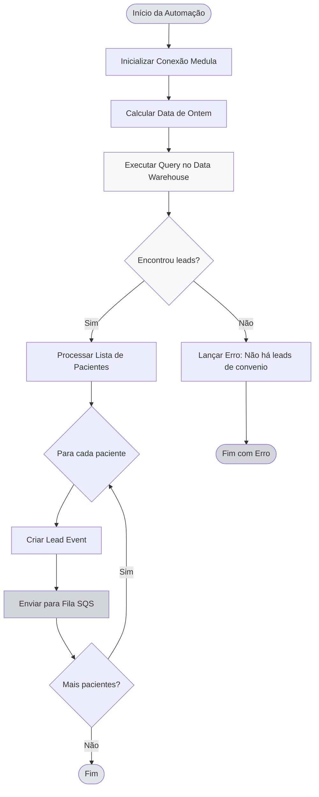

## 📊 Query e Filtros no Data Warehouse

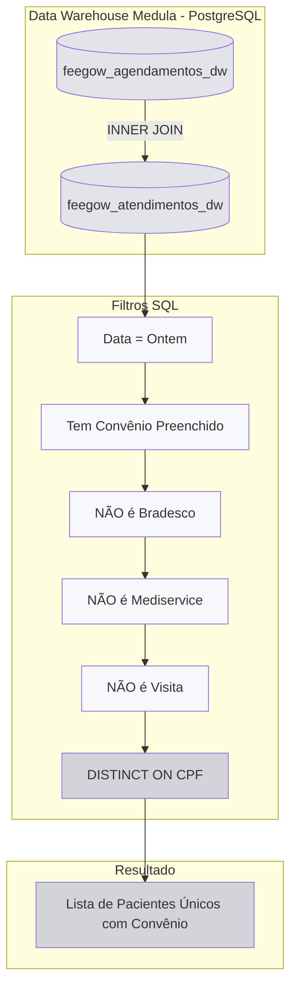

## 🎯 Filtros de Convênio

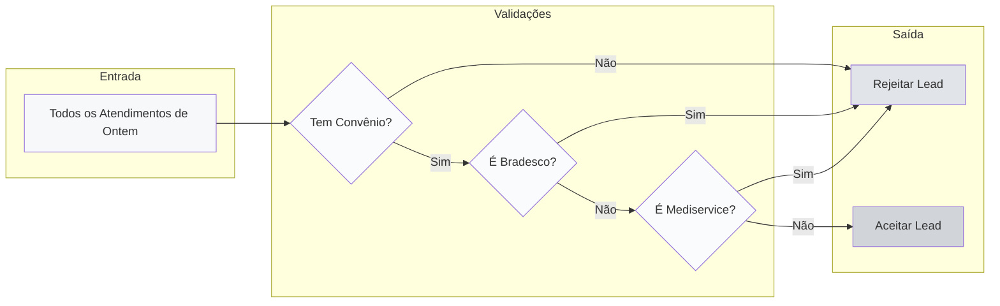

## 📅 Janela de Tempo

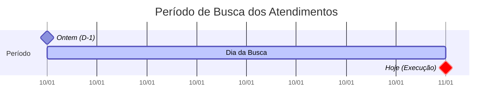

## 🔄 INNER JOIN - Garantia de Atendimento

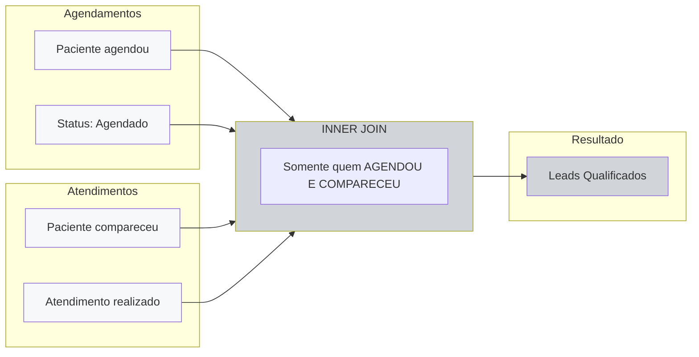

## 🔄 Integração com Sistemas

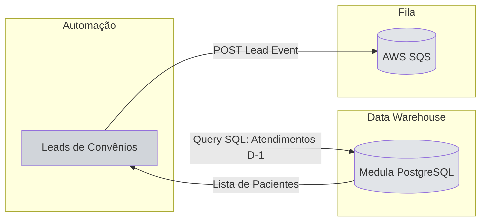

## 📦 Estrutura de Dados

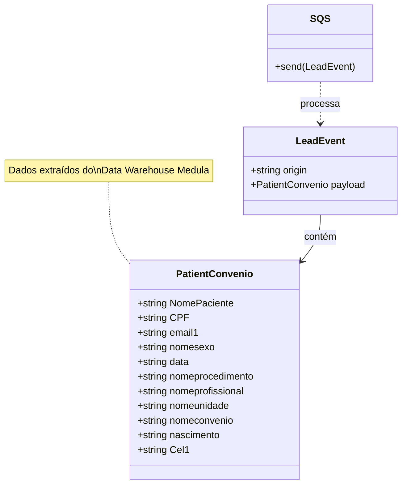

## 🚦 Deduplicação via SQL

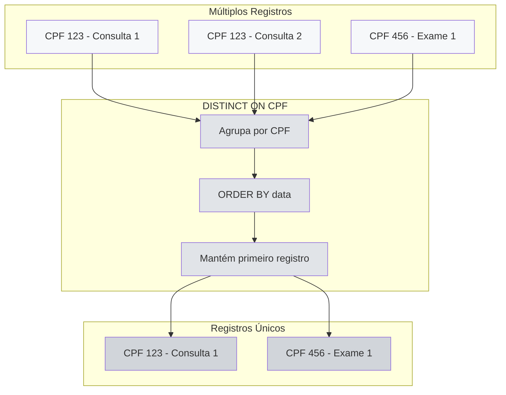

## 🎯 Convênios Aceitos vs Rejeitados

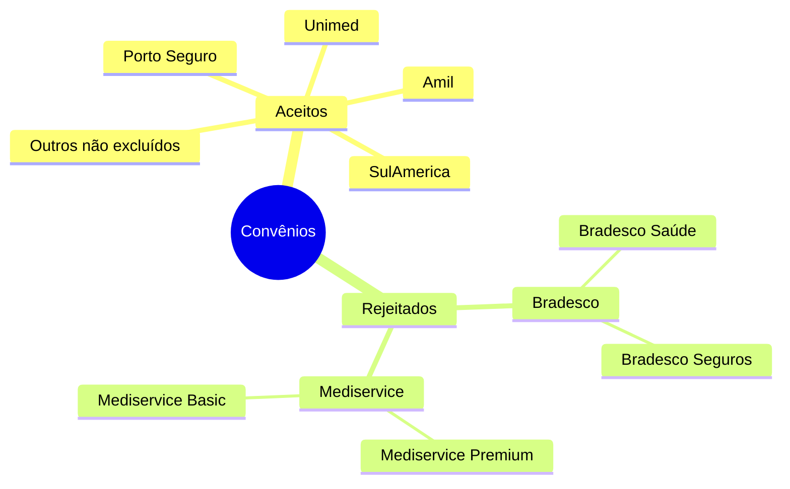

## 📊 Fluxo de Processamento Simplificado

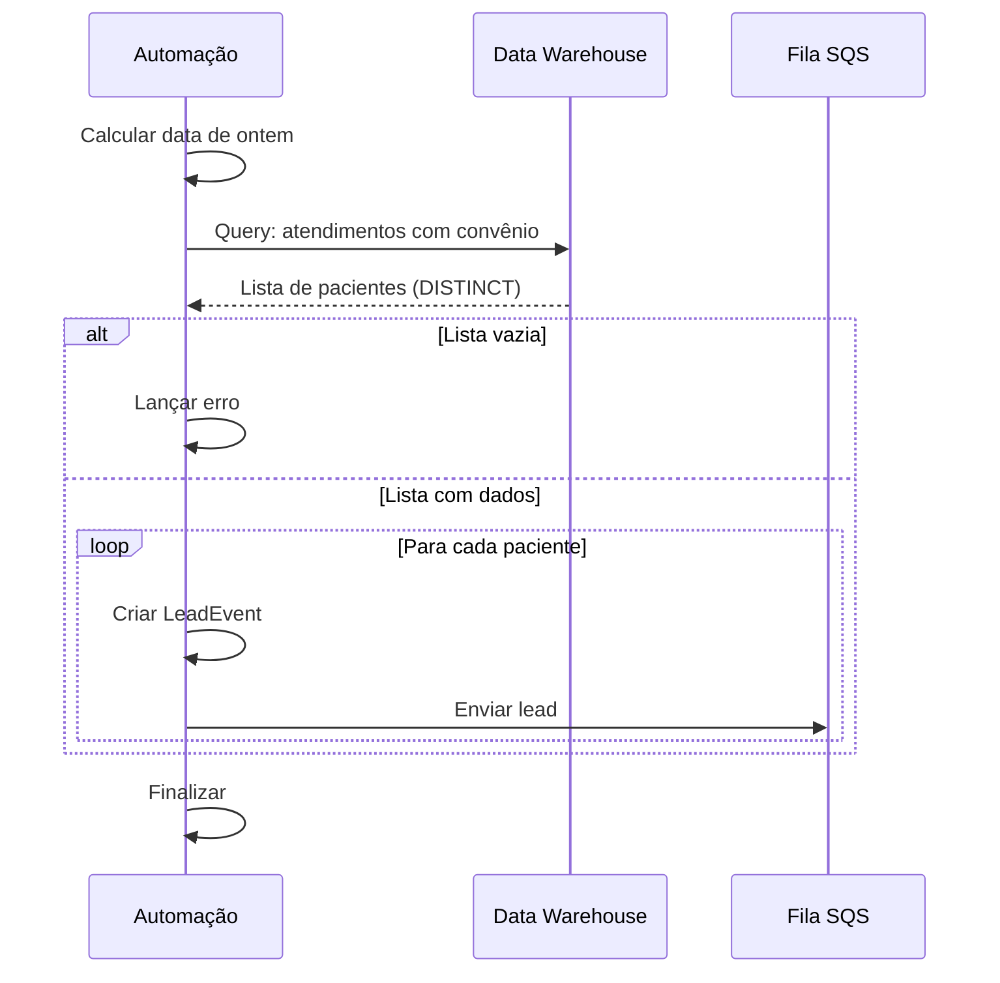

## 🔍 Validações de Procedimento

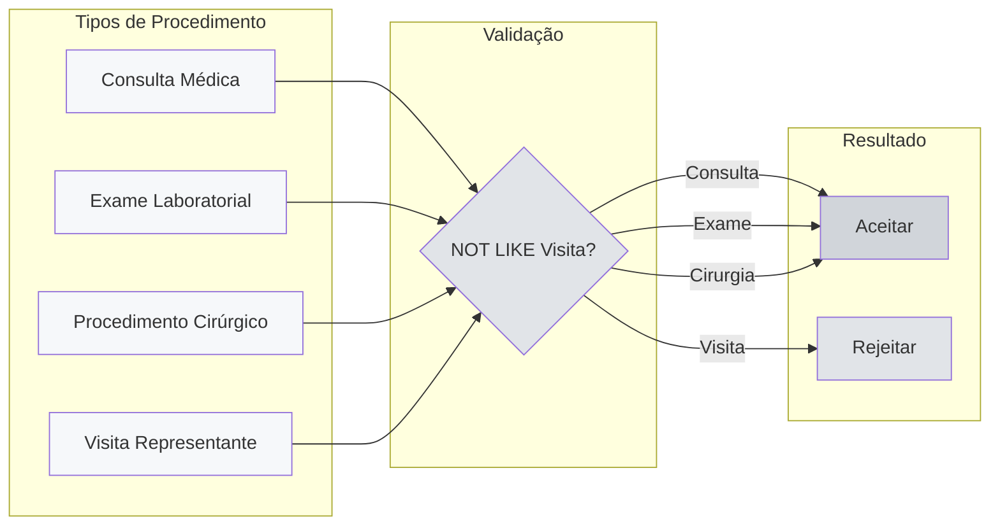

## 🎯 Comparação com Outras Automações

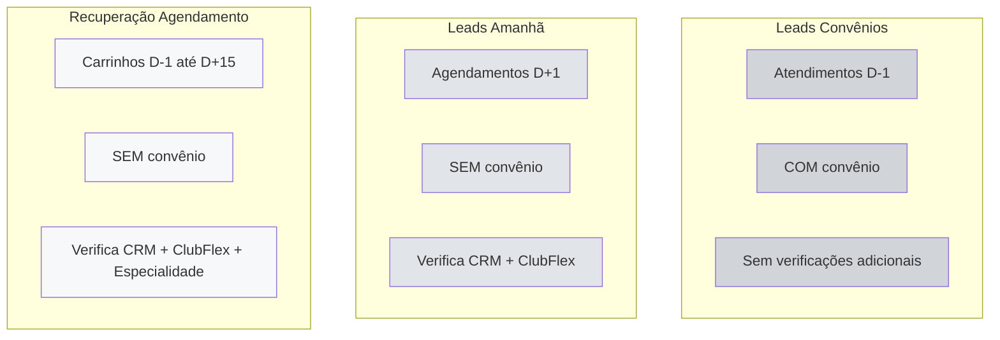
