# Fluxo Visual - Retenção de Ex-Colaboradores B2B

## 🔄 Diagrama Principal

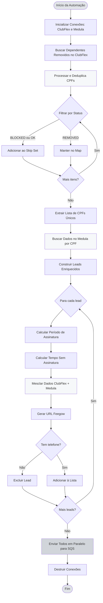

## 📊 Deduplicação Complexa com Map e Set

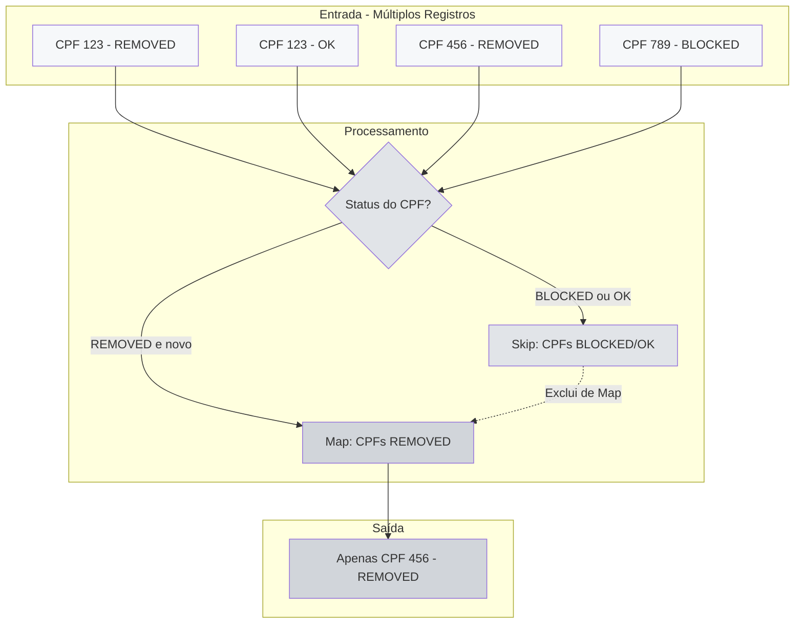

## 🔄 Enriquecimento de Dados

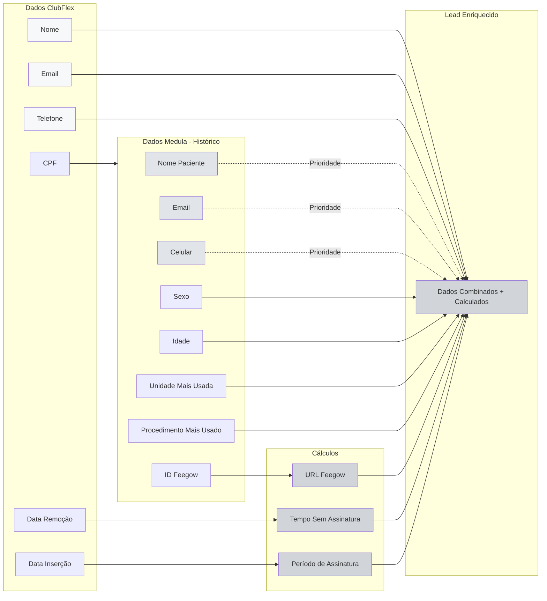

## 🎯 Filtros de Status

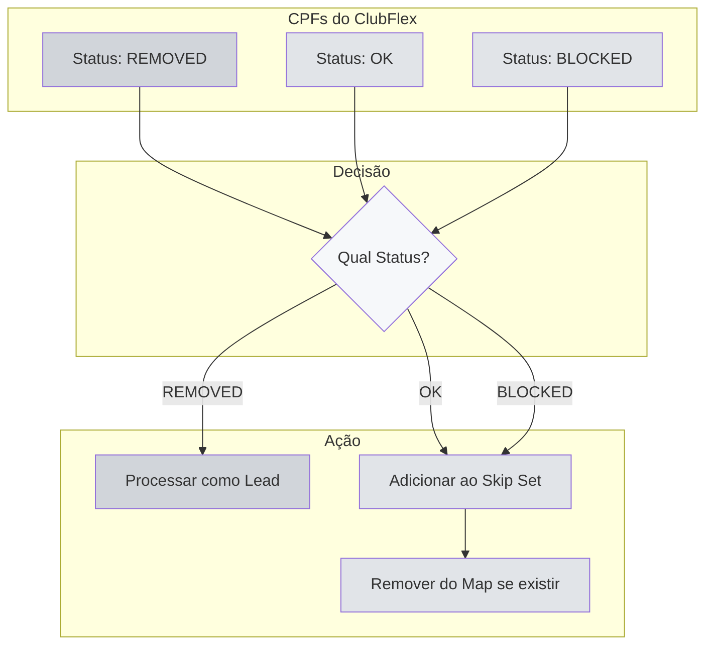

## 📅 Período de Busca

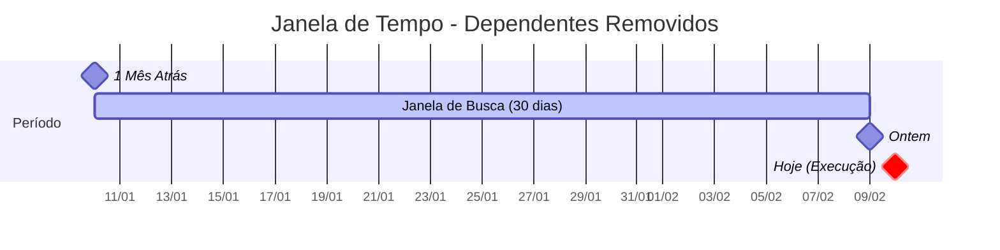

## 🔄 Integração com Sistemas

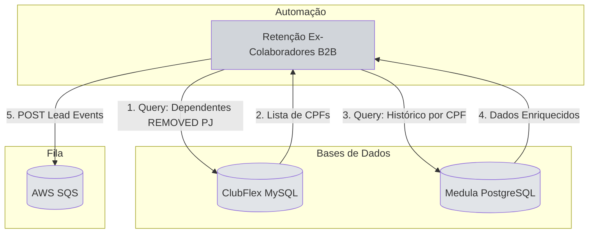

## 📦 Estrutura do Lead Enriquecido

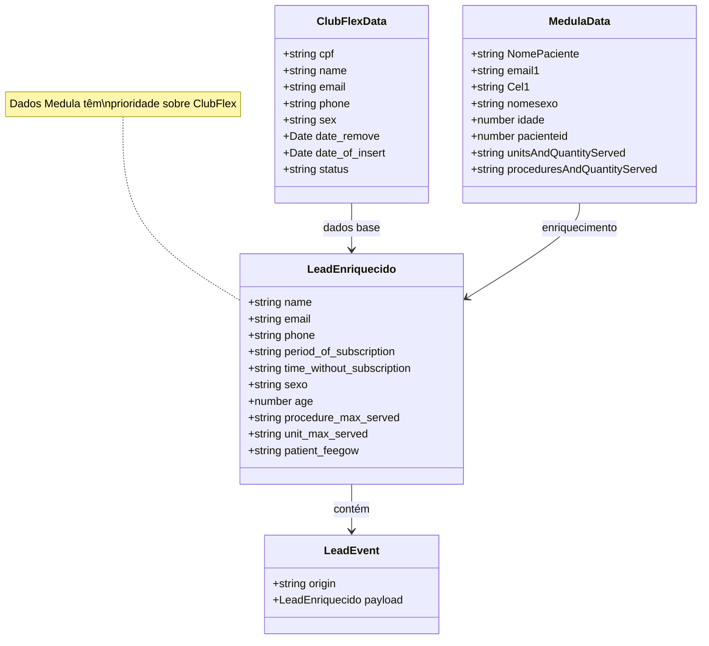

## 🚦 Validação de CPF

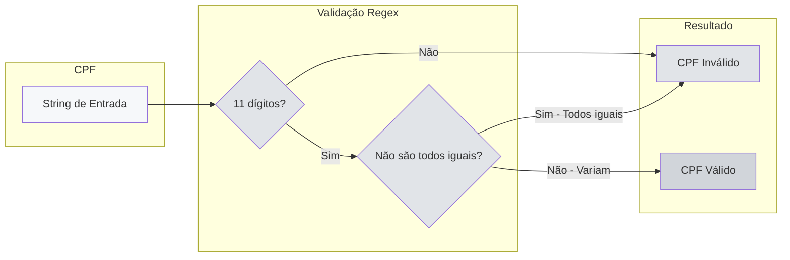

## 📊 Cálculo de Períodos

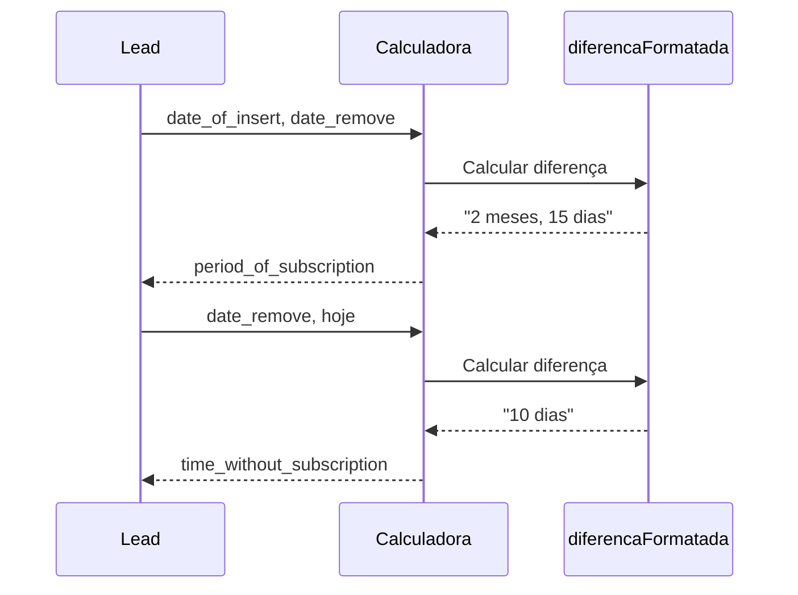

## 🎯 Query ClubFlex - Filtros SQL

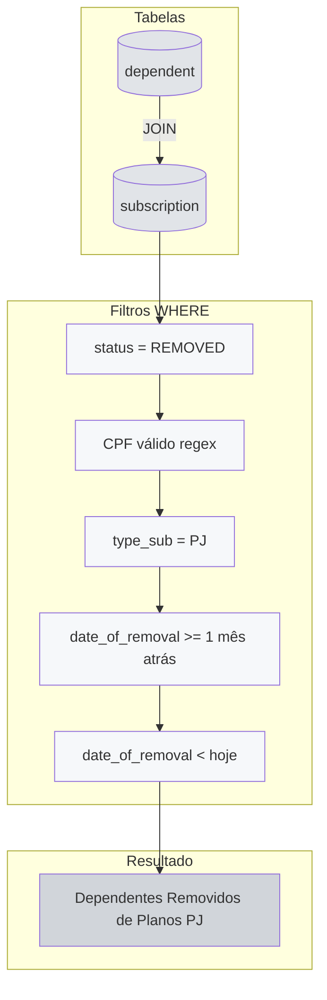

## 🔢 Prioridade de Dados

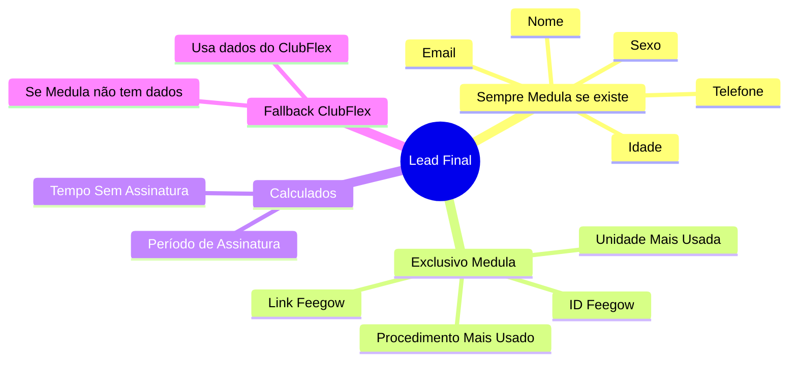

## 🚀 Envio Paralelo

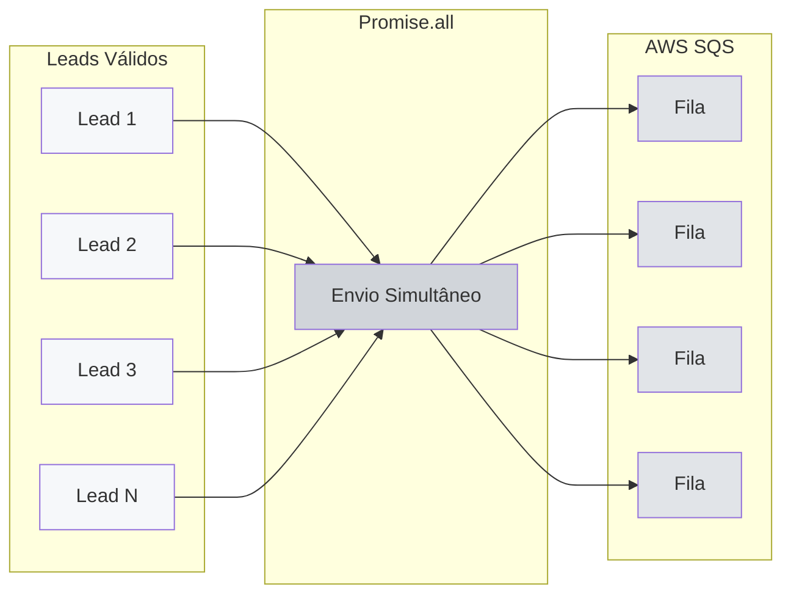

## 🎯 Comparação com Outras Automações

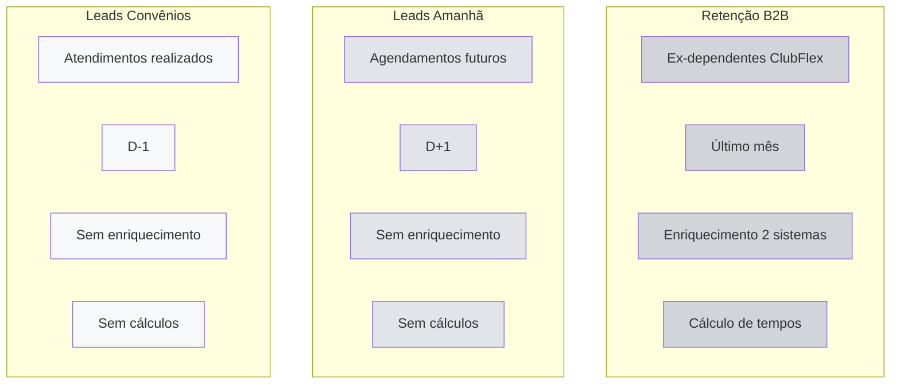
