# Fluxo Visual - Automação de Consultas

## Diagrama do Fluxo Completo

```mermaid
%%{init: {'theme':'base', 'themeVariables': { 'primaryColor':'#f5f5f5','primaryTextColor':'#333','primaryBorderColor':'#666','lineColor':'#666','secondaryColor':'#e8e8e8','tertiaryColor':'#fff', 'noteTextColor':'#333', 'noteBkgColor':'#f5f5f5', 'noteBorderColor':'#666'}}}%%
flowchart TD
    Start(["Início - Cron Diário<br/>04:00 UTC"]) --> Schedule["Schedule Function<br/>consultas.handler"]
    
    Schedule --> Connect["Conecta ao MySQL<br/>e instancia Feegow Client"]
    Connect --> Repository["ConsultaRepository<br/>listLeads()"]
    
    Repository --> QueryDB[("Query Database<br/>site_leads<br/>Data: D-1")]
    
    QueryDB --> Filter1{"Filtros Iniciais<br/>FEEGOW_ID_AGENDAMENTO = null<br/>COMPLETE_DATE = null<br/>CLIENT_PHONE não null"}
    
    Filter1 -->|Não atende| Ignore1["Ignora Lead"]
    Filter1 -->|Atende| LoopLeads{"Para cada<br/>Lead"}
    
    LoopLeads --> CheckPatient{"Paciente tem<br/>ID Feegow?"}
    CheckPatient -->|Não| Ignore2["Ignora Lead<br/>Log Warning"]
    CheckPatient -->|Sim| GetAppointments["Busca Agendamentos<br/>Feegow API"]
    
    GetAppointments --> HasAppointments{"Total de<br/>Agendamentos<br/>= 0?"}
    
    HasAppointments -->|Sim| AddToQueue["Adiciona à Fila"]
    HasAppointments -->|Não| ValidateDate{"Agendamento > próximo mês<br/>OU<br/>Criado há > 1 mês?"}
    
    ValidateDate -->|Sim| AddToQueue
    ValidateDate -->|Não| Ignore3["Ignora Lead"]
    
    AddToQueue --> SendSQS["Envia para SQS<br/>delay: 15s"]
    
    SendSQS --> MoreLeads{"Mais Leads?"}
    MoreLeads -->|Sim| LoopLeads
    MoreLeads -->|Não| EndSchedule(["Fim Schedule"])
    
    SendSQS -.->|Mensagem SQS| Worker["Worker Function<br/>consultas.handler"]
    
    Worker --> ParseMessage["Parse Mensagem SQS"]
    ParseMessage --> ParseDeal["parseDeal()"]
    
    ParseDeal --> CheckSpecialty{"Lead tem<br/>especialidade?"}
    CheckSpecialty -->|Sim| CheckSpecialtyAppt["Verifica agendamento<br/>da especialidade"]
    CheckSpecialtyAppt --> HasSpecialtyAppt{"Já tem agendamento<br/>da especialidade?"}
    HasSpecialtyAppt -->|Sim| ReturnNull["return null<br/>Descarta Lead"]
    HasSpecialtyAppt -->|Não| BuildDeal
    
    CheckSpecialty -->|Não| BuildDeal["Monta Deal Object"]
    
    BuildDeal --> DefineStage["Define Última Tela<br/>stageScream()"]
    DefineStage --> DefineClient["Define Cliente Clubflex<br/>Sim/Não"]
    DefineClient --> FormatFields["Formata Custom Fields<br/>+ Anotações"]
    
    FormatFields --> ProcessLead["processLead()<br/>RD Service"]
    
    ProcessLead --> FindOrg["findOrCreateOrganization()"]
    FindOrg --> GetOrg{"Organização<br/>existe no RD?"}
    GetOrg -->|Não| CreateOrg["POST Organization<br/>RD API"]
    GetOrg -->|Sim| UseOrg["Usa Organização<br/>existente"]
    
    CreateOrg --> PostDeal
    UseOrg --> PostDeal["POST Deal<br/>RD API"]
    
    PostDeal --> SetStage["Stage: RECUPERACAO<br/>Source: AGENDAMENTO"]
    SetStage --> LoopNotes{"Para cada<br/>Anotação"}
    
    LoopNotes --> PostNote["POST Activity<br/>RD API"]
    PostNote --> MoreNotes{"Mais<br/>Anotações?"}
    MoreNotes -->|Sim| LoopNotes
    MoreNotes -->|Não| EndWorker(["Fim Worker"])
    
    ReturnNull --> EndWorker
    
    Ignore1 -.-> EndSchedule
    Ignore2 -.-> MoreLeads
    Ignore3 -.-> MoreLeads
    
    style Start fill:#e8e8e8,stroke:#666,stroke-width:2px,color:#333
    style EndSchedule fill:#e8e8e8,stroke:#666,stroke-width:2px,color:#333
    style EndWorker fill:#e8e8e8,stroke:#666,stroke-width:2px,color:#333
    style Schedule fill:#d0d0d0,stroke:#666,stroke-width:2px,color:#333
    style Worker fill:#d0d0d0,stroke:#666,stroke-width:2px,color:#333
    style QueryDB fill:#f0f0f0,stroke:#666,stroke-width:2px,color:#333
    style SendSQS fill:#d8d8d8,stroke:#666,stroke-width:2px,color:#333
    style PostDeal fill:#d8d8d8,stroke:#666,stroke-width:2px,color:#333
    style CreateOrg fill:#d8d8d8,stroke:#666,stroke-width:2px,color:#333
    style PostNote fill:#d8d8d8,stroke:#666,stroke-width:2px,color:#333
    style Ignore1 fill:#c0c0c0,stroke:#666,stroke-width:1px,color:#333
    style Ignore2 fill:#c0c0c0,stroke:#666,stroke-width:1px,color:#333
    style Ignore3 fill:#c0c0c0,stroke:#666,stroke-width:1px,color:#333
    style ReturnNull fill:#c0c0c0,stroke:#666,stroke-width:1px,color:#333
```

## Detalhamento das Etapas

### 1. Schedule Function (Cron)

- **Trigger:** Execução diária às 04:00 UTC
- **Objetivo:** Coletar leads do dia anterior que não concluíram o agendamento
- **Output:** Mensagens enviadas para SQS

### 2. Filtros de Seleção

Leads são selecionados com base em:

- Sem ID de agendamento Feegow
- Sem data de conclusão
- Com telefone preenchido
- Do dia anterior

### 3. Validação de Agendamentos

Para cada lead com ID Feegow:

- Busca agendamentos existentes via API Feegow
- Valida se agendamentos são recentes e dentro do próximo mês
- Descarta leads com agendamentos válidos

### 4. Worker Function (SQS)

- **Trigger:** Mensagens na fila SQS
- **Processamento:** Um lead por vez (batch size = 1)
- **Delay:** 15 segundos entre processamentos

### 5. Conversão para Deal

Transforma dados do lead em estrutura do RD Station:

- **Custom Fields:** Convênio, especialidade, profissional, valor, etc.
- **Stage:** RECUPERACAO
- **Source:** AGENDAMENTO
- **Anotações:** Resumo formatado com link Feegow

### 6. Validação de Especialidade

- Verifica se já existe agendamento da mesma especialidade
- Descarta lead se confirmado

### 7. Identificação da Última Tela

Algoritmo que identifica em qual etapa o usuário abandonou:

- Tela 6: Seleção de data/horário
- Tela 5: Seleção de profissional
- Tela 4: Seleção de unidade
- Tela 3: Seleção de especialidade
- Tela 2: Preenchimento de dados
- Tela 1: Identificação Clubflex
- Tela 0: CPF inicial

### 8. Processamento no RD Station

1. Busca ou cria organização
2. Cria deal vinculado à organização
3. Adiciona todas as anotações

## Pontos de Atenção

- ⏱️ **Timeout:** Schedule tem 15min, Worker tem 3min
- 🔄 **Retry:** SQS possui retry automático em caso de falha
- 🚫 **Descarte:** Leads com agendamento da especialidade são descartados
- 📊 **Volume:** Processamento sequencial pode ser lento com alto volume
- 🔗 **APIs:** Dependente de Feegow e RD Station CRM
