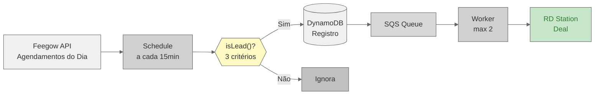

# Fluxo Visual - Automação de Convênios (Atendimentos)

## Diagrama do Fluxo Completo

```mermaid
%%{init: {'theme':'base', 'themeVariables': { 'primaryColor':'#f5f5f5','primaryTextColor':'#333','primaryBorderColor':'#666','lineColor':'#666','secondaryColor':'#e8e8e8','tertiaryColor':'#fff', 'noteTextColor':'#333', 'noteBkgColor':'#f5f5f5', 'noteBorderColor':'#666'}}}%%
flowchart TD
    Start(["Início - Cron a cada 15min<br/>10h-23h UTC"]) --> Schedule["Schedule Function<br/>atendimentos.handler"]
    
    Schedule --> GetDate["Obtém Data Atual<br/>formato: dd/MM/yyyy"]
    GetDate --> FetchSchedules["Busca Agendamentos<br/>Feegow API"]
    
    FetchSchedules --> ScanDynamo[("Scan DynamoDB<br/>ATENDIMENTOS_CONVENIOS<br/>Agendamentos processados")]
    
    ScanDynamo --> LoopSchedules{"Para cada<br/>Agendamento"}
    
    LoopSchedules --> CheckProcessed{"Já foi<br/>processado?"}
    CheckProcessed -->|Sim| NextSchedule["Próximo<br/>Agendamento"]
    
    CheckProcessed -->|Não| IsLead{"isLead()<br/>Validações"}
    
    IsLead --> CheckAttended{"StaID == 3?<br/>Atendido?"}
    CheckAttended -->|Não| NotLead["Não é Lead<br/>Ignora"]
    
    CheckAttended -->|Sim| CheckConvenio{"NomeConvenio<br/>!= vazio?"}
    CheckConvenio -->|Não| NotLead
    
    CheckConvenio -->|Sim| CheckConsulta{"NomeProcedimento<br/>contém 'consulta'?"}
    CheckConsulta -->|Não| NotLead
    
    CheckConsulta -->|Sim| ValidLead["✓ Lead Válido"]
    
    ValidLead --> SendQueue["Envia para SQS<br/>delay: 15s"]
    SendQueue --> SaveDynamo[("Salva no DynamoDB<br/>TTL: 1 dia")]
    
    SaveDynamo --> NextSchedule
    NotLead --> NextSchedule
    
    NextSchedule --> MoreSchedules{"Mais<br/>Agendamentos?"}
    MoreSchedules -->|Sim| LoopSchedules
    MoreSchedules -->|Não| EndSchedule(["Fim Schedule<br/>Aguarda próximo cron"])
    
    SendQueue -.->|Mensagem SQS| Worker["Worker Function<br/>atendimentos.handler<br/>Max Concurrency: 2"]
    
    Worker --> ParseMsg["Parse Mensagem SQS<br/>Agendamento Object"]
    
    ParseMsg --> ParseDeal["parseDeal()<br/>Converte para Deal RD"]
    
    ParseDeal --> ExtractPhone{"Cel1<br/>existe?"}
    ExtractPhone -->|Sim| AddPhone["Adiciona Phone<br/>type: cellphone"]
    ExtractPhone -->|Não| SkipPhone["Sem telefone"]
    
    AddPhone --> BuildCustomFields
    SkipPhone --> BuildCustomFields["Monta Custom Fields"]
    
    BuildCustomFields --> AddConvenio["+ FIELD_CONVENIO<br/>NomeConvenio"]
    AddConvenio --> AddEspecialidade["+ FIELD_ESPECIALIDADE<br/>NomeEspecialidade"]
    AddEspecialidade --> AddUnidade["+ FIELD_UNIDADE<br/>NomeUnidade"]
    
    AddUnidade --> BuildContact["Monta Contact<br/>Nome + Phone"]
    
    BuildContact --> BuildDealObj["Monta Deal Object"]
    
    BuildDealObj --> SetStage["Stage:<br/>ATENDIMENTO_CONVENIOS"]
    SetStage --> SetUser["User: DEFAULT_USER<br/>Rating: 0"]
    
    SetUser --> PostRD["POST Deal<br/>RD Station API"]
    
    PostRD --> Success{"Sucesso?"}
    Success -->|Sim| EndWorker(["Fim Worker<br/>Deal criado"])
    Success -->|Não| ErrorWorker["Erro<br/>SQS retry"]
    
    ErrorWorker -.->|Retry| Worker
    
    style Start fill:#e8e8e8,stroke:#666,stroke-width:2px,color:#333
    style EndSchedule fill:#e8e8e8,stroke:#666,stroke-width:2px,color:#333
    style EndWorker fill:#e8e8e8,stroke:#666,stroke-width:2px,color:#333
    style Schedule fill:#d0d0d0,stroke:#666,stroke-width:2px,color:#333
    style Worker fill:#d0d0d0,stroke:#666,stroke-width:2px,color:#333
    style ScanDynamo fill:#f0f0f0,stroke:#666,stroke-width:2px,color:#333
    style SaveDynamo fill:#f0f0f0,stroke:#666,stroke-width:2px,color:#333
    style SendQueue fill:#d8d8d8,stroke:#666,stroke-width:2px,color:#333
    style PostRD fill:#d8d8d8,stroke:#666,stroke-width:2px,color:#333
    style ValidLead fill:#c8e6c9,stroke:#666,stroke-width:2px,color:#2e7d32
    style NotLead fill:#c0c0c0,stroke:#666,stroke-width:1px,color:#333
    style ErrorWorker fill:#ffcdd2,stroke:#666,stroke-width:2px,color:#c62828
    style CheckAttended fill:#fff9c4,stroke:#666,stroke-width:2px,color:#333
    style CheckConvenio fill:#fff9c4,stroke:#666,stroke-width:2px,color:#333
    style CheckConsulta fill:#fff9c4,stroke:#666,stroke-width:2px,color:#333
```

## Detalhamento das Etapas

### 1. Schedule Function (Cron Frequente)

- **Trigger:** A cada 15 minutos das 10h às 23h UTC (07h às 20h Brasília)
- **Objetivo:** Monitorar atendimentos realizados no dia via convênio
- **Frequência:** 84 execuções por dia
- **Output:** Agendamentos válidos enviados para SQS

### 2. Coleta de Agendamentos

- Busca todos os agendamentos do dia atual via API Feegow
- Formato de data: dd/MM/yyyy
- Retorna lista completa de agendamentos (todas as especialidades)

### 3. Verificação de Processamento (DynamoDB)

- Scan completo da tabela `ATENDIMENTOS_CONVENIOS`
- Identifica agendamentos já processados pelo ID
- Evita duplicação de deals no RD Station
- TTL automático de 1 dia para limpeza

### 4. Validação de Lead (Critérios AND)

Um agendamento é considerado lead quando **TODOS** os critérios são verdadeiros:

**Critério 1: Atendido**

- `StaID == 3`
- Confirma que o paciente foi efetivamente atendido

**Critério 2: Com Convênio**

- `NomeConvenio != ""`
- Possui convênio médico associado

**Critério 3: É Consulta**

- `NomeProcedimento.toLowerCase().includes("consulta")`
- Procedimento do tipo consulta (case insensitive)

### 5. Armazenamento e Fila

**DynamoDB:**

- Salva ID do agendamento processado
- TTL de 1 dia (deleteAt)
- Previne processamento duplicado

**SQS:**

- Delay de 15 segundos
- Permite processamento controlado
- Suporta retry automático

### 6. Worker Function (Processamento)

- **Trigger:** Mensagens SQS
- **Concorrência:** Máximo 2 workers simultâneos
- **Reserved Concurrency:** 2 (garantido)
- **Batch:** 1 mensagem por vez

### 7. Conversão para Deal RD Station

**Dados Extraídos:**

- **Nome do Paciente:** `NomePaciente`
- **Telefone:** `Cel1` (se disponível)
- **Convênio:** `NomeConvenio`
- **Especialidade:** `NomeEspecialidade`
- **Unidade:** `NomeUnidade`

**Custom Fields:**

- FIELD_CONVENIO
- FIELD_ESPECIALIDADE
- FIELD_UNIDADE

**Configurações do Deal:**

- **Stage:** ATENDIMENTO_CONVENIOS (ID específico)
- **User:** DEFAULT_USER
- **Rating:** 0
- **Products:** Array vazio

### 8. Envio para RD Station

- Criação direta do deal (não cria organização)
- API: POST /deals
- Em caso de erro: SQS mantém mensagem para retry

## Comparação: Convênios vs Consultas

| Característica | Convênios | Consultas |
|----------------|-----------|-----------|
| **Frequência** | A cada 15 min (14h/dia) | 1x ao dia (04:00) |
| **Janela** | Dia atual | Dia anterior |
| **Fonte** | Feegow API | MySQL Database |
| **Cache** | DynamoDB (TTL 1 dia) | Nenhum |
| **Critério** | Atendidos c/ convênio | Leads não concluídos |
| **Validação** | 3 critérios AND | Múltiplas validações |
| **Stage RD** | ATENDIMENTO_CONVENIOS | RECUPERACAO |
| **Organização** | Não cria | Busca ou cria |
| **Anotações** | Não cria | Cria detalhadas |
| **Concorrência** | Max 2 | Sem limite específico |
| **Objetivo** | Monitorar conversão | Recuperar abandono |

## Fluxo de Dados Simplificado

## Pontos de Atenção

- ⏰ **Execução Frequente:** 84x por dia, monitoramento em tempo quase real
- 🔄 **Cache DynamoDB:** Previne duplicatas com TTL de 1 dia
- 🎯 **3 Critérios AND:** Todos devem ser verdadeiros para ser lead
- 🚦 **Concorrência Limitada:** Max 2 workers simultâneos
- 📊 **Stage Específico:** ATENDIMENTO_CONVENIOS (diferente de recuperação)
- 🏥 **Foco em Convênios:** Apenas atendimentos via plano de saúde
- ⚡ **Processamento Rápido:** Horário comercial (07h-20h)
- 💾 **Sem Organização:** Deal criado diretamente sem vincular organização
