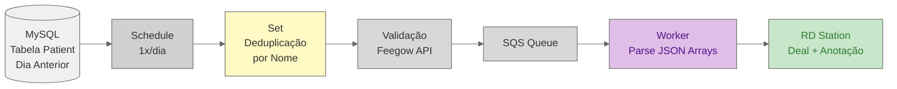

# Fluxo Visual - Automação de Exames

## Diagrama do Fluxo Completo

```mermaid
%%{init: {'theme':'base', 'themeVariables': { 'primaryColor':'#f5f5f5','primaryTextColor':'#333','primaryBorderColor':'#666','lineColor':'#666','secondaryColor':'#e8e8e8','tertiaryColor':'#fff', 'noteTextColor':'#333', 'noteBkgColor':'#f5f5f5', 'noteBorderColor':'#666'}}}%%
flowchart TD
    Start(["Início - Cron Diário<br/>04:00 UTC"]) --> Schedule["Schedule Function<br/>exam.handler"]
    
    Schedule --> ConnectDB["Conecta ao MySQL<br/>agendamentoExameConnection"]
    ConnectDB --> Repository["ExameRepository<br/>listLeads()"]
    
    Repository --> CalcDates["Calcula Janela<br/>Início/Fim Dia Anterior"]
    CalcDates --> QueryDB[("Query Database<br/>Tabela: Patient<br/>WHERE agendamentoId IS NULL")]
    
    QueryDB --> InitSet["Inicializa Set<br/>processedNames"]
    InitSet --> LoopLeads{"Para cada<br/>Lead"}
    
    LoopLeads --> CheckName{"Nome já<br/>processado?"}
    CheckName -->|Sim| SkipDuplicate["Pula Lead<br/>Duplicado"]
    
    CheckName -->|Não| CheckPatientId{"pacienteId<br/>válido?"}
    CheckPatientId -->|Não| LogWarning["Log Warning<br/>Ignora Lead"]
    
    CheckPatientId -->|Sim| FetchAppointments["Busca Agendamentos<br/>Feegow API<br/>schedulesByPatientId()"]
    
    FetchAppointments --> HasAppointments{"Total de<br/>Agendamentos<br/>= 0?"}
    
    HasAppointments -->|Sim| AddLead["Adiciona ao Array<br/>filteredLeads"]
    HasAppointments -->|Não| ValidateDate{"Agendamento > próximo mês<br/>OU<br/>Criado há > 1 mês?"}
    
    ValidateDate -->|Sim| AddLead
    ValidateDate -->|Não| SkipLead["Ignora Lead<br/>Agendamento válido"]
    
    AddLead --> AddToSet["Adiciona nome ao Set<br/>processedNames"]
    AddToSet --> MoreLeads
    
    SkipDuplicate --> MoreLeads{"Mais Leads?"}
    LogWarning --> MoreLeads
    SkipLead --> MoreLeads
    
    MoreLeads -->|Sim| LoopLeads
    MoreLeads -->|Não| SendToQueue["Para cada Lead<br/>Envia para SQS"]
    
    SendToQueue --> LogTotal["Log: Total de Leads"]
    LogTotal --> EndSchedule(["Fim Schedule"])
    
    SendToQueue -.->|Mensagem SQS| Worker["Worker Function<br/>exam.handler"]
    
    Worker --> ParseMessage["Parse Mensagem SQS<br/>LeadExame Object"]
    
    ParseMessage --> ParseDeal["parseDeal()<br/>Conversão para Deal"]
    
    ParseDeal --> ParseJSON["Parse Arrays JSON<br/>dataAgendamentos<br/>horaAgendamento<br/>procedimentos<br/>especialidades"]
    
    ParseJSON --> BuildPaciente["Monta dados Paciente<br/>ID, Nome, Contato"]
    
    BuildPaciente --> CheckClubflex{"clubflexId<br/>existe?"}
    CheckClubflex -->|Sim| SetClubYes["FIELD_CLIENTECLUB<br/>=  'Sim'"]
    CheckClubflex -->|Não| SetClubNo["FIELD_CLIENTECLUB<br/>= 'Não'"]
    
    SetClubYes --> BuildCustomFields
    SetClubNo --> BuildCustomFields["Monta Custom Fields"]
    
    BuildCustomFields --> AddConvenio["+ FIELD_CONVENIO<br/>convenio"]
    
    AddConvenio --> BuildAnnotation["Monta Anotação Detalhada"]
    
    BuildAnnotation --> AddPatientInfo["+ Seção Paciente<br/>Nome, Nascimento, Contato"]
    AddPatientInfo --> AddScheduleInfo["+ Seção Agendamentos<br/>Datas, Horários, Especialidades<br/>Procedimentos, Profissionais"]
    AddScheduleInfo --> AddFeegowLink["+ Link Feegow<br/>v8/?p=pacientes&i=ID"]
    
    AddFeegowLink --> SetStage["Stage:<br/>FUNEL_RECUPERACAO_EX"]
    SetStage --> SetSource["Source:<br/>SOURCE_AGENDAMENTO"]
    
    SetSource --> ProcessRD["processLead()<br/>RD Service"]
    
    ProcessRD --> FindOrg["findOrCreateOrganization()"]
    FindOrg --> GetOrg{"Organização<br/>existe?"}
    
    GetOrg -->|Não| CreateOrg["POST Organization<br/>RD API"]
    GetOrg -->|Sim| UseOrg["Usa Organização<br/>existente"]
    
    CreateOrg --> PostDeal
    UseOrg --> PostDeal["POST Deal<br/>RD API"]
    
    PostDeal --> PostAnnotation["POST Activity<br/>Anotação completa<br/>RD API"]
    
    PostAnnotation --> EndWorker(["Fim Worker"])
    
    style Start fill:#e8e8e8,stroke:#666,stroke-width:2px,color:#333
    style EndSchedule fill:#e8e8e8,stroke:#666,stroke-width:2px,color:#333
    style EndWorker fill:#e8e8e8,stroke:#666,stroke-width:2px,color:#333
    style Schedule fill:#d0d0d0,stroke:#666,stroke-width:2px,color:#333
    style Worker fill:#d0d0d0,stroke:#666,stroke-width:2px,color:#333
    style QueryDB fill:#f0f0f0,stroke:#666,stroke-width:2px,color:#333
    style SendToQueue fill:#d8d8d8,stroke:#666,stroke-width:2px,color:#333
    style PostDeal fill:#d8d8d8,stroke:#666,stroke-width:2px,color:#333
    style CreateOrg fill:#d8d8d8,stroke:#666,stroke-width:2px,color:#333
    style PostAnnotation fill:#d8d8d8,stroke:#666,stroke-width:2px,color:#333
    style AddLead fill:#c8e6c9,stroke:#666,stroke-width:2px,color:#2e7d32
    style SkipDuplicate fill:#c0c0c0,stroke:#666,stroke-width:1px,color:#333
    style SkipLead fill:#c0c0c0,stroke:#666,stroke-width:1px,color:#333
    style LogWarning fill:#c0c0c0,stroke:#666,stroke-width:1px,color:#333
    style InitSet fill:#fff9c4,stroke:#666,stroke-width:2px,color:#333
    style AddToSet fill:#fff9c4,stroke:#666,stroke-width:2px,color:#333
    style ParseJSON fill:#e1bee7,stroke:#666,stroke-width:2px,color:#4a148c
```



## Detalhamento das Etapas

### 1. Schedule Function (Cron Diário)

- **Trigger:** Execução diária às 04:00 UTC (01:00 Brasília)
- **Objetivo:** Coletar leads de exames do dia anterior
- **Tabela:** `Patient` (específica para exames)
- **Output:** Mensagens enviadas para SQS

### 2. Cálculo da Janela de Tempo

Diferente de consultas, usa funções específicas de data:

- **Início do dia anterior:** `startOfDay(sub(new Date(), { days: 1 }))`
- **Fim do dia anterior:** `endOfDay(sub(new Date(), { days: 1 }))`
- **Formato:** ISO String para query SQL
- **Range:** BETWEEN início e fim

### 3. Query SQL Específica

```sql
SELECT * FROM Patient 
WHERE 
    agendamentoId IS NULL
    AND pacienteNome IS NOT NULL
    AND pacienteId IS NOT NULL
    AND createdAt BETWEEN ? AND ?
```

**Diferenças:**

- Tabela `Patient` ao invés de `site_leads`
- Campo `agendamentoId` ao invés de `FEEGOW_ID_AGENDAMENTO`
- Sem validação de telefone obrigatório

### 4. Deduplicação por Nome (Set)

**Mecanismo único desta automação:**

- Cria `Set<string>` chamado `processedNames`
- Antes de processar, verifica se nome já existe no Set
- Após validação, adiciona nome ao Set
- **Objetivo:** Evitar múltiplos leads do mesmo paciente

### 5. Validação de Agendamentos

Similar a consultas, mas com lógica de Set:

1. Verifica se paciente tem ID válido
2. Busca agendamentos via API Feegow
3. Se total = 0: Adiciona ao array filtrado
4. Se total > 0: Valida datas
5. **Adiciona nome ao Set** após aprovação

### 6. Worker Function (Processamento)

- **Trigger:** Mensagens na fila SQS
- **Batch:** 1 mensagem por vez
- **Delay:** 15 segundos entre processamentos
- **Tipo:** `LeadExame` (interface específica)

### 7. Parsing de Arrays JSON

**Etapa crítica desta automação:**

Múltiplos campos armazenados como JSON precisam ser parseados:

- `dataAgendamentos` → Array de strings (datas)
- `horaAgendamento` → Array de strings (horários)
- `procedimentos` → Array de strings (exames)
- `especialidades` → Array ou string separada por vírgula
- `profissionalsId` → Array de strings (IDs)
- `unidadesId` → Array de strings (IDs)

**Tratamento:**

```typescript
leadExames.dataAgendamentos 
    ? JSON.parse(leadExames.dataAgendamentos) 
    : undefined
```

### 8. Identificação de Cliente Clubflex

- Verifica se `clubflexId` existe
- Define custom field `FIELD_CLIENTECLUB`:
  - "Sim" se possui clubflexId
  - "Não" caso contrário

### 9. Construção da Anotação Detalhada

**Anotação complexa com duas seções:**

**Seção Paciente:**

- Nome completo
- Data de nascimento (se disponível)
- Telefone de contato (se disponível)

**Seção Agendamentos:**

- Data e hora do acesso (formatada em PT-BR)
- **Datas de interesse** (array formatado com join)
- **Horários selecionados** (array formatado)
- **Especialidades** (array formatado)
- **Procedimentos** (array de exames)
- **Profissionais** (IDs dos médicos)
- **Unidades** (IDs das clínicas)
- Convênio médico
- Plano específico
- **Link Feegow** (formato v8 com parâmetro Pers=1)

### 10. Stage e Source Específicos

- **Stage:** `FUNEL_RECUPERACAO_EX` (ID específico para exames)
- **Source:** `SOURCE_AGENDAMENTO` (mesma origem)
- **Diferença:** Stage separado permite segmentação no RD

### 11. Processamento no RD Station

Mesmo fluxo de consultas:

1. Busca ou cria organização
2. Cria deal vinculado
3. Adiciona anotação detalhada

## Comparação: Exames vs Consultas vs Convênios

| Característica | Exames | Consultas | Convênios |
|----------------|--------|-----------|-----------|
| **Frequência** | 1x/dia (04:00) | 1x/dia (04:00) | 15min (10h-23h) |
| **Tabela** | `Patient` | `site_leads` | API Feegow |
| **Janela** | Dia anterior | Dia anterior | Dia atual |
| **Deduplicação** | Set por nome | Por agendamento | DynamoDB |
| **Campos** | Arrays JSON | Simples | Simples |
| **Custom Fields** | 2 campos | 10+ campos | 3 campos |
| **Stage** | FUNEL_RECUPERACAO_EX | STAGE_RECUPERACAO | ATENDIMENTO_CONVENIOS |
| **Anotação** | Arrays múltiplos | Texto formatado | Não cria |
| **Organização** | Busca/Cria | Busca/Cria | Não cria |
| **Link Feegow** | v8 com Pers=1 | Método estático | Não usado |
| **Objetivo** | Recuperar exames | Recuperar consultas | Monitorar convênios |

## Fluxo de Dados Simplificado



## Particularidades da Automação de Exames

### 1. Múltiplas Seleções (Arrays)

Diferente de consultas que têm valores únicos, exames permitem:

- ✅ **Múltiplas datas** de interesse
- ✅ **Múltiplos horários** disponíveis
- ✅ **Múltiplos procedimentos** (diferentes tipos de exames)
- ✅ **Múltiplas especialidades**
- ✅ **Múltiplos profissionais**
- ✅ **Múltiplas unidades**

### 2. Parsing JSON Complexo

Campos precisam ser deserializados:

```typescript
// Parsing simples
dataAgendamentos: JSON.parse(leadExames.dataAgendamentos)

// Parsing com fallback para especialidades
especialidades: Array.isArray(leadExames.especialidades)
    ? leadExames.especialidades
    : leadExames.especialidades.split(",")
```

### 3. Deduplicação em Memória

Usa `Set` para controle:

```typescript
const processedNames = new Set<string>();

// Verifica antes de processar
if (processedNames.has(lead.pacienteNome)) {
    continue;
}

// Adiciona após validação
processedNames.add(lead.pacienteNome);
```

**⚠️ Limitação:** Pacientes com nomes idênticos serão tratados como duplicatas

### 4. Link Feegow Específico

Formato diferente de consultas:

```
https://app.feegow.com/v8/?p=pacientes&i=${pacienteId}&Pers=1
```

- `v8` - Versão da interface
- `p=pacientes` - Página de pacientes
- `i=${pacienteId}` - ID do paciente
- `Pers=1` - Parâmetro de personalização

### 5. Formatação de Data Brasileira

Usa função utilitária específica:

```typescript
formatBrazilianDate(data.createdAt)
```

Converte ISO para formato brasileiro (DD/MM/YYYY HH:mm)

### 6. Stage Específico para Exames

`FUNEL_RECUPERACAO_EX` permite:

- Segmentação no RD Station
- Métricas separadas de consultas
- Fluxo de follow-up diferenciado
- Relatórios específicos para exames

## Pontos de Atenção

- 📅 **Janela de Tempo:** Dia anterior completo (00:00 às 23:59)
- 🔄 **Deduplicação:** Por nome, não por ID (risco de homônimos)
- 📊 **Arrays JSON:** Campos podem estar vazios ou null
- 🏷️ **Clubflex:** Identificação via clubflexId
- 📝 **Anotações Ricas:** Múltiplos arrays formatados
- 🔗 **Link v8:** Formato específico do Feegow
- 🎯 **Stage Próprio:** FUNEL_RECUPERACAO_EX
- 💾 **Tabela Patient:** Estrutura diferente de site_leads
- ⚡ **Parsing JSON:** Pode falhar se formato inválido
- 🔍 **Set em Memória:** Resetado a cada execução

## Logs e Debugging

```typescript
console.log(lead)           // Cada lead sendo enviado
console.log(leads.length)   // Total de leads encontrados
console.error(`Erro ao verificar agendamentos...`)
console.warn(`Lead ${lead.id} não possui pacienteId válido...`)
```

**Métricas importantes para monitorar:**

- Total de registros na tabela Patient
- Quantidade de leads após deduplicação
- Taxa de leads com arrays JSON válidos
- Tempo de processamento (parsing JSON pode ser lento)
- Leads ignorados por falta de pacienteId
