# Fluxo Visual - Automação de Propostas RC

## Diagrama do Fluxo Completo

```mermaid
%%{init: {'theme':'base', 'themeVariables': { 'primaryColor':'#f5f5f5','primaryTextColor':'#333','primaryBorderColor':'#666','lineColor':'#666','secondaryColor':'#e8e8e8','tertiaryColor':'#fff', 'noteTextColor':'#333', 'noteBkgColor':'#f5f5f5', 'noteBorderColor':'#666'}}}%%
flowchart TD
    Start(["Início - Cron Diário<br/>04:00 UTC"]) --> Schedule["Schedule Function<br/>proposals-rc.handler"]
    
    Schedule --> GetDate["Calcula Data<br/>Dia Anterior<br/>formato: dd/MM/yyyy"]
    GetDate --> FetchProposalsRC["Busca Propostas RC<br/>Feegow API<br/>proposalsRc(date)<br/>⚡ Endpoint Específico"]
    
    FetchProposalsRC --> FilterStatus["Filtra Status<br/>PropostaStatusID = 1<br/>Apenas 'Em Aberto'"]
    
    FilterStatus --> GroupProposals["groupProposals()<br/>Agrupa por Paciente"]
    
    GroupProposals --> LoopItems{"Para cada<br/>Item Feegow"}
    
    LoopItems --> CheckPatient{"Paciente já<br/>no grupo?"}
    
    CheckPatient -->|Não| CreateProposal["Cria Nova Proposta<br/>agente = 'ATIVOS'<br/>✓ Fixo para todos"]
    CreateProposal --> AddItem["Adiciona Item<br/>ao array items"]
    
    CheckPatient -->|Sim| AddItem
    
    AddItem --> MoreItems{"Mais Itens?"}
    MoreItems -->|Sim| LoopItems
    MoreItems -->|Não| ConvertToArray["Converte Objeto<br/>para Array"]
    
    ConvertToArray --> LogTotal["Log Total<br/>console.info(propostas.length)"]
    LogTotal --> SendLoop["Para cada Proposta<br/>Envia para SQS"]
    SendLoop --> EndSchedule(["Fim Schedule"])
    
    SendLoop -.->|Mensagem SQS| Worker["Worker Function<br/>proposals-rc.handler<br/>Max Concurrency: 2"]
    
    Worker --> ParseMsg["Parse Mensagem SQS<br/>Proposal Object"]
    
    ParseMsg --> FetchPatient["Busca Dados Completos<br/>Feegow API<br/>getPatient()"]
    
    FetchPatient --> ParseDeal["parseDeal()<br/>Conversão para Deal"]
    
    ParseDeal --> BuildCustomFields["Monta Custom Fields<br/>12 campos"]
    
    BuildCustomFields --> AddPriority["+ FIELD_PRIORIDADE<br/>groupExames[grupo]"]
    AddPriority --> AddAddress["+ Dados Endereço<br/>CPF, CEP, Cidade, Bairro<br/>Logradouro, Número"]
    AddAddress --> AddAgentFixed["+ AGENTE_PROPOSTA<br/>'ATIVOS' (fixo)<br/>⚡ Sem round-robin"]
    AddAgentFixed --> AddOthers["+ Unidade, Telefone<br/>Anotações cliente"]
    
    AddOthers --> BuildProducts["Monta deal_products<br/>Array de procedimentos"]
    
    BuildProducts --> CheckPatientId{"pacienteId<br/>existe?"}
    CheckPatientId -->|Sim| AddFeegowLink["Adiciona Link Feegow<br/>às anotações"]
    CheckPatientId -->|Não| SkipSchedules["Pula busca<br/>agendamentos"]
    
    AddFeegowLink --> FetchSchedules["Busca Agendamentos<br/>schedulesByPatientId()"]
    
    FetchSchedules --> FilterProcedures["⚡ FILTRO EXCLUSIVO<br/>Remove procedimentos<br/>já agendados"]
    
    FilterProcedures --> LoopFilter{"Para cada<br/>Procedimento"}
    LoopFilter --> HasSchedule{"Existe<br/>agendamento<br/>deste proc?"}
    HasSchedule -->|Sim| RemoveProc["Remove da lista<br/>nonScheduledProcedures"]
    HasSchedule -->|Não| KeepProc["Mantém na lista<br/>nonScheduledProcedures"]
    
    RemoveProc --> MoreFilter
    KeepProc --> MoreFilter{"Mais<br/>Procedimentos?"}
    MoreFilter -->|Sim| LoopFilter
    MoreFilter -->|Não| CheckRemaining
    
    CheckRemaining{"Lista vazia?<br/>Todos agendados?"}
    CheckRemaining -->|Sim| DiscardDeal["⚠️ DESCARTA Proposta<br/>Todos proc. agendados<br/>continue"]
    CheckRemaining -->|Não| UpdateDeal["Atualiza Deal<br/>Apenas proc. não agendados"]
    
    SkipSchedules --> EnrichAnnotation
    UpdateDeal --> EnrichAnnotation["Enriquece Anotação<br/>Procedimentos restantes"]
    
    EnrichAnnotation --> LoopProc{"Para cada<br/>Procedimento"}
    LoopProc --> FindSchedule{"Existe<br/>agendamento?"}
    FindSchedule -->|Sim| AddStatus["Adiciona Status<br/>StatusAppointment[id]"]
    FindSchedule -->|Não| AddPlain["Adiciona apenas<br/>nome procedimento"]
    
    AddStatus --> MoreProc
    AddPlain --> MoreProc{"Mais<br/>Procedimentos?"}
    MoreProc -->|Sim| LoopProc
    MoreProc -->|Não| SetStage["Stage:<br/>FUNNEL_PROPOSTAS_GERAIS<br/>⚡ Funil específico RC"]
    
    SetStage --> SetSource["Source:<br/>SOURCE_PROPOSTAS"]
    
    SetSource --> ProcessRD["processLead()<br/>RD Service"]
    
    ProcessRD --> FindOrg["findOrCreateOrganization()"]
    FindOrg --> GetOrg{"Organização<br/>existe?"}
    
    GetOrg -->|Não| CreateOrg["POST Organization<br/>RD API"]
    GetOrg -->|Sim| UseOrg["Usa Organização<br/>existente"]
    
    CreateOrg --> PostDeal
    UseOrg --> PostDeal["POST Deal<br/>RD API<br/>+ 12 Custom Fields<br/>+ Produtos filtrados"]
    
    PostDeal --> PostAnnotations["POST Activities<br/>Anotações<br/>RD API"]
    
    PostAnnotations --> EndWorker(["Fim Worker"])
    
    DiscardDeal --> EndWorker
    
    style Start fill:#e8e8e8,stroke:#666,stroke-width:2px,color:#333
    style EndSchedule fill:#e8e8e8,stroke:#666,stroke-width:2px,color:#333
    style EndWorker fill:#e8e8e8,stroke:#666,stroke-width:2px,color:#333
    style Schedule fill:#d0d0d0,stroke:#666,stroke-width:2px,color:#333
    style Worker fill:#d0d0d0,stroke:#666,stroke-width:2px,color:#333
    style FetchProposalsRC fill:#b3e5fc,stroke:#666,stroke-width:2px,color:#01579b
    style FetchPatient fill:#f0f0f0,stroke:#666,stroke-width:2px,color:#333
    style FetchSchedules fill:#f0f0f0,stroke:#666,stroke-width:2px,color:#333
    style GroupProposals fill:#bbdefb,stroke:#666,stroke-width:2px,color:#0d47a1
    style AddAgentFixed fill:#ffe082,stroke:#666,stroke-width:2px,color:#f57f17
    style SendLoop fill:#d8d8d8,stroke:#666,stroke-width:2px,color:#333
    style PostDeal fill:#d8d8d8,stroke:#666,stroke-width:2px,color:#333
    style CreateOrg fill:#d8d8d8,stroke:#666,stroke-width:2px,color:#333
    style PostAnnotations fill:#d8d8d8,stroke:#666,stroke-width:2px,color:#333
    style BuildProducts fill:#e1bee7,stroke:#666,stroke-width:2px,color:#4a148c
    style FilterProcedures fill:#ffccbc,stroke:#666,stroke-width:3px,color:#bf360c
    style RemoveProc fill:#ffab91,stroke:#666,stroke-width:2px,color:#d84315
    style KeepProc fill:#c8e6c9,stroke:#666,stroke-width:2px,color:#2e7d32
    style DiscardDeal fill:#c0c0c0,stroke:#666,stroke-width:2px,color:#333
    style UpdateDeal fill:#c8e6c9,stroke:#666,stroke-width:2px,color:#2e7d32
    style FilterStatus fill:#b2dfdb,stroke:#666,stroke-width:2px,color:#004d40
    style EnrichAnnotation fill:#c5e1a5,stroke:#666,stroke-width:2px,color:#33691e
    style SetStage fill:#fff59d,stroke:#666,stroke-width:2px,color:#f57f17
    style LogTotal fill:#e1bee7,stroke:#666,stroke-width:2px,color:#4a148c
```



## Detalhamento das Etapas

### 1. Schedule Function (Cron Diário)

- **Trigger:** Execução diária às 04:00 UTC (01:00 Brasília)
- **Objetivo:** Coletar propostas RC do dia anterior
- **Fonte:** API Feegow - **endpoint específico** `proposalsRc(date)`
- **Output:** Propostas agrupadas enviadas para SQS

### 2. Endpoint Específico RC (Diferencial)

**API Call:**

```typescript
proposalsRc(date)  // Específico para RC
// vs
proposals(date)     // Regular
```

**Características:**

- Retorna subset específico de propostas
- Provavelmente filtrado por unidade ou categoria
- Segmentação na origem dos dados

### 3. Agrupamento por Paciente

**Função:** `groupProposals(data: any[])`

**Processo:** Idêntico a proposals regular

- Consolida múltiplos procedimentos por paciente
- Uma proposta por paciente com N itens

### 4. Atendente Fixo "ATIVOS" (Diferencial)

**Sem Round-Robin:**

```typescript
agente: "ATIVOS"  // Fixo para TODAS as propostas RC
```

**Diferença de Proposals Regular:**

| Aspect | Proposals RC | Proposals Regular |
|--------|--------------|-------------------|
| Atendente | "ATIVOS" (fixo) | Round-robin entre 5 |
| Distribuição | Pool único | Balanceamento automático |
| Código | Direto | Loop com índice |

### 5. Log de Total (Exclusivo)

```typescript
console.info("propostas: " + proposals.length)
```

**Único que loga total encontrado**

- Visibilidade do volume
- Facilita monitoramento
- Debug simplificado

### 6. Worker Function (Processamento)

- **Trigger:** Mensagens SQS
- **Batch:** 1 proposta por vez
- **Concorrência:** Máximo 2 simultâneos
- **Delay:** 15 segundos

### 7. Construção de 12 Custom Fields

**Idêntico a proposals regular, exceto:**

```typescript
AGENTE_PROPOSTA: "ATIVOS"  // Sempre fixo
```

**Campos completos:**

- Prioridade (baseada em grupo)
- Endereço completo (8 campos)
- Dados do paciente
- Atendente fixo

### 8. Filtro Inteligente de Procedimentos (⚡ EXCLUSIVO!)

**O GRANDE DIFERENCIAL desta automação:**

**Lógica:**

```typescript
// 1. Busca agendamentos do paciente
schedules = await feegow.schedulesByPatientId(pacienteId)

// 2. Filtra procedimentos NÃO agendados
nonScheduledProcedures = deal.procedimentos.filter(({ id }) => {
    return !schedules.some((schedule) => schedule.procedimento_id === id)
})

// 3. Se todos já agendados → DESCARTA proposta completa
if (nonScheduledProcedures.length === 0) {
    continue  // Pula para próxima
}

// 4. Se alguns não agendados → MANTÉM apenas esses
deal.procedimentos = nonScheduledProcedures
```

**Comportamento por Cenário:**

**Cenário 1 - Descarte Total:**

```
Proposta Original:
├─ Alergologia (ID: 246)
├─ Cardiologia (ID: 254)
└─ Dermatologia (ID: 261)

Agendamentos Existentes:
├─ Alergologia ✓ (agendado)
├─ Cardiologia ✓ (agendado)
└─ Dermatologia ✓ (agendado)

Resultado: ⚠️ PROPOSTA DESCARTADA
Motivo: Todos procedimentos já agendados
Ação: continue (não cria deal)
```

**Cenário 2 - Filtro Parcial:**

```
Proposta Original:
├─ Alergologia (ID: 246) - R$ 150
├─ Cardiologia (ID: 254) - R$ 200
└─ Dermatologia (ID: 261) - R$ 120

Agendamentos Existentes:
└─ Cardiologia ✓ (agendado)

Resultado: ✓ Deal criado com filtro
Procedimentos no Deal:
├─ Alergologia - R$ 150
└─ Dermatologia - R$ 120
Total: R$ 270 (Cardiologia removido)
```

**Cenário 3 - Sem Filtro:**

```
Proposta Original:
├─ Alergologia (ID: 246) - R$ 150
├─ Cardiologia (ID: 254) - R$ 200
└─ Dermatologia (ID: 261) - R$ 120

Agendamentos Existentes:
(nenhum)

Resultado: ✓ Deal criado completo
Procedimentos no Deal: Todos os 3
Total: R$ 470
```

**Benefícios:**

- ✅ Evita duplicação de esforço comercial
- ✅ Foco apenas em procedimentos pendentes
- ✅ Otimiza tempo da equipe
- ✅ Previne conflitos de agendamento

### 9. Sem Validações de Valor ou Telefone (Diferencial)

**Proposals Regular:**

```typescript
// Valida valor mínimo
if (totalValue >= 0.1 && totalValue <= 65) {
    continue;
}

// Valida telefone
if (!deal) {
    continue;
}
```

**Proposals RC:**

```typescript
// SEM validação de valor
// SEM validação de telefone
```

**Implicações:**

- Aceita propostas de qualquer valor
- Processa mesmo sem telefone cadastrado
- Mais permissivo que proposals regular

### 10. Stage Específico (Diferencial)

```typescript
stage: RD.FUNNEL_PROPOSTAS_GERAIS  // RC específico
// vs
stage: RD.STAGE_PROPOSTA          // Regular
```

**ID:** 65391eec1e66020013a4a86a

**Benefícios:**

- Funil separado para RC
- Métricas isoladas
- SLA diferenciado
- Relatórios segmentados

### 11. Processamento no RD Station

Idêntico às outras automações:

1. Busca ou cria organização
2. Cria deal com produtos (filtrados!)
3. Adiciona anotações enriquecidas

## Comparação: Proposals RC vs Proposals vs Outras Automações

| Característica | **Proposals RC** | **Proposals** | Consultas | Convênios | Exames |
|----------------|------------------|---------------|-----------|-----------|--------|
| **Endpoint** | proposalsRc() | proposals() | MySQL | API Feegow | MySQL |
| **Atendente** | "ATIVOS" fixo | Round-robin (5) | ❌ | ❌ | ❌ |
| **Filtro Proc.** | ✅ Remove agendados | ❌ | ❌ | ❌ | ❌ |
| **Descarte Total** | ✅ Se todos agend. | ❌ | ❌ | ❌ | ❌ |
| **Validação $** | ❌ | ✅ > R$ 65 | ❌ | ❌ | ❌ |
| **Validação Tel** | ❌ | ✅ | ❌ | ❌ | ❌ |
| **Stage** | PROPOSTAS_GERAIS | PROPOSTA | RECUPERACAO | ATENDIMENTO | RECUPERACAO_EX |
| **Produtos** | ✅ Filtrados | ✅ Todos | ❌ | ❌ | ❌ |
| **Custom Fields** | 12 | 12 | 10+ | 3 | 2 |
| **Log Total** | ✅ | ❌ | ❌ | ❌ | ❌ |
| **Agrupamento** | ✅ | ✅ | ❌ | ❌ | Por nome |

## Fluxo de Dados Simplificado

```mermaid
%%{init: {'theme':'base', 'themeVariables': { 'primaryColor':'#f5f5f5','primaryTextColor':'#333','primaryBorderColor':'#666','lineColor':'#666','secondaryColor':'#e8e8e8','tertiaryColor':'#fff'}}}%%
graph LR
    A["Feegow API<br/>proposalsRc()<br/>⚡ Específico RC"] --> B["Schedule<br/>1x/dia"]
    B --> C["Agrupamento<br/>por Paciente"]
    C --> D["Atendente ATIVOS<br/>⚡ Fixo"]
    D --> E["SQS Queue"]
    E --> F["Worker<br/>max 2"]
    F --> G["⚡ FILTRO<br/>Remove proc.<br/>agendados"]
    G --> H{"Sobrou<br/>algum proc?"}
    H -->|Não| I["Descarta"]
    H -->|Sim| J["RD Station<br/>Deal + Produtos"]
    
    style A fill:#b3e5fc,stroke:#666,color:#01579b
    style B fill:#d0d0d0,stroke:#666,color:#333
    style C fill:#bbdefb,stroke:#666,color:#0d47a1
    style D fill:#ffe082,stroke:#666,color:#f57f17
    style E fill:#d8d8d8,stroke:#666,color:#333
    style F fill:#d0d0d0,stroke:#666,color:#333
    style G fill:#ffccbc,stroke:#666,stroke-width:3px,color:#bf360c
    style H fill:#fff9c4,stroke:#666,color:#333
    style I fill:#c0c0c0,stroke:#666,color:#333
    style J fill:#c8e6c9,stroke:#666,color:#2e7d32
```



## Diferenciais Exclusivos de Proposals RC

### 1. ⚡ Filtro Inteligente de Procedimentos (MAIOR DIFERENCIAL)

**Única automação que:**

- Busca agendamentos existentes
- Compara por ID de procedimento
- Remove procedimentos já agendados
- Descarta proposta se todos estão agendados

**Impacto:**

- 🎯 Foco em procedimentos pendentes
- ⏱️ Economia de tempo da equipe
- 📊 Deals mais precisos no RD
- 🚫 Evita duplicação de esforço

### 2. 🎯 Atendente Fixo "ATIVOS"

**Características:**

- Sem distribuição round-robin
- Pool único de atendimento
- Código de distribuição comentado
- Constante ATENDENTES_RC definida mas não usada

**Possível evolução:**

```typescript
// Código preparado para ativar:
// let indiceAtendente = 0
// ATENDENTES_RC = ["Ana Carolina Pereira", "Ana Carolina Marcos"]
```

### 3. 📡 Endpoint API Específico

**proposalsRc() vs proposals():**

- Dados já segmentados na origem
- Provavelmente filtrado por unidade ou tipo
- Menor volume que proposals regular
- Foco em categoria específica

### 4. 🏷️ Stage Diferenciado

**FUNNEL_PROPOSTAS_GERAIS:**

- Funil separado no RD Station
- Permite SLA específico
- Métricas isoladas
- Processo comercial diferenciado

### 5. 🔓 Sem Validações Restritivas

**Mais permissivo:**

- ✓ Aceita qualquer valor (sem mínimo de R$ 65)
- ✓ Aceita sem telefone
- ✓ Processa todos os dados

**Razão:** Foco em completude vs qualificação

### 6. 📊 Log de Visibilidade

**console.info("propostas: " + total):**

- Única automação que loga total
- Facilita monitoramento
- Debug simplificado
- Controle de volume

### 7. 💡 Código Preparado para Evolução

**Comentários estratégicos:**

- Distribuição de atendentes (pronta para ativar)
- Logs de debug (úteis para troubleshooting)
- Constante ATENDENTES_RC (já definida)

## Pontos de Atenção

- ⚡ **Filtro de Proc:** Remove agendados - EXCLUSIVO!
- 🚫 **Descarte Total:** Se todos agendados, não cria deal
- 🎯 **Atendente Fixo:** "ATIVOS" para todos
- 📡 **Endpoint RC:** proposalsRc() específico
- 🏷️ **Stage RC:** FUNNEL_PROPOSTAS_GERAIS
- 📊 **Log Total:** console.info ativo
- 🔓 **Sem Validações:** Valor e telefone não validados
- 💾 **12 Campos:** Endereço completo
- 📦 **Produtos:** Array filtrado de procedimentos
- ⚙️ **Concorrência:** Max 2 workers

## Logs e Debugging

```typescript
console.info("propostas: " + proposals.length)
// Total de propostas encontradas

// Código comentado (útil para reativar):
// console.log(`Paciente ${id} já possui agendamentos para todos os procedimentos`)
// console.log(`Proposta para paciente ${id} atualizada com procedimentos não agendados`)
```

**Métricas para monitorar:**

- Total de propostas RC coletadas
- Taxa de descarte (todos procedimentos agendados)
- Taxa de filtro parcial (alguns removidos)
- Procedimentos removidos vs mantidos
- Valor médio antes e após filtro
- Propostas processadas vs descartadas

## Casos de Uso Práticos

### Caso 1: Paciente com Histórico Parcial

**Situação:**

```
Cliente: João Silva
Proposta RC: Alergologia + Cardiologia + Dermatologia
Histórico: Já agendou Cardiologia semana passada
```

**Resultado:**

- Sistema busca agendamentos de João
- Identifica Cardiologia agendada
- Remove Cardiologia da proposta
- Cria deal apenas com Alergologia + Dermatologia
- Equipe "ATIVOS" foca nos 2 procedimentos pendentes

### Caso 2: Paciente com Tudo Agendado

**Situação:**

```
Cliente: Maria Santos
Proposta RC: Audiometria + Ultrasonografia
Histórico: Ambos já agendados
```

**Resultado:**

- Sistema busca agendamentos de Maria
- Identifica todos procedimentos agendados
- **Descarta proposta completa**
- Não cria deal no RD
- Equipe não perde tempo

### Caso 3: Paciente Novo

**Situação:**

```
Cliente: Pedro Costa
Proposta RC: Ecocardiograma + Espirometria
Histórico: Sem agendamentos
```

**Resultado:**

- Sistema busca agendamentos de Pedro
- Não encontra nenhum agendamento
- Mantém todos procedimentos
- Cria deal completo
- Equipe "ATIVOS" trabalha proposta integral
