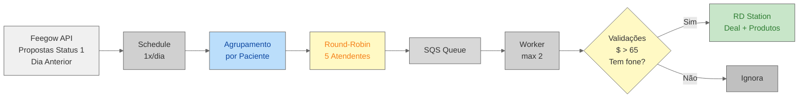

# Fluxo Visual - Automação de Propostas

## Diagrama do Fluxo Completo

```mermaid
%%{init: {'theme':'base', 'themeVariables': { 'primaryColor':'#f5f5f5','primaryTextColor':'#333','primaryBorderColor':'#666','lineColor':'#666','secondaryColor':'#e8e8e8','tertiaryColor':'#fff', 'noteTextColor':'#333', 'noteBkgColor':'#f5f5f5', 'noteBorderColor':'#666'}}}%%
flowchart TD
    Start(["Início - Cron Diário<br/>04:00 UTC"]) --> Schedule["Schedule Function<br/>proposals.handler"]
    
    Schedule --> GetDate["Calcula Data<br/>Dia Anterior<br/>formato: dd/MM/yyyy"]
    GetDate --> FetchProposals["Busca Propostas<br/>Feegow API<br/>proposals(date)"]
    
    FetchProposals --> FilterStatus["Filtra Status<br/>PropostaStatusID = 1<br/>Apenas 'Em Aberto'"]
    
    FilterStatus --> GroupProposals["groupProposals()<br/>Agrupa por Paciente"]
    
    GroupProposals --> InitIndex["Inicializa<br/>indiceAtendente = 0"]
    InitIndex --> LoopItems{"Para cada<br/>Item Feegow"}
    
    LoopItems --> CheckPatient{"Paciente já<br/>no grupo?"}
    
    CheckPatient -->|Não| IncrementIndex["Incrementa<br/>indiceAtendente"]
    IncrementIndex --> CheckReset{"índice =<br/>tamanho array?"}
    CheckReset -->|Sim| ResetIndex["indiceAtendente = 0"]
    CheckReset -->|Não| AssignAgent
    
    ResetIndex --> AssignAgent["Atribui Atendente<br/>Round-Robin<br/>ATENDENTES[índice]"]
    
    AssignAgent --> CreateProposal["Cria Nova Proposta<br/>no grupo"]
    CreateProposal --> AddItem["Adiciona Item<br/>ao array items"]
    
    CheckPatient -->|Sim| AddItem
    
    AddItem --> MoreItems{"Mais Itens?"}
    MoreItems -->|Sim| LoopItems
    MoreItems -->|Não| ConvertToArray["Converte Objeto<br/>para Array"]
    
    ConvertToArray --> SendLoop["Para cada Proposta<br/>Envia para SQS"]
    SendLoop --> EndSchedule(["Fim Schedule"])
    
    SendLoop -.->|Mensagem SQS| Worker["Worker Function<br/>proposals.handler<br/>Max Concurrency: 2"]
    
    Worker --> ParseMsg["Parse Mensagem SQS<br/>Proposal Object"]
    
    ParseMsg --> FetchPatient["Busca Dados Completos<br/>Feegow API<br/>getPatient()"]
    
    FetchPatient --> CalcTotal["Calcula Valor Total<br/>Soma items.value"]
    
    CalcTotal --> CheckValue{"Valor > R$ 0,10<br/>E<br/>Valor ≤ R$ 65?"}
    CheckValue -->|Sim| IgnoreValue["Log: Proposta ignorada<br/>Valor muito baixo"]
    CheckValue -->|Não| ParseDeal["parseDeal()<br/>Conversão para Deal"]
    
    ParseDeal --> CheckPhone{"Deal válido?<br/>Tem telefone?"}
    CheckPhone -->|Não| IgnorePhone["Log: Proposta ignorada<br/>Sem telefone"]
    
    CheckPhone -->|Sim| BuildCustomFields["Monta Custom Fields<br/>12 campos"]
    
    BuildCustomFields --> AddPriority["+ FIELD_PRIORIDADE<br/>groupExames[grupo]"]
    AddPriority --> AddAddress["+ Dados Endereço<br/>CPF, CEP, Cidade, Bairro<br/>Logradouro, Número"]
    AddAddress --> AddAgent["+ AGENTE_PROPOSTA<br/>Atendente round-robin"]
    AddAgent --> AddOthers["+ Unidade, Telefone<br/>Anotações cliente"]
    
    AddOthers --> BuildProducts["Monta deal_products<br/>Array de procedimentos"]
    
    BuildProducts --> LoopProducts{"Para cada<br/>Item"}
    LoopProducts --> AddProduct["Adiciona Produto<br/>ID, Nome, Valor, Grupo"]
    AddProduct --> MoreProducts{"Mais Itens?"}
    MoreProducts -->|Sim| LoopProducts
    MoreProducts -->|Não| CheckPatientId
    
    CheckPatientId{"pacienteId<br/>existe?"}
    CheckPatientId -->|Sim| AddFeegowLink["Adiciona Link Feegow<br/>às anotações"]
    CheckPatientId -->|Não| SkipLink["Pula Link"]
    
    AddFeegowLink --> FetchSchedules["Busca Agendamentos<br/>schedulesByPatientId()"]
    SkipLink --> FetchSchedules
    
    FetchSchedules --> EnrichAnnotation["Enriquece Anotação<br/>Procedimentos"]
    
    EnrichAnnotation --> LoopProc{"Para cada<br/>Procedimento"}
    LoopProc --> FindSchedule{"Existe<br/>agendamento?"}
    FindSchedule -->|Sim| AddStatus["Adiciona Status<br/>StatusAppointment[id]"]
    FindSchedule -->|Não| AddPlain["Adiciona apenas<br/>nome procedimento"]
    
    AddStatus --> MoreProc
    AddPlain --> MoreProc{"Mais<br/>Procedimentos?"}
    MoreProc -->|Sim| LoopProc
    MoreProc -->|Não| SetStage["Stage: PROPOSTA<br/>Source: PROPOSTAS"]
    
    SetStage --> ProcessRD["processLead()<br/>RD Service"]
    
    ProcessRD --> FindOrg["findOrCreateOrganization()"]
    FindOrg --> GetOrg{"Organização<br/>existe?"}
    
    GetOrg -->|Não| CreateOrg["POST Organization<br/>RD API"]
    GetOrg -->|Sim| UseOrg["Usa Organização<br/>existente"]
    
    CreateOrg --> PostDeal
    UseOrg --> PostDeal["POST Deal<br/>RD API<br/>+ 12 Custom Fields<br/>+ Produtos"]
    
    PostDeal --> PostAnnotations["POST Activities<br/>Anotações<br/>RD API"]
    
    PostAnnotations --> EndWorker(["Fim Worker"])
    
    IgnoreValue --> EndWorker
    IgnorePhone --> EndWorker
    
    style Start fill:#e8e8e8,stroke:#666,stroke-width:2px,color:#333
    style EndSchedule fill:#e8e8e8,stroke:#666,stroke-width:2px,color:#333
    style EndWorker fill:#e8e8e8,stroke:#666,stroke-width:2px,color:#333
    style Schedule fill:#d0d0d0,stroke:#666,stroke-width:2px,color:#333
    style Worker fill:#d0d0d0,stroke:#666,stroke-width:2px,color:#333
    style FetchProposals fill:#f0f0f0,stroke:#666,stroke-width:2px,color:#333
    style FetchPatient fill:#f0f0f0,stroke:#666,stroke-width:2px,color:#333
    style FetchSchedules fill:#f0f0f0,stroke:#666,stroke-width:2px,color:#333
    style GroupProposals fill:#bbdefb,stroke:#666,stroke-width:2px,color:#0d47a1
    style AssignAgent fill:#fff9c4,stroke:#666,stroke-width:2px,color:#f57f17
    style SendLoop fill:#d8d8d8,stroke:#666,stroke-width:2px,color:#333
    style PostDeal fill:#d8d8d8,stroke:#666,stroke-width:2px,color:#333
    style CreateOrg fill:#d8d8d8,stroke:#666,stroke-width:2px,color:#333
    style PostAnnotations fill:#d8d8d8,stroke:#666,stroke-width:2px,color:#333
    style BuildProducts fill:#e1bee7,stroke:#666,stroke-width:2px,color:#4a148c
    style IgnoreValue fill:#c0c0c0,stroke:#666,stroke-width:1px,color:#333
    style IgnorePhone fill:#c0c0c0,stroke:#666,stroke-width:1px,color:#333
    style FilterStatus fill:#b2dfdb,stroke:#666,stroke-width:2px,color:#004d40
    style EnrichAnnotation fill:#c5e1a5,stroke:#666,stroke-width:2px,color:#33691e
```



## Detalhamento das Etapas

### 1. Schedule Function (Cron Diário)

- **Trigger:** Execução diária às 04:00 UTC (01:00 Brasília)
- **Objetivo:** Coletar propostas comerciais do dia anterior
- **Fonte:** API Feegow - endpoint `proposals(date)`
- **Output:** Propostas agrupadas por paciente enviadas para SQS

### 2. Filtro de Status

**Status da Proposta:**

```typescript
PropostaStatusID = 1  // "Em Aberto"
```

**Objetivo:**

- Capturar apenas propostas pendentes
- Evitar propostas já finalizadas ou canceladas
- Foco em oportunidades ativas

### 3. Agrupamento por Paciente (Exclusivo desta Automação)

**Função:** `groupProposals(data: any[])`

**Processo:**

1. Cria objeto indexado por `PacienteID`
2. Para cada item da API:
   - Se paciente não existe → cria nova proposta
   - Se paciente existe → adiciona item ao array
3. Resultado: Uma proposta por paciente com múltiplos procedimentos

**Benefício:**

- ✅ Consolidação de orçamento completo
- ✅ Visão única do valor total
- ✅ Facilita negociação de pacotes

### 4. Distribuição Round-Robin de Atendentes (Exclusivo)

**Lista de Atendentes:**

```typescript
ATENDENTES = [
  "Joseani Feliciano",
  "Nicole Botelho", 
  "Karen Ribeiro",
  "Jossana Gusmão",
  "Hosana Santos"
]
```

**Algoritmo:**

1. Inicializa `indiceAtendente = 0`
2. A cada **nova proposta** (novo paciente):
   - Incrementa índice
   - Se índice = tamanho array → reseta para 0
   - Atribui `ATENDENTES[indice]` à proposta

**Resultado:**

- Distribuição equitativa automática
- Cada atendente recebe ~20% das propostas
- Balanceamento de carga da equipe comercial

### 5. Worker Function (Processamento Individual)

- **Trigger:** Mensagens SQS
- **Batch:** 1 proposta por vez
- **Concorrência:** Máximo 2 workers simultâneos
- **Delay:** 15 segundos entre mensagens

### 6. Busca de Dados Completos do Paciente

**API Feegow:** `getPatient(pacienteId)`

**Dados obtidos:**

- Email completo
- CPF e documentos
- Endereço completo (CEP, cidade, bairro, logradouro, número, complemento)
- Observações do cadastro

**Uso:**

- Preencher 12 custom fields no RD
- Enriquecer dados da proposta
- Permitir contato multicanal

### 7. Validação de Valor Mínimo (Exclusivo)

**Regra:**

```typescript
if (totalValue >= 0.1 && totalValue <= 65) {
    // Ignora proposta
}
```

**Range ignorado:** R$ 0,10 a R$ 65,00

**Objetivo:**

- Filtrar propostas de baixo valor comercial
- Evitar ruído no CRM
- Foco em oportunidades relevantes

### 8. Validação de Telefone Obrigatório

**Regra:**

```typescript
if (!deal) {
    // Proposta ignorada - sem telefone
}
```

**Motivo:**

- Telefone é essencial para contato comercial
- Sem telefone, follow-up fica impossibilitado

### 9. Construção de 12 Custom Fields (Mais Completo)

**Campos incluídos:**

1. **FIELD_PRIORIDADE** - Baseado no grupo do primeiro procedimento
2. **CLIENT_ANOTACAO** - Observações do cadastro
3. **FIELD_UNIDADE** - Unidade da proposta
4. **CLIENT_CPF** - CPF do paciente
5. **CLIENT_CEP** - CEP
6. **CLIENT_CIDADE** - Cidade
7. **CLIENT_BAIRRO** - Bairro
8. **CLIENT_COMPLEMENTO** - Complemento
9. **CLIENT_NUMERO** - Número
10. **CLIENT_LOGRADOURO** - Rua/Avenida
11. **CLIENT_TELEFONE** - Telefone principal
12. **AGENTE_PROPOSTA** - Atendente atribuído (round-robin)

**Diferencial:**

- Endereço completo (8 campos relacionados)
- Permite envio de materiais/documentos
- Atendente específico para follow-up

### 10. Adição de Produtos no Deal (Exclusivo)

**Estrutura:**

```typescript
deal_products: [
    {
        amount: 1,
        base_price: valor,
        description: grupoId,
        name: nomeProcedimento,
        price: valor,
        total: valor,
        recurrence: "spare"
    }
]
```

**Benefícios:**

- ✅ Controle financeiro no RD
- ✅ Valor total automático
- ✅ Rastreamento de procedimentos
- ✅ Análise de mix de produtos

### 11. Enriquecimento com Status de Agendamentos (Exclusivo)

**Processo:**

1. Busca agendamentos do paciente
2. Para cada procedimento da proposta:
   - Verifica se existe agendamento correspondente
   - Se existe, adiciona status
3. Cria anotação formatada

**Exemplo:**

```
Procedimentos:
246 - Alergologia - Marcado - confirmado
254 - Cardiologia - Atendido
120 - Ultrasonografia
```

**Mapeamento de Status:**

- 1: "Marcado - não confirmado"
- 3: "Atendido"
- 7: "Marcado - confirmado"
- 11: "Desmarcado pelo paciente"
- (11 status diferentes)

**Valor:**

- 📊 Visão completa da jornada do paciente
- 🎯 Identificação de procedimentos pendentes
- 💡 Insights para abordagem comercial

### 12. Stage e Source Específicos

- **Stage:** `STAGE_PROPOSTA` - Funil comercial
- **Source:** `SOURCE_PROPOSTAS` - Rastreabilidade

### 13. Processamento no RD Station

Similar às outras automações:

1. Busca ou cria organização
2. Cria deal com produtos
3. Adiciona anotações enriquecidas

## Comparação: Proposals vs Outras Automações

| Característica | **Proposals** | Consultas | Convênios | Exames |
|----------------|---------------|-----------|-----------|--------|
| **Frequência** | 1x/dia | 1x/dia | 84x/dia | 1x/dia |
| **Fonte** | API Feegow | MySQL | API Feegow | MySQL |
| **Agrupamento** | ✅ Por paciente | ❌ | ❌ | Por nome |
| **Atendentes** | ✅ Round-robin | ❌ | ❌ | ❌ |
| **Validação $** | ✅ > R$ 65 | ❌ | ❌ | ❌ |
| **Produtos RD** | ✅ Sim | ❌ | ❌ | ❌ |
| **Custom Fields** | 12 campos | 10+ | 3 | 2 |
| **Endereço** | ✅ Completo | ❌ | ❌ | ❌ |
| **Status Agend.** | ✅ Anota | Valida | ❌ | Valida |
| **Prioridade** | ✅ Auto | ❌ | ❌ | ❌ |
| **Stage** | PROPOSTA | RECUPERACAO | ATENDIMENTO | RECUPERACAO_EX |
| **Objetivo** | Conversão $ | Recuperação | Monitoramento | Recuperação |

## Fluxo de Dados Simplificado



## Diferenciais Únicos de Proposals

### 1. 🔄 Agrupamento por Paciente

**Como funciona:**

- API retorna 1 linha por procedimento
- Algoritmo agrupa por `PacienteID`
- Resultado: 1 proposta com N procedimentos

**Exemplo:**

```
Input API:
- Linha 1: Paciente João, Alergologia, R$ 150
- Linha 2: Paciente João, Cardiologia, R$ 200
- Linha 3: Paciente Maria, Ultrasonografia, R$ 100

Output Agrupado:
- Proposta João: [Alergologia R$150, Cardiologia R$200] = R$350
- Proposta Maria: [Ultrasonografia R$100] = R$100
```

### 2. 🎯 Distribuição Round-Robin

**Ciclo automático:**

```
Proposta 1 → Joseani Feliciano
Proposta 2 → Nicole Botelho
Proposta 3 → Karen Ribeiro
Proposta 4 → Jossana Gusmão
Proposta 5 → Hosana Santos
Proposta 6 → Joseani Feliciano (volta ao início)
```

**Benefícios:**

- Sem intervenção manual
- Distribuição justa
- Rastreabilidade de responsabilidade

### 3. 💰 Filtro de Valor Comercial

**Lógica:**

```typescript
Total >= R$ 0,10 AND Total <= R$ 65,00 → IGNORA
Total > R$ 65,00 → PROCESSA
```

**Razão:**

- Foco em oportunidades relevantes
- Redução de ruído no CRM
- Priorização da equipe comercial

### 4. 📦 Produtos no Deal

**Única automação que popula `deal_products`:**

- Permite análise financeira no RD
- Cálculo automático de valor total
- Rastreamento de mix de produtos
- Relatórios de conversão por procedimento

### 5. 📋 Status de Agendamentos

**Cruzamento inteligente:**

- Busca agendamentos existentes
- Relaciona procedimentos por ID
- Anota status atual
- Visão 360° do paciente

**Exemplo de insight:**

```
Proposta: Alergologia + Cardiologia = R$ 350
Status: Alergologia já agendado
Ação: Focar venda apenas na Cardiologia
```

### 6. 🏠 Endereço Completo

**8 campos de endereço:**

- CPF, CEP, Cidade
- Bairro, Logradouro
- Número, Complemento

**Uso:**

- Envio de materiais pré-consulta
- Validação de dados cadastrais
- Análise geográfica de demanda

### 7. 🎨 Prioridade Automática

**Baseado no grupo:**

```typescript
Grupo 69 → "Exames Laboratoriais"
Grupo 120 → "Ultrasonografia"
Grupo 94 → "Audiometria"
```

**Permite:**

- Triagem automática
- Roteamento especializado
- SLA diferenciado por tipo

## Pontos de Atenção

- 📊 **Agrupamento:** Múltiplos procedimentos → 1 proposta
- 🔄 **Round-Robin:** 5 atendentes rotativos
- 💵 **Validação $:** Mínimo R$ 65,01
- 📱 **Telefone:** Obrigatório para processar
- 📦 **Produtos:** Array de procedimentos no deal
- 🏥 **Status:** Cruzamento com agendamentos
- 🎯 **Prioridade:** Baseada no primeiro grupo
- 📍 **Endereço:** 8 campos completos
- 🔢 **Status = 1:** Apenas propostas "Em Aberto"
- ⚙️ **Concorrência:** Max 2 workers simultâneos

## Logs e Debugging

```typescript
console.log("DEAL", deal)  
// Deal completo sendo processado

console.log(`Proposta ignorada, valor total (${totalValue})...`)
// Filtro de valor atuando

console.log("Proposta ignorada, o paciente não possui número de telefone.")
// Falta de telefone
```

**Métricas para monitorar:**

- Total de propostas coletadas
- Taxa de filtragem por valor
- Taxa de propostas sem telefone
- Distribuição de atendentes (deve ser ~20% cada)
- Valor médio por proposta
- Procedimentos mais frequentes
- Taxa de propostas com agendamentos existentes
